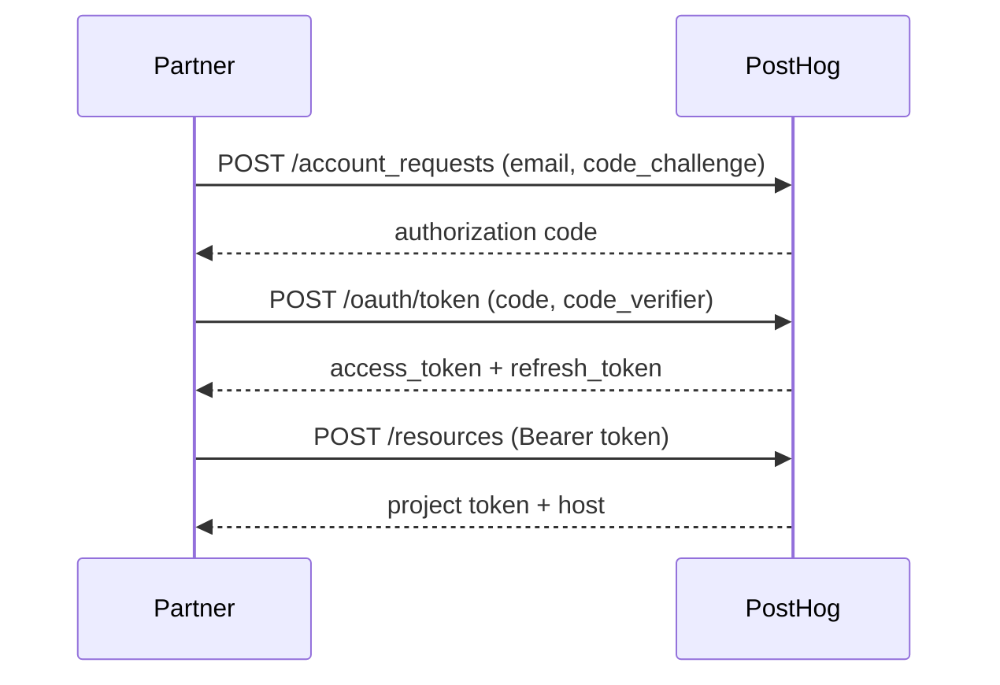
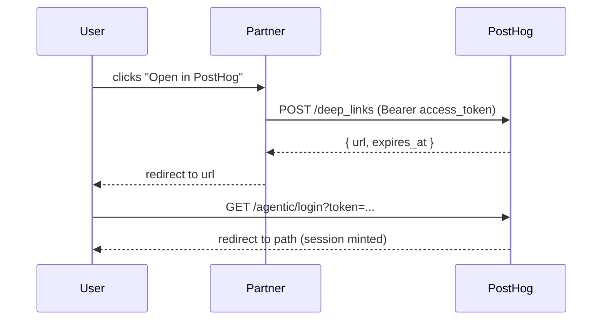
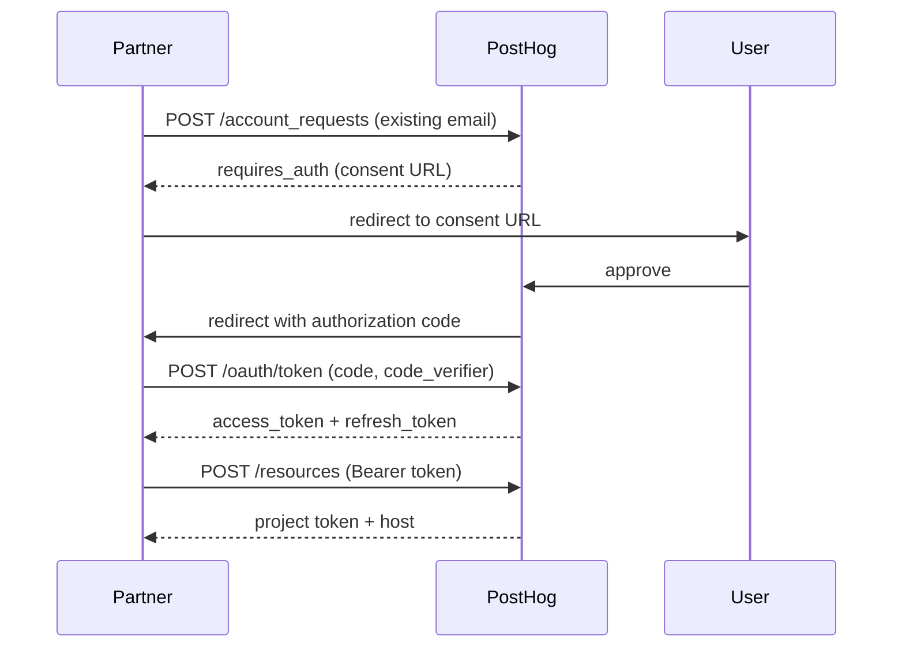

PostHog's provisioning API lets you create PostHog accounts for your users and deep link them into their PostHog project.

It's intended for partners and platform integrations. If you're integrating your own app with your own PostHog account, you probably want [OAuth](/docs/api/oauth) or a [personal API key](/docs/api/personal-api-keys) instead.

Jump to the [full Node.js example](#full-example) to see the complete flow in code.

## How it works

The flow uses OAuth 2.0 with PKCE (Proof Key for Code Exchange).
Your application is identified by a metadata document hosted on your domain, so there is no registration form to fill in and no client secret for us to issue.

**PKCE is all you need.** Everything on this page – creating accounts, exchanging tokens, provisioning projects, deep linking – works for a **public client**, which is identified by its `client_id` and proves the code exchange with PKCE. That's the default, it's what most integrations are, and you can stop reading about authentication here.

One optional add-on, [provisioning straight from a GitHub repo](/docs/integrate/github-grants), asks more of you. Nothing on this page does.

### Onboarding (once per user)

```
1. POST /account_requests  →  authorization code
2. POST /oauth/token        →  access + refresh tokens
3. POST /resources          →  project token + host
```


```mermaid
sequenceDiagram
    participant P as Partner
    participant PH as PostHog

    P->>PH: POST /account_requests (email, code_challenge)
    PH-->>P: authorization code

    P->>PH: POST /oauth/token (code, code_verifier)
    PH-->>P: access_token + refresh_token

    P->>PH: POST /resources (Bearer token)
    PH-->>P: project token + host
```

### Deep linking (per click, after onboarding)

Reuses the access token from onboarding to mint a single-use URL that logs the user into their PostHog project.

```
4. POST /deep_links  →  single-use URL (10 min TTL)
```


```mermaid
sequenceDiagram
    participant U as User
    participant P as Partner
    participant PH as PostHog

    U->>P: clicks "Open in PostHog"
    P->>PH: POST /deep_links (Bearer access_token)
    PH-->>P: { url, expires_at }
    P-->>U: redirect to url
    U->>PH: GET /agentic/login?token=...
    PH-->>U: redirect to path (session minted)
```

## Set up as a partner

Setup is two steps, and you only do them once:

1. **[Host a metadata document](#host-a-cimd-metadata-document)** at an HTTPS URL on your domain. That URL becomes your `client_id`. There is no signup form.
2. **[Register your client](#register-your-client)** in every region you serve, and check the diagnostics it returns.

Optionally, [link the app to a PostHog organization](#link-your-partner-app-to-a-posthog-organization-optional) to raise your rate limit, and [declare a scope ceiling](#declare-oauth-scopes-for-your-app-optional).

After that, the per-user flow is the three API calls in [onboarding](#onboarding-once-per-user).

### Host a CIMD metadata document

PostHog uses [Client ID Metadata Documents](https://datatracker.ietf.org/doc/draft-ietf-oauth-client-id-metadata-document/) (CIMD) for partner registration. There's no signup form to fill out – you host a JSON document at an HTTPS URL on your domain, and that URL becomes your `client_id`.

You host **one** of these. It describes your app, not your relationship with us: it's a draft IETF standard, the same document works with any authorization server that supports CIMD, and it's the same document for every customer you onboard. So name it after your app rather than after PostHog, and don't create a second one per provider.

Create a JSON file at a stable HTTPS URL, for example `https://yourapp.com/.well-known/oauth-client.json`:

```json
{
  "client_id": "https://yourapp.com/.well-known/oauth-client.json",
  "client_name": "Your App Name",
  "redirect_uris": ["https://yourapp.com/callbacks/posthog"],
  "logo_uri": "https://yourapp.com/logo.png",
  "token_endpoint_auth_method": "none",
  "grant_types": ["authorization_code"],
  "response_types": ["code"]
}
```

Requirements:

- **`client_id`** must exactly match the URL where this document is hosted.
- **`redirect_uris`** is required and must contain at least one HTTPS URI. This is where PostHog redirects existing users during the consent flow.
- **`logo_uri`** (optional) must be HTTPS if provided.
- **`token_endpoint_auth_method`** must be either `"none"` (a public client, relying on PKCE) or `"private_key_jwt"` (a confidential client, which also requires `jwks_uri`). A CIMD client can never hold a client secret, because there is no registration step in which we could deliver one.
- **`jwks_uri`** is required when `token_endpoint_auth_method` is `"private_key_jwt"`, and must be an HTTPS URL serving your public keys as a JWK Set.
- The document must be served with `Content-Type: application/json` and be under 5 KB.
- The URL must use HTTPS, include a path component, and must not contain query parameters or fragments. These rules apply to the `client_id` document only, since it is your stable identifier. Your `jwks_uri` is an ordinary document reference and may carry a query string.

PostHog fetches and caches this document automatically.
Subsequent requests reuse the cached version and refresh it in the background based on your `Cache-Control: max-age` header (clamped between 5 minutes and 24 hours, default 1 hour).

Because the document is re-read on every refresh, you can switch between `"none"` and `"private_key_jwt"` at any time by editing it. Your `client_id` does not change and there is nothing to re-register.

#### A real one you can look at

posthog.com is itself a partner: the [wizard](/docs/getting-started/install) provisions accounts through this API. Its metadata document is public, so here is exactly what a live one looks like, fetched as you read this:

<LiveJSON src="https://posthog.com/.well-known/posthog.com.json" label="posthog.com's metadata document" />

It also publishes a `jwks_uri`, because it uses [GitHub grants](/docs/integrate/github-grants). That's the second file, shown here because it's the one people ask what it should look like:

<LiveJSON src="https://posthog.com/api/oauth/jwks" label="the JWK Set served at that jwks_uri" />

You almost certainly need neither field – drop `jwks_uri`, leave `token_endpoint_auth_method` as `"none"`, and everything above still applies.

PostHog publishes a couple of others you can compare against, both public clients: [the setup wizard's](https://us.posthog.com/api/oauth/wizard/client-metadata) and [the Raycast extension's](https://us.posthog.com/api/oauth/raycast/client-metadata).

### Register your client

Once the document is live, register it. Paste the URL below: this reads the document back so you can see what you actually published, then registers it per region.

<CIMDRegistration />

Or do it yourself:

```bash
curl -X POST https://us.posthog.com/api/agentic/provisioning/client_registration \
  -H "Content-Type: application/json" \
  -d '{"client_id": "https://yourapp.com/.well-known/oauth-client.json"}'
```

This is the first call you make. Every other endpoint requires an already-registered client and returns `401` naming this one if it does not find yours.

<CalloutBox icon="IconWarning" title="Register in every region you serve" type="caution">

US and EU are separate deployments with separate databases, so registering in one does **not** register you in the other, and we will not do it for you. A client registered only in the US gets a `401` from `eu.posthog.com`.

Run the registration against `https://us.posthog.com` and `https://eu.posthog.com` separately, and re-run both whenever you change your metadata document or your keys. The interactive form above has a button for each.

</CalloutBox>

The response reports each check separately, so a broken setup tells you which part is wrong rather than failing as a bare `401`:

```json
{
  "client_id": "https://yourapp.com/.well-known/oauth-client.json",
  "registered": true,
  "client_type": "confidential",
  "token_endpoint_auth_method": "private_key_jwt",
  "jwks_uri": "https://yourapp.com/.well-known/jwks.json",
  "scopes": ["organization:read", "project:read"],
  "provisioning": { "active": true, "can_create_accounts": true, "can_provision_resources": true },
  "capabilities": { "account_requests": true, "github_grants": true, "wizard_runs": true },
  "checks": [
    { "name": "metadata_document", "ok": true, "detail": "Fetched and validated" },
    { "name": "provisioning_enabled", "ok": true, "detail": "Active" },
    { "name": "jwks", "ok": true, "detail": "1 key(s) served: my-key-1" }
  ]
}
```

`capabilities` tells you which endpoints you qualify for. `account_requests` is on for everyone who registers; `github_grants` and `wizard_runs` need a capability [PostHog grants by hand](/docs/integrate/github-grants). It is safe to call this endpoint again at any time; it re-fetches your document and re-runs every check, which makes it the fastest way to confirm a change took effect.

You can also verify your signing setup end to end by including an assertion. It is checked and reported as a `client_assertion` entry in `checks`:

```bash
curl -X POST https://us.posthog.com/api/agentic/provisioning/client_registration \
  -H "Content-Type: application/json" \
  -d '{
        "client_id": "https://yourapp.com/.well-known/oauth-client.json",
        "client_assertion": "eyJhbGciOi...",
        "client_assertion_type": "urn:ietf:params:oauth:client-assertion-type:jwt-bearer"
      }'
```

Verifying consumes the assertion's `jti`, so mint a fresh one for the check rather than reusing it on a real call.

### Link your partner app to a PostHog organization (optional)

By default, a CIMD partner app is unverified and capped at 10 account requests per hour.
You can link the app to a PostHog organization with a verification token to raise that to 100/hour and surface the partner integration to that org's admins.

1. In PostHog, go to **Organization settings → CIMD verification tokens** and click **Create token**. Copy the `phvt_…` value – it's only shown once.
2. Add the token inside a `com.posthog` namespace in your CIMD metadata document:

   ```json
   {
     "client_id": "https://yourapp.com/.well-known/oauth-client.json",
     "client_name": "Your App Name",
     "redirect_uris": ["https://yourapp.com/callbacks/posthog"],
     "logo_uri": "https://yourapp.com/logo.png",
     "token_endpoint_auth_method": "none",
     "grant_types": ["authorization_code"],
     "response_types": ["code"],
     "com.posthog": {
       "verification_token": "phvt_..."
     }
   }
   ```

3. The next time PostHog refreshes the metadata document, the app is linked to the matching organization and the rate limit is bumped.

The token is only used to prove ownership of the partner app – it isn't sent on API requests.
You can rotate or revoke a token at any time from the same settings page.
Revocation clears the link on the next metadata refresh, so a leaked or stale token can't keep an app linked to your org.

<CalloutBox icon="IconInfo" title="The legacy top-level field still works" type="fyi">

`posthog_verification_token` at the top level is still supported as a fallback. PostHog reads `com.posthog.verification_token` first and falls back to the top-level field if the nested one is absent or unrecognized. New integrations should use the `com.posthog` namespace.

</CalloutBox>

### Declare OAuth scopes for your app (optional)

You can declare which OAuth scopes your partner app needs by adding a `scopes` field inside the `com.posthog` namespace. This sets a scope ceiling – tokens issued to your app are limited to these scopes.

```json
{
  "client_id": "https://yourapp.com/.well-known/oauth-client.json",
  "client_name": "Your App Name",
  "redirect_uris": ["https://yourapp.com/callbacks/posthog"],
  "token_endpoint_auth_method": "none",
  "grant_types": ["authorization_code"],
  "response_types": ["code"],
  "com.posthog": {
    "verification_token": "phvt_...",
    "scopes": ["insight:read", "project:read", "person:read"]
  }
}
```

Only scopes a user can grant on the consent screen are accepted – see [available scopes](#available-scopes) for the full list. Any scope PostHog reserves for internal use, or doesn't recognize, is dropped. If every scope you declare is dropped (none are grantable), registration is rejected rather than falling back to an empty ceiling, so make sure at least one declared scope is on the available list.

If `com.posthog.scopes` is omitted, your app can request any scope a user can grant. When present, the declared scopes are applied on both initial registration and every subsequent metadata refresh. A scope ceiling is a cap, not a grant – each scope still requires user consent at the authorization step.

CIMD app scopes are managed via the metadata document and are read-only in the PostHog admin UI.

## Choosing an authentication method

Almost certainly you do not have to. `token_endpoint_auth_method` defaults to `"none"`, which makes you a **public client** identified by your `client_id` and relying on PKCE, and every endpoint on this page works that way.

The one exception is the GitHub grant endpoints, which need a **confidential client** signing a short-lived assertion with a published key. They are documented separately, along with how to set that up, in [provisioning from a GitHub repo](/docs/integrate/github-grants).

<CalloutBox icon="IconWarning" title="A confidential client cannot fall back to the public path" type="caution">

If your document declares `private_key_jwt` and you send only your `client_id`, the request is rejected rather than treated as a public client. Your `client_id` is published, so honouring it alone would let anyone act as you.

</CalloutBox>

## API reference

All endpoints are on `https://us.posthog.com` (US region) or `https://eu.posthog.com` (EU region).

The two regions are separate deployments with separate databases. Your client must be [registered in each region you serve](#register-your-client), tokens issued by one are not valid at the other, and a `client_assertion` must name the region it is sent to in its `aud`.

### Step 1: Create an account

Create a PostHog account for a user by email. If the user is new, PostHog creates the account and returns an authorization code immediately. If the user already exists, the response tells you to redirect them for consent.

Generate a PKCE code verifier and challenge before making this request:

```bash
# Generate PKCE values
CODE_VERIFIER=$(openssl rand -base64 32 | tr -d '=' | tr '+/' '-_')
CODE_CHALLENGE=$(echo -n "$CODE_VERIFIER" | openssl dgst -sha256 -binary | openssl base64 | tr -d '=' | tr '+/' '-_')
```

```bash
BODY=$(cat <<JSON
{
  "id": "req_unique_request_id",
  "email": "user@example.com",
  "name": "Jane Doe",
  "client_id": "https://yourapp.com/.well-known/oauth-client.json",
  "code_challenge": "$CODE_CHALLENGE",
  "code_challenge_method": "S256",
  "configuration": {
    "region": "US",
    "organization_name": "Acme Corp"
  }
}
JSON
)

curl -X POST https://us.posthog.com/api/agentic/provisioning/account_requests \
  -H "Content-Type: application/json" \
  -d "$BODY"
```

**Request fields:**

| Field                             | Type   | Required | Description                                                                              |
| --------------------------------- | ------ | -------- | ---------------------------------------------------------------------------------------- |
| `id`                              | string | Yes      | Your unique request ID (for idempotency)                                                 |
| `email`                           | string | Yes      | User's email address                                                                     |
| `name`                            | string | No       | User's full name                                                                         |
| `client_id`                       | string | Yes      | Your CIMD metadata URL                                                                   |
| `code_challenge`                  | string | Yes      | Base64url-encoded SHA-256 hash of your code verifier (43-128 chars)                      |
| `code_challenge_method`           | string | Yes      | Must be `"S256"`                                                                         |
| `scopes`                          | list   | No       | OAuth scopes to request for the access token. See [available scopes](#available-scopes). |
| `configuration.region`            | string | No       | `"US"` (default) or `"EU"`                                                               |
| `configuration.organization_name` | string | No       | Organization name (defaults to `"Partner (email)"`)                                      |
| `client_assertion`                | string | Confidential clients | Signed assertion. See [GitHub grants](/docs/integrate/github-grants#becoming-a-confidential-client). |
| `client_assertion_type`           | string | Confidential clients | `urn:ietf:params:oauth:client-assertion-type:jwt-bearer` |

**New user response** (HTTP 200):

```json
{
  "id": "req_unique_request_id",
  "type": "oauth",
  "oauth": {
    "code": "abc123...authorization_code"
  }
}
```

The user receives a welcome email with a link to set their password and access their dashboard.

**Existing user response** (HTTP 200):

```json
{
  "id": "req_unique_request_id",
  "type": "requires_auth",
  "requires_auth": {
    "url": "https://us.posthog.com/api/agentic/authorize?state=xyz..."
  }
}
```

When `type` is `requires_auth`, redirect the user to the provided URL. After they approve, PostHog redirects them to your `redirect_uris` with a `code` query parameter that you use in step 2.

An email that already has a PostHog account **always** takes this path. No partner setting skips it, and authenticating as a confidential client does not skip it either. Proving you control your app is not the same as proving you control somebody's email address, and silently linking an existing account to a partner would be an account takeover. Plan for the consent redirect as a normal branch rather than an edge case.


```mermaid
sequenceDiagram
    participant P as Partner
    participant PH as PostHog
    participant U as User

    P->>PH: POST /account_requests (existing email)
    PH-->>P: requires_auth (consent URL)

    P->>U: redirect to consent URL
    U->>PH: approve
    PH->>P: redirect with authorization code

    P->>PH: POST /oauth/token (code, code_verifier)
    PH-->>P: access_token + refresh_token

    P->>PH: POST /resources (Bearer token)
    PH-->>P: project token + host
```

### Step 2: Exchange the code for tokens

Exchange the authorization code for an access token and refresh token. The token endpoint uses standard `application/x-www-form-urlencoded` encoding.

```bash
curl -X POST https://us.posthog.com/api/agentic/oauth/token \
  -H "Content-Type: application/x-www-form-urlencoded" \
  -d "grant_type=authorization_code&code=abc123...authorization_code&code_verifier=$CODE_VERIFIER"
```

**Request fields:**

| Field           | Type   | Required | Description                                                            |
| --------------- | ------ | -------- | ---------------------------------------------------------------------- |
| `grant_type`    | string | Yes      | Must be `"authorization_code"`                                         |
| `code`          | string | Yes      | The authorization code from step 1                                     |
| `code_verifier` | string | Yes      | The original PKCE code verifier (must match the challenge from step 1) |
| `client_assertion` | string | Confidential clients | Signed assertion. See [GitHub grants](/docs/integrate/github-grants#becoming-a-confidential-client). |
| `client_assertion_type` | string | Confidential clients | `urn:ietf:params:oauth:client-assertion-type:jwt-bearer` |

There's no `client_id` here, unlike on the account request. The authorization code already records which app it was issued to, so PostHog reads your identity off the code rather than off the request – sending a `client_id` has no effect either way. A confidential client is identified by the `iss`/`sub` in its assertion, and that has to match the app the code names.

A public client exchanges on `code_verifier` alone. A confidential client sends the assertion **as well as** the verifier, not instead of it – authenticating does not exempt you from PKCE, and [there's a reason for that](/docs/integrate/github-grants#both-always). It gets `invalid_client` with a `401` if it does not authenticate.

Client authentication is checked before the code is consumed, so an attempt that fails on credentials leaves the code usable and you can retry with the same one.

**Response** (HTTP 200):

```json
{
  "token_type": "bearer",
  "access_token": "pha_abc123...",
  "refresh_token": "phr_def456...",
  "expires_in": 3600,
  "account": {
    "id": "01234567-89ab-cdef-0123-456789abcdef",
    "payment_credentials": "orchestrator",
    "available_teams": [
      {
        "id": 12345,
        "name": "Default project",
        "organization_id": "01234567-89ab-cdef-0123-456789abcdef",
        "organization_name": "Acme Corp"
      }
    ]
  }
}
```

Authorization codes expire after 5 minutes and can only be used once.
Access tokens expire after 1 hour. Use the refresh token to get new tokens.

**Token endpoint errors** use the standard OAuth 2.0 format:

```json
{
  "error": "invalid_grant",
  "error_description": "Invalid or expired authorization code"
}
```

### Step 3: Provision a project

Use the access token to provision a PostHog project and get credentials.

```bash
curl -X POST https://us.posthog.com/api/agentic/provisioning/resources \
  -H "Content-Type: application/json" \
  -H "Authorization: Bearer pha_abc123..." \
  -d '{
    "label_prefix": "Acme Co",
    "configuration": {
      "project_name": "My App - Production"
    }
  }'
```

**Request fields:**

| Field | Type | Required | Description |
|---|---|---|---|
| `label_prefix` | string | No | Label prefix for the provisioned personal API key, up to 25 characters, used only when a personal API key is issued (off by default). When issued, the key is labeled `{label_prefix} - {team_name}`; if omitted, empty, or whitespace-only, just the team name. |
| `configuration.project_name` | string | No | Project name (defaults to `"Default project"`) |

**Response** (HTTP 200):

```json
{
  "status": "complete",
  "id": "12345",
  "complete": {
    "access_configuration": {
      "api_key": "phc_abc123...",
      "host": "https://us.posthog.com"
    }
  }
}
```

**Response fields:**

| Field | Description |
|---|---|
| `api_key` | The project token (starts with `phc_`) – use this to initialize PostHog SDKs |
| `host` | The API host (`https://us.posthog.com` or `https://eu.posthog.com`) |

For authenticated REST API calls, use the OAuth `access_token` from [Step 2](#step-2-exchange-the-code-for-tokens) as a `Bearer` token. It carries the [scopes](#available-scopes) you requested in the account request. Provisioning does not return a `personal_api_key` in this response.

### Deep linking

For recurring deep links from your application into PostHog – the most common case is an "Open in PostHog" button on a user's connected project – use the deep-link endpoint. Each call returns a short-lived, single-use URL that logs the user into their PostHog project on click. There's no consent screen and no email-mismatch friction: the URL mints a fresh PostHog session for the right user, overriding any other session the browser happens to have.

```bash
curl -X POST https://us.posthog.com/api/agentic/provisioning/deep_links \
  -H "Content-Type: application/json" \
  -H "Authorization: Bearer pha_abc123..." \
  -d '{
    "path": "/project/12345/replay/019e6d10-c3b0-7000-8000-000000000000"
  }'
```

Authenticate with the `access_token` you got from [Step 2](#step-2-exchange-the-code-for-tokens) – the same Bearer credential you use for `/resources`. The token is scoped to a single team, so the resulting deep link lands the user in the correct project.

**Request fields:**

| Field | Type | Required | Description |
|---|---|---|---|
| `path` | string | No | The in-app path to land the user on after login, for example `/project/12345/replay/<recording_id>`. Must be a relative, same-origin path beginning with a single `/`. If omitted, the link lands on the project home (`/project/<team_id>`). |
| `purpose` | string | No | Free-form label recorded for your own analytics. Defaults to `dashboard`. It does not affect where the link lands – use `path` for that. |

The `path` is validated when the link is minted and again when it's opened. PostHog rejects open-redirect forms (absolute URLs, protocol-relative `//`, backslashes, and `javascript:`) as well as control characters and whitespace. To find the path for a destination, open it in PostHog and copy everything after the host, including the leading `/`.

**Response:**

```json
{
  "purpose": "dashboard",
  "url": "https://us.posthog.com/agentic/login?token=...&team_id=12345",
  "expires_at": "2026-05-20T21:00:00Z"
}
```

The returned `url` is valid for 10 minutes and can only be opened once, so don't pre-render it as the button's `href`. Wire the button click to your backend, call `/deep_links` there, then redirect the user to the returned URL.

#### Requires a trusted partner record

This endpoint is gated on the `provisioning_can_issue_deep_links` flag on your partner record, which is only enabled for partners admin-onboarded by PostHog. If you get a `deep_links_not_enabled` 403, ask PostHog to enable it for your CIMD app.

### Rotate project credentials

Rotate the project token for an existing provisioned project:

```bash
curl -X POST https://us.posthog.com/api/agentic/provisioning/resources/12345/rotate_credentials \
  -H "Content-Type: application/json" \
  -H "Authorization: Bearer pha_abc123..." \
  -d '{
    "label_prefix": "Acme Co"
  }'
```

**Request fields:**

| Field | Type | Required | Description |
|---|---|---|---|
| `label_prefix` | string | No | Label prefix for the personal API key, up to 25 characters, used only when a personal API key is issued (off by default). When issued, the key is labeled `{label_prefix} - {team_name}`; if omitted, empty, or whitespace-only, just the team name. |

The response has the same shape as the project provisioning response and includes the rotated `api_key` and `host`.

### Refresh tokens

Access tokens expire after 1 hour. Use the refresh token to get new credentials:

```bash
curl -X POST https://us.posthog.com/api/agentic/oauth/token \
  -H "Content-Type: application/x-www-form-urlencoded" \
  -d "grant_type=refresh_token&refresh_token=phr_def456..."
```

**Response** (HTTP 200):

```json
{
  "token_type": "bearer",
  "access_token": "pha_new_token...",
  "refresh_token": "phr_new_refresh...",
  "expires_in": 3600
}
```

Confidential clients must authenticate on this grant too, with the same `client_assertion` parameters as the authorization code exchange.

Each refresh token is single-use. The response includes a new refresh token for subsequent refreshes. Refreshing can only keep or narrow a token's scopes, never add them. To grant additional scopes, request them in a new account request; they apply to connections provisioned afterward.

## What the user gets

When you provision a new account, the user receives:

- A welcome email with a link to set their password.
- Full dashboard access at [us.posthog.com](https://us.posthog.com) (or [eu.posthog.com](https://eu.posthog.com) for EU).
- The PostHog [free tier](/pricing) across all products – no credit card required.

Your integration gets back the project token and host, so you can start sending events the moment the API call returns.

## Error handling

Provisioning endpoints (account_requests, resources) return errors in this format:

```json
{
  "type": "error",
  "error": {
    "code": "error_code",
    "message": "Human-readable description"
  }
}
```

The token endpoint uses the standard OAuth 2.0 error format instead:

```json
{
  "error": "error_code",
  "error_description": "Human-readable description"
}
```

Common error codes:

| Code | HTTP Status | Description |
|---|---|---|
| `invalid_request` | 400 | Missing or invalid field |
| `unauthorized` | 401 | Authentication failed. If the message names `client_registration`, your client is not registered yet, so [register it](#register-your-client). |
| `invalid_client` | 401 | Client authentication failed at the token endpoint: missing, wrong, or replayed credentials |
| `forbidden` | 403 | Partner not authorized for this action. On the [GitHub grant endpoints](/docs/integrate/github-grants) this means either that you are a public client, or that the capability has not been enabled for you. |
| `registration_failed` | 400 | `client_registration` could not register your client. The `checks` array says which part failed. |
| `expired` | 400 | Account request has expired |
| `invalid_grant` | 400 | Authorization code is invalid or expired (token endpoint) |
| `invalid_label_prefix` | 400 | `label_prefix` is not a string, is longer than 25 characters after trimming, or contains control or Unicode format characters |
| `invalid_path` | 400 | Deep-link `path` is not a relative, same-origin in-app path beginning with a single `/` |
| `invalid_scope` | 400 | Unrecognized scope requested |
| `rate_limited` | 429 | Rate limit exceeded |
| `account_creation_failed` | 500 | Server error during account creation |

## Rate limits

All provisioning endpoints are rate limited.

**CIMD registration** (first request from a new `client_id`):

- 5 requests per minute per IP (burst)
- 10 requests per hour per IP (sustained)
- 100 new client registrations per hour globally
- 5 new client registrations per domain per hour

**Account requests** (per partner, per hour):

- 10/hour for unverified CIMD partners
- 100/hour for partners linked to a PostHog organization via a [verification token](#link-your-partner-app-to-a-posthog-organization-optional)

Open a [support request](https://us.posthog.com/#panel=support%3Asupport%3Alogin%3A%3Atrue) in the app, choosing **Authentication** as the topic, if you need a higher limit for production use.

## Full example

Here's a complete example in Node.js:

```javascript
import crypto from "node:crypto";

const CLIENT_ID = "https://yourapp.com/.well-known/oauth-client.json";
const BASE_URL = "https://us.posthog.com";

async function provisionPostHogAccount(email, name) {
  // Generate PKCE values
  const codeVerifier = crypto.randomBytes(32).toString("base64url");
  const codeChallenge = crypto.createHash("sha256").update(codeVerifier).digest("base64url");

  // Step 1: Create account
  const accountRes = await fetch(`${BASE_URL}/api/agentic/provisioning/account_requests`, {
    method: "POST",
    headers: {
      "Content-Type": "application/json",
      },
    body: JSON.stringify({
      id: crypto.randomUUID(),
      email,
      name,
      client_id: CLIENT_ID,
      code_challenge: codeChallenge,
      code_challenge_method: "S256",
      configuration: { region: "US" },
    }),
  });

  if (!accountRes.ok) {
    const err = await accountRes.json();
    throw new Error(
      `Account request failed (${accountRes.status}): ${err.error?.message || JSON.stringify(err)}`,
    );
  }

  const account = await accountRes.json();

  if (account.type === "requires_auth") {
    // Existing user - redirect them to account.requires_auth.url
    return { type: "requires_auth", url: account.requires_auth.url };
  }

  if (account.type !== "oauth") {
    throw new Error(account.error?.message || "Unexpected response type");
  }

  // Step 2: Exchange code for tokens
  const tokenRes = await fetch(`${BASE_URL}/api/agentic/oauth/token`, {
    method: "POST",
    headers: {
      "Content-Type": "application/x-www-form-urlencoded",
      },
    body: new URLSearchParams({
      grant_type: "authorization_code",
      code: account.oauth.code,
      // No client_id: the code already records which app it belongs to.
      code_verifier: codeVerifier,
      // A confidential client adds client_assertion and client_assertion_type here,
      // in addition to code_verifier above. The assertion never replaces PKCE.
    }),
  });

  if (!tokenRes.ok) {
    const err = await tokenRes.json();
    throw new Error(
      `Token exchange failed (${tokenRes.status}): ${err.error_description || JSON.stringify(err)}`,
    );
  }

  const tokens = await tokenRes.json();

  // Step 3: Provision a project
  const resourceRes = await fetch(`${BASE_URL}/api/agentic/provisioning/resources`, {
    method: "POST",
    headers: {
      "Content-Type": "application/json",
      Authorization: `Bearer ${tokens.access_token}`,
      },
    body: JSON.stringify({
      label_prefix: "Acme Co",
      configuration: { project_name: "Production" },
    }),
  });

  if (!resourceRes.ok) {
    const err = await resourceRes.json();
    throw new Error(
      `Resource provisioning failed (${resourceRes.status}): ${err.error?.message || JSON.stringify(err)}`,
    );
  }

  const resource = await resourceRes.json();

  return {
    type: "provisioned",
    apiKey: resource.complete.access_configuration.api_key,
    host: resource.complete.access_configuration.host,
    projectId: resource.id,
    accessToken: tokens.access_token,
    refreshToken: tokens.refresh_token,
  };
}
```

For the "Open in PostHog" button, call this from your click handler with the user's stored `access_token`, then redirect the browser to the returned URL. Pass a `path` to land the user on a specific page, or omit it to land on the project home:

```javascript
async function getDeepLinkUrl(accessToken, path) {
  const res = await fetch(
    `${BASE_URL}/api/agentic/provisioning/deep_links`,
    {
      method: 'POST',
      headers: {
        'Content-Type': 'application/json',
        Authorization: `Bearer ${accessToken}`,
      },
      body: JSON.stringify(path ? { path } : {}),
    }
  );

  if (!res.ok) {
    const err = await res.json();
    throw new Error(
      `Deep link request failed (${res.status}): ${err.error?.message || JSON.stringify(err)}`,
    );
  }

  const { url } = await res.json();
  return url;
}
```
