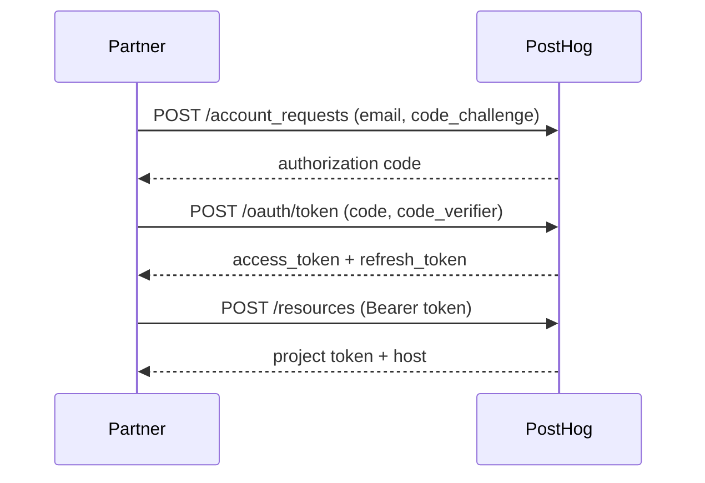
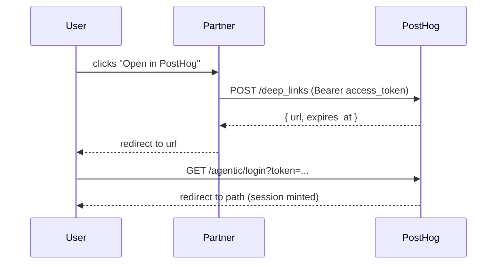
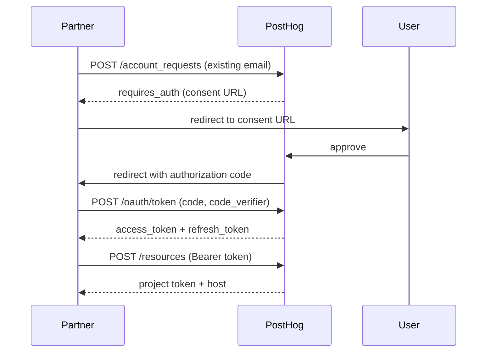

PostHog's provisioning API lets you create PostHog accounts for your users and deep link them into their PostHog project.

It's intended for partners and platform integrations. If you're integrating your own app with your own PostHog account, you probably want [OAuth](/docs/api/oauth) or a [personal API key](/docs/api/personal-api-keys) instead.

Jump to the [full Node.js example](#full-example) to see the complete flow in code.

## How it works

The flow uses OAuth 2.0 with PKCE (Proof Key for Code Exchange), so there are no shared secrets to manage.
Your application is identified by a metadata document hosted on your domain.

### Onboarding (once per user)

```
1. POST /account_requests  →  authorization code
2. POST /oauth/token        →  access + refresh tokens
3. POST /resources          →  project token + host
```


```mermaid
sequenceDiagram
    participant P as Partner
    participant PH as PostHog

    P->>PH: POST /account_requests (email, code_challenge)
    PH-->>P: authorization code

    P->>PH: POST /oauth/token (code, code_verifier)
    PH-->>P: access_token + refresh_token

    P->>PH: POST /resources (Bearer token)
    PH-->>P: project token + host
```

### Deep linking (per click, after onboarding)

Reuses the access token from onboarding to mint a single-use URL that logs the user into their PostHog project.

```
4. POST /deep_links  →  single-use URL (10 min TTL)
```


```mermaid
sequenceDiagram
    participant U as User
    participant P as Partner
    participant PH as PostHog

    U->>P: clicks "Open in PostHog"
    P->>PH: POST /deep_links (Bearer access_token)
    PH-->>P: { url, expires_at }
    P-->>U: redirect to url
    U->>PH: GET /agentic/login?token=...
    PH-->>U: redirect to path (session minted)
```

## Set up as a partner

### Host a CIMD metadata document

PostHog uses [Client ID Metadata Documents](https://datatracker.ietf.org/doc/draft-ietf-oauth-client-id-metadata-document/) (CIMD) for partner registration. There's no signup form to fill out – you host a JSON document at an HTTPS URL on your domain, and that URL becomes your `client_id`.

Create a JSON file at a stable HTTPS URL, for example `https://yourapp.com/.well-known/posthog-client.json`:

```json
{
  "client_id": "https://yourapp.com/.well-known/posthog-client.json",
  "client_name": "Your App Name",
  "redirect_uris": ["https://yourapp.com/callbacks/posthog"],
  "logo_uri": "https://yourapp.com/logo.png",
  "token_endpoint_auth_method": "none",
  "grant_types": ["authorization_code"],
  "response_types": ["code"],
  "contacts": ["integrations@yourapp.com"],
  "com.posthog": {
    "provisioning": true
  }
}
```

Requirements:

- **`client_id`** must exactly match the URL where this document is hosted.
- **`com.posthog.provisioning`** must be `true` to use the provisioning API. Your `client_id` is a public URL, so a request that names it proves nothing about who sent it. Declaring the opt-in in the document, which only you can publish, is what grants your app provisioning access. It must be the JSON literal `true`, not the string `"true"`.
- **`redirect_uris`** is required and must contain at least one HTTPS URI. This is where PostHog redirects existing users during the consent flow.
- **`logo_uri`** (optional) must be HTTPS if provided.
- **`contacts`** (optional) is a list of up to 5 email addresses for whoever runs the integration. Add one. It is how PostHog reaches you if your client starts failing, and a shared address such as `integrations@yourapp.com` outlasts any one engineer. Addresses PostHog cannot parse are ignored.
- **`token_endpoint_auth_method`** must be `"none"` (a public client, no client secret) or `"private_key_jwt"` with an HTTPS `jwks_uri`. With `private_key_jwt`, your app authenticates by signing an assertion with your own key, which also raises your [rate limits](#rate-limits).
- The document must be served with `Content-Type: application/json` and be under 5 KB.
- The URL must use HTTPS, include a path component, and must not contain query parameters or fragments.

PostHog fetches and caches this document automatically.
Subsequent requests reuse the cached version and refresh it in the background based on your `Cache-Control: max-age` header (clamped between 5 minutes and 24 hours, default 1 hour).

### Register your app

Once your metadata document is live, register it. PostHog fetches the document, validates it, and turns on provisioning access if it declares `com.posthog.provisioning`.

This call is not authenticated, because an app that hasn't registered yet has no credential to present. That's why the opt-in lives in your document rather than in this request.

```bash
curl -X POST https://us.posthog.com/api/agentic/provisioning/client_registration \
  -H "Content-Type: application/json" \
  -H "API-Version: 0.1d" \
  -d '{"client_id": "https://yourapp.com/.well-known/posthog-client.json"}'
```

**Response** (HTTP 200):

```json
{
  "client_id": "https://yourapp.com/.well-known/posthog-client.json",
  "registered": true,
  "client_type": "public",
  "token_endpoint_auth_method": "none",
  "jwks_uri": null,
  "scopes": ["insight:read", "project:read"],
  "provisioning": {
    "active": true,
    "can_create_accounts": true,
    "can_provision_resources": true
  },
  "capabilities": {
    "account_requests": true,
    "github_grants": false,
    "wizard_runs": false
  },
  "checks": [
    { "name": "metadata_document", "ok": true, "detail": "Fetched and validated" },
    { "name": "provisioning_enabled", "ok": true, "detail": "Active" },
    {
      "name": "jwks",
      "ok": true,
      "detail": "No jwks_uri, so this client authenticates with PKCE only and cannot use the GitHub grant endpoints"
    }
  ]
}
```

`scopes` is your [scope ceiling](#declare-oauth-scopes-for-your-app-optional): the scopes you declared, or every scope a user can grant if you declared none. `capabilities` says which endpoints you can call, including the ones PostHog has to enable for you.

Each check is reported separately, so a setup problem names its own cause instead of arriving as a bare 401 later. If registration fails, you get HTTP 400 with `"registered": false`, the same `checks` array, and an `error` object whose message is the first failed check.

Call this endpoint again whenever you want to re-check your setup. It re-fetches your document and re-reports every check. Registering again never reactivates an app PostHog has deactivated.

You can also verify a signed assertion end to end by sending `client_assertion` and `client_assertion_type`, which is worth doing once before you depend on `private_key_jwt`. Verifying consumes the assertion's `jti`, so mint a fresh one for the check rather than reusing it afterwards.

Until your app is registered, the other endpoints return HTTP 401 with a message pointing back here.

### Link your partner app to a PostHog organization (optional)

By default, a CIMD partner app is unverified.
You can link the app to a PostHog organization with a verification token, which raises your [rate limits](#rate-limits) and surfaces the partner integration to that org's admins.

1. In PostHog, go to **Organization settings → CIMD verification tokens** and click **Create token**. Copy the `phvt_…` value – it's only shown once.
2. Add the token inside a `com.posthog` namespace in your CIMD metadata document:

   ```json
   {
     "client_id": "https://yourapp.com/.well-known/posthog-client.json",
     "client_name": "Your App Name",
     "redirect_uris": ["https://yourapp.com/callbacks/posthog"],
     "logo_uri": "https://yourapp.com/logo.png",
     "token_endpoint_auth_method": "none",
     "grant_types": ["authorization_code"],
     "response_types": ["code"],
     "com.posthog": {
       "provisioning": true,
       "verification_token": "phvt_..."
     }
   }
   ```

3. The next time PostHog refreshes the metadata document, the app is linked to the matching organization and your rate limits go up.

The token is only used to prove ownership of the partner app – it isn't sent on API requests.
You can rotate or revoke a token at any time from the same settings page.
Revocation clears the link on the next metadata refresh, so a leaked or stale token can't keep an app linked to your org.

> **Note:** The legacy top-level `posthog_verification_token` field is still supported as a fallback. PostHog reads `com.posthog.verification_token` first and falls back to the top-level field if the nested one is absent or unrecognized. New integrations should use the `com.posthog` namespace.

### Declare OAuth scopes for your app (optional)

You can declare which OAuth scopes your partner app needs by adding a `scopes` field inside the `com.posthog` namespace. This sets a scope ceiling – tokens issued to your app are limited to these scopes.

```json
{
  "client_id": "https://yourapp.com/.well-known/posthog-client.json",
  "client_name": "Your App Name",
  "redirect_uris": ["https://yourapp.com/callbacks/posthog"],
  "token_endpoint_auth_method": "none",
  "grant_types": ["authorization_code"],
  "response_types": ["code"],
  "com.posthog": {
    "provisioning": true,
    "verification_token": "phvt_...",
    "scopes": ["insight:read", "project:read", "person:read"]
  }
}
```

Only scopes a user can grant on the consent screen are accepted – see [available scopes](#available-scopes) for the full list. Any scope PostHog reserves for internal use, or doesn't recognize, is dropped. If every scope you declare is dropped (none are grantable), registration is rejected rather than falling back to an empty ceiling, so make sure at least one declared scope is on the available list.

If `com.posthog.scopes` is omitted, your app can request any scope a user can grant. When present, the declared scopes are applied on both initial registration and every subsequent metadata refresh. A scope ceiling is a cap, not a grant – each scope still requires user consent at the authorization step.

CIMD app scopes are managed via the metadata document and are read-only in the PostHog admin UI.

#### Scopes a user can decline

Everything in `scopes` is required, and the user sees it locked on the consent screen. If part of what you ask for is for a feature they may not want, put those scopes in `optional_scopes` instead. Those appear as declinable, and the user can approve the rest without them.

```json
"com.posthog": {
  "provisioning": true,
  "scopes": ["insight:read", "project:read"],
  "optional_scopes": ["session_recording:read"]
}
```

Your ceiling is both lists together, so a token can carry anything in either one, and never anything outside them. Check the scopes on the token you get back before using a feature that depends on a declinable scope, because the user may have said no to it.

`optional_scopes` needs a non-empty `scopes` alongside it: an app offering extras has to declare the base they sit on top of. Both lists are filtered the same way, so an unrecognized or internal scope is dropped from either. Unlike `scopes`, an `optional_scopes` list that ends up empty is fine, and just means you offer no declinable extras.

## API reference

All endpoints are on `https://us.posthog.com` (US region) or `https://eu.posthog.com` (EU region).

Every request must include the `API-Version: 0.1d` header.

### Step 1: Create an account

Create a PostHog account for a user by email. If the user is new, PostHog creates the account and returns an authorization code immediately. If the user already exists, the response tells you to redirect them for consent.

Generate a PKCE code verifier and challenge before making this request:

```bash
# Generate PKCE values
CODE_VERIFIER=$(openssl rand -base64 32 | tr -d '=' | tr '+/' '-_')
CODE_CHALLENGE=$(echo -n "$CODE_VERIFIER" | openssl dgst -sha256 -binary | openssl base64 | tr -d '=' | tr '+/' '-_')
```

```bash
BODY=$(cat <<JSON
{
  "id": "req_unique_request_id",
  "email": "user@example.com",
  "name": "Jane Doe",
  "client_id": "https://yourapp.com/.well-known/posthog-client.json",
  "code_challenge": "$CODE_CHALLENGE",
  "code_challenge_method": "S256",
  "configuration": {
    "region": "US",
    "organization_name": "Acme Corp"
  }
}
JSON
)

curl -X POST https://us.posthog.com/api/agentic/provisioning/account_requests \
  -H "Content-Type: application/json" \
  -H "API-Version: 0.1d" \
  -d "$BODY"
```

**Request fields:**

| Field                             | Type   | Required | Description                                                                              |
| --------------------------------- | ------ | -------- | ---------------------------------------------------------------------------------------- |
| `id`                              | string | Yes      | Your unique request ID (for idempotency)                                                 |
| `email`                           | string | Yes      | User's email address                                                                     |
| `name`                            | string | No       | User's full name                                                                         |
| `client_id`                       | string | Yes      | Your CIMD metadata URL                                                                   |
| `code_challenge`                  | string | Yes      | Base64url-encoded SHA-256 hash of your code verifier (43-128 chars)                      |
| `code_challenge_method`           | string | Yes      | Must be `"S256"`                                                                         |
| `scopes`                          | list   | No       | OAuth scopes to request for the access token. See [available scopes](#available-scopes). |
| `configuration.region`            | string | No       | `"US"` (default) or `"EU"`                                                               |
| `configuration.organization_name` | string | No       | Organization name (defaults to `"Partner (email)"`)                                      |

**New user response** (HTTP 200):

```json
{
  "id": "req_unique_request_id",
  "type": "oauth",
  "oauth": {
    "code": "abc123...authorization_code"
  }
}
```

The user receives a welcome email with a link to set their password and access their dashboard.

**Existing user response** (HTTP 200):

```json
{
  "id": "req_unique_request_id",
  "type": "requires_auth",
  "requires_auth": {
    "url": "https://us.posthog.com/api/agentic/authorize?state=xyz..."
  }
}
```

When `type` is `requires_auth`, redirect the user to the provided URL. After they approve, PostHog redirects them to your `redirect_uris` with a `code` query parameter that you use in step 2.

> **Note:** `requires_auth` is a final answer, not a retryable error. The email already belongs to a PostHog user, so we cannot link the account until that person approves it. The same request returns `requires_auth` every time until they do, and retrying it makes no progress. In an automated test suite with nobody to approve, use a new email address per run, or complete the consent redirect once and reuse the tokens it returns.


```mermaid
sequenceDiagram
    participant P as Partner
    participant PH as PostHog
    participant U as User

    P->>PH: POST /account_requests (existing email)
    PH-->>P: requires_auth (consent URL)

    P->>U: redirect to consent URL
    U->>PH: approve
    PH->>P: redirect with authorization code

    P->>PH: POST /oauth/token (code, code_verifier)
    PH-->>P: access_token + refresh_token

    P->>PH: POST /resources (Bearer token)
    PH-->>P: project token + host
```

### Step 2: Exchange the code for tokens

Exchange the authorization code for an access token and refresh token. The token endpoint uses standard `application/x-www-form-urlencoded` encoding.

```bash
curl -X POST https://us.posthog.com/api/agentic/oauth/token \
  -H "Content-Type: application/x-www-form-urlencoded" \
  -H "API-Version: 0.1d" \
  -d "grant_type=authorization_code&code=abc123...authorization_code&code_verifier=$CODE_VERIFIER"
```

**Request fields:**

| Field           | Type   | Required | Description                                                            |
| --------------- | ------ | -------- | ---------------------------------------------------------------------- |
| `grant_type`    | string | Yes      | Must be `"authorization_code"`                                         |
| `code`          | string | Yes      | The authorization code from step 1                                     |
| `code_verifier` | string | Yes      | The original PKCE code verifier (must match the challenge from step 1) |

**Response** (HTTP 200):

```json
{
  "token_type": "bearer",
  "access_token": "pha_abc123...",
  "refresh_token": "phr_def456...",
  "expires_in": 3600,
  "account": {
    "id": "01234567-89ab-cdef-0123-456789abcdef",
    "payment_credentials": "orchestrator",
    "available_teams": [
      {
        "id": 12345,
        "name": "Default project",
        "organization_id": "01234567-89ab-cdef-0123-456789abcdef",
        "organization_name": "Acme Corp"
      }
    ]
  }
}
```

Authorization codes expire after 5 minutes and can only be used once.
Access tokens expire after 1 hour. Use the refresh token to get new tokens.

**Token endpoint errors** use the standard OAuth 2.0 format:

```json
{
  "error": "invalid_grant",
  "error_description": "Invalid or expired authorization code"
}
```

### Step 3: Provision a project

Use the access token to provision a PostHog project and get credentials.

```bash
curl -X POST https://us.posthog.com/api/agentic/provisioning/resources \
  -H "Content-Type: application/json" \
  -H "Authorization: Bearer pha_abc123..." \
  -H "API-Version: 0.1d" \
  -d '{
    "service_id": "analytics",
    "label_prefix": "Acme Co",
    "configuration": {
      "project_name": "My App - Production"
    }
  }'
```

**Request fields:**

| Field | Type | Required | Description |
|---|---|---|---|
| `service_id` | string | No | The plan to provision. `"analytics"` (default) provisions a standard project. `"free"` and `"pay_as_you_go"` set the billing plan explicitly. |
| `label_prefix` | string | No | Label prefix for the provisioned personal API key, up to 25 characters, used only when a personal API key is issued (off by default). When issued, the key is labeled `{label_prefix} - {team_name}`; if omitted, empty, or whitespace-only, just the team name. |
| `configuration.project_name` | string | No | Project name (defaults to `"Default project"`) |

**Response** (HTTP 200):

```json
{
  "status": "complete",
  "id": "12345",
  "service_id": "analytics",
  "complete": {
    "access_configuration": {
      "api_key": "phc_abc123...",
      "host": "https://us.posthog.com"
    }
  }
}
```

**Response fields:**

| Field | Description |
|---|---|
| `api_key` | The project token (starts with `phc_`) – use this to initialize PostHog SDKs |
| `host` | The API host (`https://us.posthog.com` or `https://eu.posthog.com`) |

For authenticated REST API calls, use the OAuth `access_token` from [Step 2](#step-2-exchange-the-code-for-tokens) as a `Bearer` token. It carries the [scopes](#available-scopes) you requested in the account request. Provisioning does not return a `personal_api_key` in this response.

### Deep linking

For recurring deep links from your application into PostHog – the most common case is an "Open in PostHog" button on a user's connected project – use the deep-link endpoint. Each call returns a short-lived, single-use URL that logs the user into their PostHog project on click. There's no consent screen and no email-mismatch friction: the URL mints a fresh PostHog session for the right user, overriding any other session the browser happens to have.

```bash
curl -X POST https://us.posthog.com/api/agentic/provisioning/deep_links \
  -H "Content-Type: application/json" \
  -H "Authorization: Bearer pha_abc123..." \
  -H "API-Version: 0.1d" \
  -d '{
    "path": "/project/12345/replay/019e6d10-c3b0-7000-8000-000000000000"
  }'
```

Authenticate with the `access_token` you got from [Step 2](#step-2-exchange-the-code-for-tokens) – the same Bearer credential you use for `/resources`. The token is scoped to a single team, so the resulting deep link lands the user in the correct project.

**Request fields:**

| Field | Type | Required | Description |
|---|---|---|---|
| `path` | string | No | The in-app path to land the user on after login, for example `/project/12345/replay/<recording_id>`. Must be a relative, same-origin path beginning with a single `/`. If omitted, the link lands on the project home (`/project/<team_id>`). |
| `purpose` | string | No | Free-form label recorded for your own analytics. Defaults to `dashboard`. It does not affect where the link lands – use `path` for that. |

The `path` is validated when the link is minted and again when it's opened. PostHog rejects open-redirect forms (absolute URLs, protocol-relative `//`, backslashes, and `javascript:`) as well as control characters and whitespace. To find the path for a destination, open it in PostHog and copy everything after the host, including the leading `/`.

**Response:**

```json
{
  "purpose": "dashboard",
  "url": "https://us.posthog.com/agentic/login?token=...&team_id=12345",
  "expires_at": "2026-05-20T21:00:00Z"
}
```

The returned `url` is valid for 10 minutes and can only be opened once, so don't pre-render it as the button's `href`. Wire the button click to your backend, call `/deep_links` there, then redirect the user to the returned URL.

#### Requires a trusted partner record

This endpoint is gated on the `provisioning_can_issue_deep_links` flag on your partner record, which is only enabled for partners admin-onboarded by PostHog. If you get a `deep_links_not_enabled` 403, ask PostHog to enable it for your CIMD app.

Deep links also require `private_key_jwt` client authentication. A public client, identified only by a client_id anyone can send, has no deep-link budget because a deep link mints a full PostHog session.

### Rotate project credentials

Rotate the project token for an existing provisioned project:

```bash
curl -X POST https://us.posthog.com/api/agentic/provisioning/resources/12345/rotate_credentials \
  -H "Content-Type: application/json" \
  -H "Authorization: Bearer pha_abc123..." \
  -H "API-Version: 0.1d" \
  -d '{
    "label_prefix": "Acme Co"
  }'
```

**Request fields:**

| Field | Type | Required | Description |
|---|---|---|---|
| `label_prefix` | string | No | Label prefix for the personal API key, up to 25 characters, used only when a personal API key is issued (off by default). When issued, the key is labeled `{label_prefix} - {team_name}`; if omitted, empty, or whitespace-only, just the team name. |

The response has the same shape as the project provisioning response and includes the rotated `api_key` and `host`.

### Refresh tokens

Access tokens expire after 1 hour. Use the refresh token to get new credentials:

```bash
curl -X POST https://us.posthog.com/api/agentic/oauth/token \
  -H "Content-Type: application/x-www-form-urlencoded" \
  -H "API-Version: 0.1d" \
  -d "grant_type=refresh_token&refresh_token=phr_def456..."
```

**Response** (HTTP 200):

```json
{
  "token_type": "bearer",
  "access_token": "pha_new_token...",
  "refresh_token": "phr_new_refresh...",
  "expires_in": 3600
}
```

Each refresh token is single-use. The response includes a new refresh token for subsequent refreshes. Refreshing can only keep or narrow a token's scopes, never add them. To grant additional scopes, request them in a new account request; they apply to connections provisioned afterward.

### Available scopes

The `scopes` field in the account request controls what permissions the access token receives. If omitted, a default set of scopes is granted. The default set does not include every scope below, so explicitly request the scopes your integration needs. Available scopes:

| Scope | Description |
|---|---|
| `customer_journey:read` | Read customer journey data |
| `query:read` | Execute read-only queries |
| `session_recording:read` | Read session recordings |
| `conversation:read` | Read PostHog AI conversations |
| `conversation:write` | Create and update PostHog AI conversations |
| `experiment:read` | Read experiments |
| `feature_flag:read` | Read feature flags |
| `insight:read` | Read insights |
| `organization:read` | Read organization details |
| `person:read` | Read person data |
| `project:read` | Read project settings |
| `ticket:read` | Read tickets |
| `ticket:write` | Create and update tickets |
| `user:read` | Read user information |
| `hog_flow:read` | Read Hog flows |
| `hog_flow:write` | Create and update Hog flows |

## What the user gets

When you provision a new account, the user receives:

- A welcome email with a link to set their password.
- Full dashboard access at [us.posthog.com](https://us.posthog.com) (or [eu.posthog.com](https://eu.posthog.com) for EU).
- The PostHog [free tier](/pricing) across all products – no credit card required.

Your integration gets back the project token and host, so you can start sending events the moment the API call returns.

## Error handling

Provisioning endpoints (account_requests, resources) return errors in this format:

```json
{
  "type": "error",
  "error": {
    "code": "error_code",
    "message": "Human-readable description"
  }
}
```

The token endpoint uses the standard OAuth 2.0 error format instead:

```json
{
  "error": "error_code",
  "error_description": "Human-readable description"
}
```

Common error codes:

| Code | HTTP Status | Description |
|---|---|---|
| `invalid_request` | 400 | Missing or invalid field |
| `unauthorized` | 401 | Authentication failed |
| `registration_failed` | 400 | [Registration](#register-your-app) did not complete. The `checks` array in the same response says which step failed |
| `forbidden` | 403 | Partner not authorized for this action |
| `expired` | 400 | Account request has expired |
| `invalid_grant` | 400 | Authorization code is invalid or expired (token endpoint) |
| `invalid_label_prefix` | 400 | `label_prefix` is not a string, is longer than 25 characters after trimming, or contains control or Unicode format characters |
| `invalid_path` | 400 | Deep-link `path` is not a relative, same-origin in-app path beginning with a single `/` |
| `invalid_scope` | 400 | Unrecognized scope requested |
| `rate_limited` | 429 | Rate limit exceeded. The `Retry-After` header says how many seconds to wait. See [rate limits](#rate-limits). |
| `account_creation_failed` | 500 | Server error during account creation |

## Rate limits

Every provisioning endpoint has a per-partner budget: a burst you can spend at once, refilling continuously at an hourly rate. There is no fixed window, so you never wait for the top of the hour. When you run out, the response is a 429 with a `Retry-After` header saying exactly how many seconds until your next request can succeed.

Requests that fail validation (4xx errors like `invalid_request`) are refunded, so debugging an integration doesn't spend your budget.

### Your tier

Budgets scale with how strongly your app identifies itself, on two axes:

| Client authentication | Not linked to an org | Linked via a [verification token](#link-your-partner-app-to-a-posthog-organization-optional) |
| --- | --- | --- |
| `none` (public, PKCE) | 1x | 2x |
| `private_key_jwt` | 5x | 10x |

Both upgrades are self-serve and take effect on your next request: declare `private_key_jwt` with a `jwks_uri` in your metadata document, or add a verification token. Nothing to wait for and nobody to ask.

### Budgets

At the 1x tier:

| Endpoints | Burst | Refill |
| --- | --- | --- |
| Account requests | 5 | 10/hour |
| Project provisioning (`/resources`) | 10 | 30/hour |
| Everything else (token exchange, token refresh, reads, credential rotation, deep links) | 30 | 120/hour |

So account requests, the tightest budget, run at 10/20/50/100 per hour across the four tiers. Token refreshes have their own budget, separate from token exchanges, so keeping many users' tokens alive never competes with onboarding new ones.

Limits are per region: US and EU count separately.

**[Registration](#register-your-app)** is limited separately, because it fetches your document while you wait:

- 30 registration calls per hour per `client_id`
- 120 registration calls per hour per IP
- 5 requests per minute per IP, and 10 per hour per IP, for a `client_id` PostHog has never seen
- 100 new client registrations per hour globally
- 5 new client registrations per domain per hour

If the top tier still isn't enough for production use, open a [support request](https://us.posthog.com/#panel=support%3Asupport%3Alogin%3A%3Atrue) in the app, choosing **Authentication** as the topic. PostHog can set per-endpoint overrides for your app.

### Check your limits

Every response that counted against a budget includes `RateLimit-Limit`, `RateLimit-Remaining`, and `RateLimit-Reset` headers, so you can pace requests instead of reacting to 429s.

To see everything at once, call the limits endpoint. It returns your tier, why you have it, and every endpoint's budget with current headroom.

The endpoint is `POST` only, and you have to prove the request is yours. Send an access token, or authenticate as your client the same way you do at the token endpoint:

```bash
# With an access token. Public clients use this after their first token exchange.
curl -X POST https://us.posthog.com/api/agentic/provisioning/limits \
  -H "Authorization: Bearer pha_abc123..."

# Or as a private_key_jwt client, with the signed assertion in the form body
curl -X POST https://us.posthog.com/api/agentic/provisioning/limits \
  -d "client_id=https://yourapp.com/.well-known/posthog-client.json" \
  -d "client_assertion_type=urn:ietf:params:oauth:client-assertion-type:jwt-bearer" \
  -d "client_assertion=eyJhbGci..."
```

A `client_id` on its own is not enough. Your `client_id` is published, so accepting it here would let anyone read your limits and spend your budget for this endpoint. Requests that only carry a `client_id` get a 401.

**Response:**

```json
{
  "tier": "public_attested",
  "tier_basis": {
    "client_authentication": "none",
    "attested": true
  },
  "endpoints": {
    "account_requests": { "per_hour": 20, "burst": 10, "remaining": 9, "reset": 180 },
    "token_exchanges": { "per_hour": 40, "burst": 20, "remaining": 20, "reset": 0 },
    "deep_links": { "blocked": true }
  }
}
```

`remaining` is whole tokens available now, and `reset` is seconds until the budget is full again. A `blocked` endpoint is unavailable at your tier; an `unlimited` one has a PostHog-set override.

## Full example

Here's a complete example in Node.js:

```javascript
import crypto from "node:crypto";

const CLIENT_ID = "https://yourapp.com/.well-known/posthog-client.json";
const BASE_URL = "https://us.posthog.com";

async function provisionPostHogAccount(email, name) {
  // Generate PKCE values
  const codeVerifier = crypto.randomBytes(32).toString("base64url");
  const codeChallenge = crypto.createHash("sha256").update(codeVerifier).digest("base64url");

  // Step 1: Create account
  const accountRes = await fetch(`${BASE_URL}/api/agentic/provisioning/account_requests`, {
    method: "POST",
    headers: {
      "Content-Type": "application/json",
      "API-Version": "0.1d",
    },
    body: JSON.stringify({
      id: crypto.randomUUID(),
      email,
      name,
      client_id: CLIENT_ID,
      code_challenge: codeChallenge,
      code_challenge_method: "S256",
      configuration: { region: "US" },
    }),
  });

  if (!accountRes.ok) {
    const err = await accountRes.json();
    throw new Error(
      `Account request failed (${accountRes.status}): ${err.error?.message || JSON.stringify(err)}`,
    );
  }

  const account = await accountRes.json();

  if (account.type === "requires_auth") {
    // Existing user - redirect them to account.requires_auth.url
    return { type: "requires_auth", url: account.requires_auth.url };
  }

  if (account.type !== "oauth") {
    throw new Error(account.error?.message || "Unexpected response type");
  }

  // Step 2: Exchange code for tokens
  const tokenRes = await fetch(`${BASE_URL}/api/agentic/oauth/token`, {
    method: "POST",
    headers: {
      "Content-Type": "application/x-www-form-urlencoded",
      "API-Version": "0.1d",
    },
    body: new URLSearchParams({
      grant_type: "authorization_code",
      code: account.oauth.code,
      code_verifier: codeVerifier,
    }),
  });

  if (!tokenRes.ok) {
    const err = await tokenRes.json();
    throw new Error(
      `Token exchange failed (${tokenRes.status}): ${err.error_description || JSON.stringify(err)}`,
    );
  }

  const tokens = await tokenRes.json();

  // Step 3: Provision a project
  const resourceRes = await fetch(`${BASE_URL}/api/agentic/provisioning/resources`, {
    method: "POST",
    headers: {
      "Content-Type": "application/json",
      Authorization: `Bearer ${tokens.access_token}`,
      "API-Version": "0.1d",
    },
    body: JSON.stringify({
      service_id: "analytics",
      label_prefix: "Acme Co",
      configuration: { project_name: "Production" },
    }),
  });

  if (!resourceRes.ok) {
    const err = await resourceRes.json();
    throw new Error(
      `Resource provisioning failed (${resourceRes.status}): ${err.error?.message || JSON.stringify(err)}`,
    );
  }

  const resource = await resourceRes.json();

  return {
    type: "provisioned",
    apiKey: resource.complete.access_configuration.api_key,
    host: resource.complete.access_configuration.host,
    projectId: resource.id,
    accessToken: tokens.access_token,
    refreshToken: tokens.refresh_token,
  };
}
```

For the "Open in PostHog" button, call this from your click handler with the user's stored `access_token`, then redirect the browser to the returned URL. Pass a `path` to land the user on a specific page, or omit it to land on the project home:

```javascript
async function getDeepLinkUrl(accessToken, path) {
  const res = await fetch(
    `${BASE_URL}/api/agentic/provisioning/deep_links`,
    {
      method: 'POST',
      headers: {
        'Content-Type': 'application/json',
        Authorization: `Bearer ${accessToken}`,
        'API-Version': '0.1d',
      },
      body: JSON.stringify(path ? { path } : {}),
    }
  );

  if (!res.ok) {
    const err = await res.json();
    throw new Error(
      `Deep link request failed (${res.status}): ${err.error?.message || JSON.stringify(err)}`,
    );
  }

  const { url } = await res.json();
  return url;
}
```
