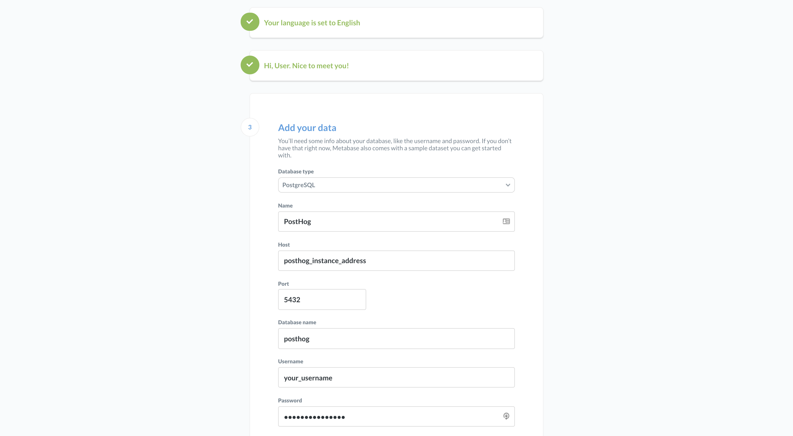
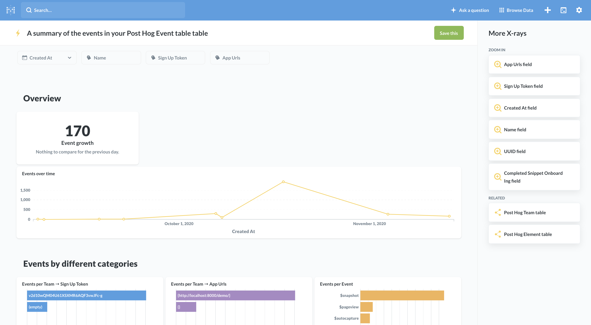

## Objective

Integrating PostHog with your Metabase instance.

## Why is this useful?

[Metabase](https://www.metabase.com/) is an open-source data explorer and Business Intelligence tool that lets you derive insights and build charts from your data with ease.

## Pre-Requisites

To follow this tutorial along, you should:

1. Have [deployed PostHog](/docs/deployment). 

**Important Note** 

Integrating with Metabase currently works only for self-hosted PostHog instances. Additionally, since Metabase does not support ClickHouse, you are only able to integrate it _directly_ with your PostHog database if your PostHog instance uses PostgreSQL for event data (i.e. you're not using our Enterprise Edition). 

If you're on EE, we still use Postgres for certain types of data which you could explore with Metabase, but you'll have no access to event data, for example. If using Metabase is essential to you, you could export the ClickHouse data to another Metabase-supported database. 

## Step-By-Step Instructions

### Metabase Setup

1. [Download and run Metabase](https://www.metabase.com/start/oss/) (it's free!)
    
    The easiest way to get started is with the Docker one-liner, getting you from 0 to Metabase in about 1 minute:
    ```shell
    docker run -d -p 3000:3000 --name metabase metabase/metabase
    ```

1. Running Metabase will start a server running in port 3000, but you can change this if you prefer to use another port. Access your instance by navigating to `<your_instance_address>.com:3000`.
1. This will open up a Metabase setup page where you can select your preferred language and create a new user.

### Connecting to PostHog

1. After you've create your user, Metabase will prompt you with a screen to connect to a database:

    <br /><br />

1. On this screen, you should select 'PostgreSQL' as the database, and add the details of your PostHog instance.

    **Host**

    If you're hosting Metabase and PostHog on the same server, your can use `localhost` as your 'Host'. Otherwise, this should be the address of your PostHog instance.

    **Port**

    Unless you have made changes to this during deployment, PostgreSQL listens on port 5432 by default.

    **Username**

    The username you used to create your database. Read [the next section](#for-posthog-docker-deployments) if your deployed PostHog with Docker.

    **Password**

    The password you used to create your database. Read [the next section](#for-posthog-docker-deployments) if your deployed PostHog with Docker.

1. Finish the setup and you're ready to start using Metabase! By default, the platform will already give you some views for the available data, but it's up to you how to go from there.

    <br /><br />


#### For PostHog Docker Deployments
    
If you deployed PostHog with Docker, some additional setup is necessary to make the connection with Metabase work. 

For security reasons, with our standard Docker deployment, we do not expose a port to connect to the database from outside the Docker container. As such, you need to edit your `docker-compose.yml` file to do this. 

##### db

First, you need to add a port mapping and a secure password to your `db` service:
```yaml
services:
    db:
        container_name: posthog_db
        environment:
            POSTGRES_DB: posthog 
            POSTGRES_PASSWORD: <your_db_password_here>
            POSTGRES_USER: posthog
        image: postgres:alpine
        volumes:
            - postgres-data:/var/lib/postgresql/data
        ports: # Add port mapping here
            - 5432:5432
# ...
```
Pro tip: You can generate a secure password with the following command:

```shell
openssl rand -hex 32
```

You can also change the username by modifying the `POSTGRES_USER` variable.

##### web

Then, you need to update your `web` service according to the credential changes you just made, like so:
```yaml
# ...
web:
    container_name: posthog_web
    depends_on:
        - db
        - redis
    environment:
        DATABASE_URL: postgres://<new_username>:<new_password>@db:5432/posthog
# ...
```

After restarting your container, your Postgres intance should now be accessible from outside, so you can connect to it from Metabase.