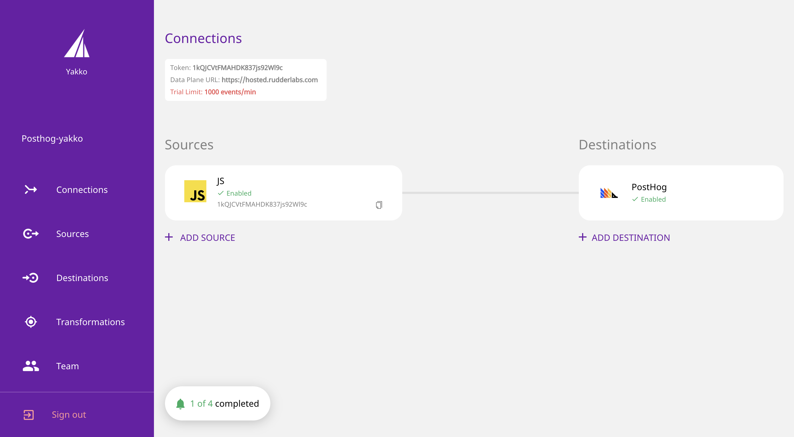
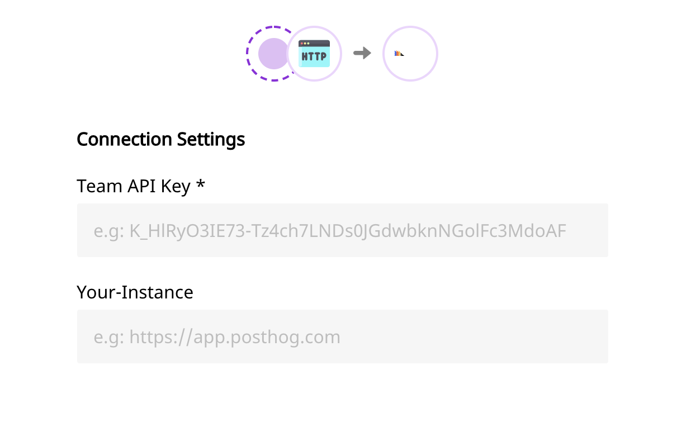

> **Note:** The [Official RudderStack Docs page for the PostHog integration](https://docs.rudderstack.com/destinations/posthog) provides a better overview of how to set up this integration.

## About RudderStack

RudderStack is an open-source, warehouse-first, customer data platform for developers. It allows you to collect and deliver customer event data to a variety of destinations such as data warehouses and analytics platforms.

#### Can PostHog with RudderStack do everything PostHog does by itself?

The PostHog integration with RudderStack gives you access to everything our [JS Library](/docs/integrate/client/js) can do, with the exception of autocapture. All features for your PostHog instance will be the same, but all RudderStack sends to PostHog are events you **manually** send. In addition, PostHog isn't able to show you our [toolbar](/docs/user-guides/toolbar). 

## Setting Up The Integration

0. Make sure you have a [RudderStack account](https://rudderstack.com/) **and** a PostHog account, either [self-hosted](/docs/deployment) or using [PostHog Cloud](https://app.posthog.com/signup).
1. [Integrate a RudderStack source for your events](https://docs.rudderstack.com/how-to-guides/adding-source-and-destination-rudderstack)
1. Select PostHog as your _destination_ for the selected source from the step above
1. Add your PostHog token and host details:
     
    
    
    
     
    
    > 'Team API Key' refers to your PostHog 'Project API Key' (token), that can be found in 'Project Settings'. **Do not use a Personal API Key for this.** 'Your Instance' refers to the address of your PostHog instance, which is `https://app.posthog.com` if you're on PostHog Cloud.
1. You're all set!

## Sending Events

To learn how to send events to PostHog with RudderStack, you should check out the [official RudderStack Docs for this integration](https://docs.rudderstack.com/destinations/posthog). 
