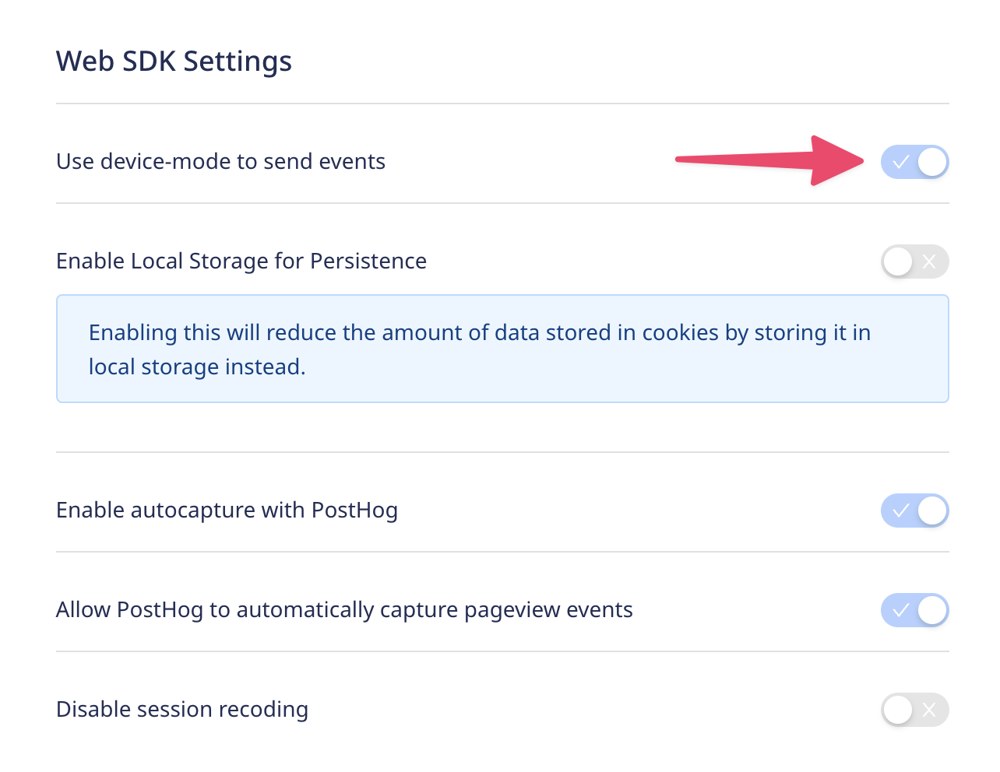

RudderStack is an open-source, customer data platform for developers. It allows you to collect and deliver customer event data to a variety of destinations across your growth, product, and marketing stack.

> Before integrating with Rudderstack, we recommend you read our [CDP integration guide](/docs/integrate/cdp) to understand the different options for integrating with PostHog.

## Setting up the Rudderstack Importer

Make sure you have a Rudderstack account **and** a PostHog account, using [PostHog Cloud](https://app.posthog.com/signup) or self-hosting.

1. From your RudderStack dashboard, add each source and select PostHog from the list of destinations.
2. Assign a name to your destination (e.g. PostHog production) and click Continue.
3. Add your PostHog 'Project API Key' as the Team API key (**Do not use a Personal API key**) and your host url as `Your-Instance` (`https://app.posthog.com` if you're on PostHog Cloud):
    
    - If it's a website or web app:
      1. In the rudderstack console set `Use device-mode to send events` to `true` so that the events originate from the client side. Additionally, this will enable the toolbar and heatmaps.
      2. Set `Enable autocapture with PostHog` to `true`. This will automatically capture events from your website or web app  
        
    - If it's not a website or web app (e.g. a mobile app or server), to use the full set of features such as feature flags and session recordings manually install the [PostHog SDK docs](/docs/integrate) in addition to adding PostHog as the event destination in Rudderstack.

For more information see the [Rudderstack guide for setting up PostHog](https://www.rudderstack.com/docs/destinations/streaming-destinations/posthog/setting-up-posthog/)

## Sending events to PostHog

Once you have set up Rudderstack and PostHog, you can use Rudderstack to send events to PostHog. You can send events through the Rudderstack API, or one of the Rudderstack libraries. For example, with javascript you can use the `analytics.track('Event Name')` function which will send the events to your Rudderstack destinations including PostHog.

For the full list of functions see the relevant SDK docs e.g. the [Javascript SDK](https://www.rudderstack.com/docs/sources/event-streams/sdks/rudderstack-javascript-sdk/supported-api/#track).
