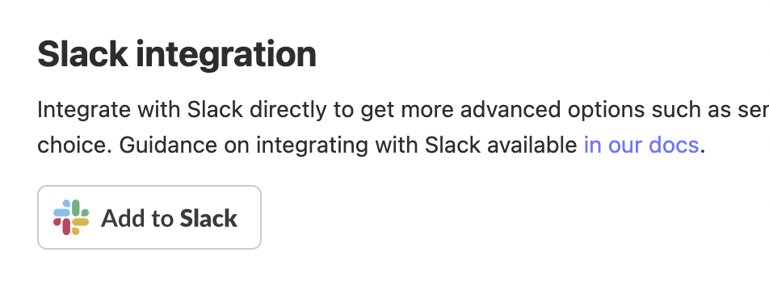
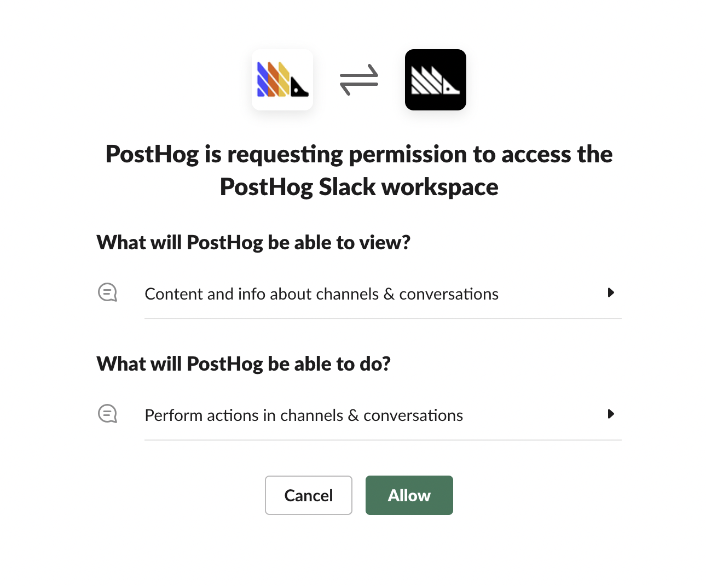

PostHog integrates with Slack to send notifications to channels of your choice via **Subscriptions**.

> 🤔 Webhooks for Events or Actions are currently configured differently. [See Slack Webhooks](/docs/integrate/webhooks/slack) for more info. 

### Getting started with Slack

> 🚧 For Self-hosted plans, you need to have first configured the Slack App in [instance settings](/docs/self-host/configure/slack).

To get started, go to [Project Settings](https://app.posthog.com/project/settings) and under the **Slack** section you will find a button to add the PostHog App to your Slack workspace of choice 

You will be redirected to Slack and prompted to understand what permissions you are giving PostHog. You can select your workspace from the top-right and upon pressing **Allow** will be redirected back to PostHog.

With that Slack is configured for your project! You can now [create a Subscription](/docs/user-guides/subscriptions#slack-subscriptions) and start getting Insights delivered to your favorite channels

### Troubleshooting

#### I can't select my Slack channel or I am not recieiving Subscriptions

In order for the PostHog Slack App to send messages to a channel it needs to be first added to it. To do this you can type `/invite` in the relevant channel and then select `Add Apps to this channel` which will then allow you to search for the PostHog app and add it.