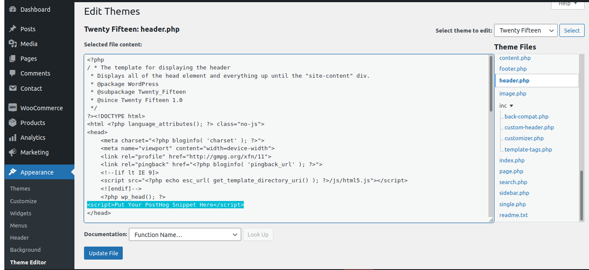

## Objective

Integrating PostHog with your WordPress site.

## Why is this useful?

Tracking how users use your [WordPress](https://www.wordpress.org/) website can help you improve the user experience, increase conversion rates, gain new insights, and identify what your users find most valuable.

## TLDR, the short version

1. [Deploy PostHog](/docs/deployment) or [signup for PostHog Cloud](https://app.posthog.com/signup).

2. Get your [PostHog snippet](/docs/integrate/client/snippet-installation) from your 'Project Settings' or the initial PostHog setup.

3. Add the PostHog snippet before the closing `</head>` tag in your `header.php` template file. This can be done in two ways:
    1. Access WordPress admin, navigate to 'Appearance' -> 'Theme Editor', select your theme, and select 'Theme Header'.
    2. Manually update the header template file. This is usually `wp-content/themes/your-theme/header.php`.

Read on for additional information.

## Pre-requisites

To follow this tutorial, you should:

1. Have [deployed PostHog](/docs/deployment) or be using [PostHog Cloud](https://app.posthog.com/signup).

## Step-by-step instructions

The instructions below detail how to use the WordPress built-in functionality for editing templates via the admin interface.

> Using the Theme Editor is very convenient, but you have to consider the potential draw-backs of having template files writable, which many prefer to disable for security purposes. Also, wrongfully editing a file may cause problems so be sure to perform appropriate backups before attempting this.

1. Get your [PostHog snippet](/docs/integrate/client/snippet-installation) from your 'Project Settings' or the initial PostHog setup.
2. Login to your WordPress admin dashboard.
3. Go to 'Appearance' -> 'Theme Editor'.
4. Select your theme in the editor drop-down menu to the right and click the `header.php` file in the file column to the right (see image below).

     
    
    
    
     
5. You should now see the contents of the `header.php` template file in the code editing view. It is recommended that you copy all the text/code and save it somewhere as a back-up.
6. Find the closing `</head>` in the code editor and paste the PostHog snippet before it (see above image).
7. Click the 'Update File' button at the bottom. You're good to go - PostHog should now be working on your WordPress website!

To confirm PostHog is configured correctly, visit your website and then check if the events from your session appear in PostHog. Note that this may take a few minutes.

## Alternative ways to install

There are alternative ways to installing the PostHog analytics snippet on WordPress:

* Use a WordPress header script insertion plug-in. Easy, but there are no official WordPress plug-ins for editing the header. Reviewing the quality of third-party plug-ins, including after they get updated by providers, is an additional responsibility. The benefit is that plug-ins can be easily turned on and off, and updated with a few clicks through the admin interface. 

* Some WordPress themes include additional functionality for inserting custom code into headers and footers. This is a convenient approach, so make sure to check if your theme has that option before installing a plug-in or editing `header.php`.

* Manually edit the header template file in WordPress. This is usually `header.php`. This gives you the most control, but requires backend access and re-editing in case of updates. If your theme auto-updates, you may lose your settings. Making a [Child Theme](https://developer.wordpress.org/themes/advanced-topics/child-themes/) is the recommended approach.