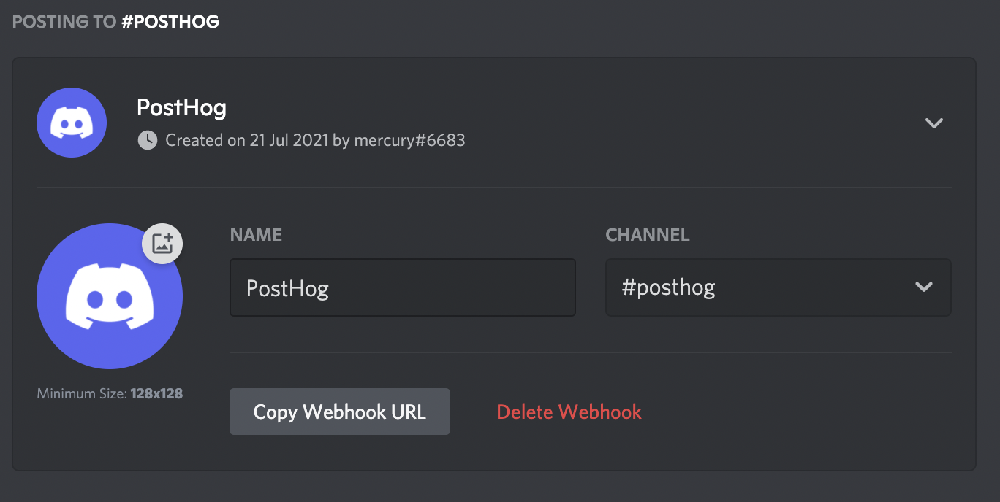
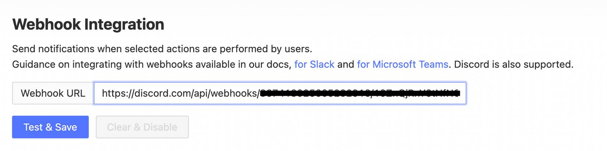

> For message formatting instructions, see [this dedicated page](/docs/integrate/webhooks/message-formatting).
## 1. Create an incoming webhook in Discord 

1. Navigate to the channel where you want to add the webhook and select 'Edit Channel' option from left navigation pane. 
1. Select 'Integerations' option from the left navigation pane. 
1. If Creating Webhook for first time, click "Create Webhook" button. 
1. If you have other webhooks, click "View Webhooks" and now click "New Webhook". 
1. Give any name you prefer (say PostHog). 
1. Your preferred channel would be appearing in 'Channel' option, If not select you preferred channel from drop-down menu.
1. Click "Copy Webhook URL" button to copy webhook into clipboard.  

It would look something like this. 

## 2. Setup Webhook in PostHog

1. Copy the Webhook URL into the PostHog Setup page:

    

1. Click "Test & Save" and you should receive message on discord. 

## 3. Add to Action

For each action that should be posted to Discord, select "Post to webhook when this action is triggered":

## 4. Celebrate

