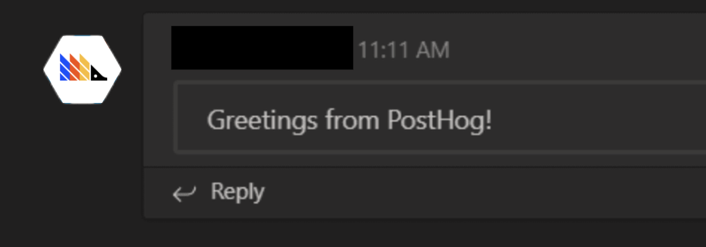

> For message formatting instructions, see [this dedicated page](/docs/integrate/webhooks/message-formatting).

## 1. Create an incoming webhook in Teams

1. Navigate to the channel where you want to add the webhook and select (•••) More Options from the top navigation bar.
1. Choose Connectors from the drop-down menu and search for Incoming Webhook.
1. Select the Configure button, provide a name, and, optionally, upload an image avatar for your webhook.
1. The dialog window will present a unique URL that will map to the channel. Make sure that you copy and save the URL—you will need to provide it to the outside service.
1. Select the Done button. The webhook will be available in the team channel.

[See the Microsoft Teams documentation for more info](https://docs.microsoft.com/en-us/microsoftteams/platform/webhooks-and-connectors/how-to/add-incoming-webhook#add-an-incoming-webhook-to-a-teams-channel).

## 2. Setup webhook in PostHog

Copy the Webhook URL into the PostHog Setup page:

## 3. Add to Action

For each Action that should be posted to Teams, select "Post to webhook when this action is triggered":

## 4. Celebrate!

