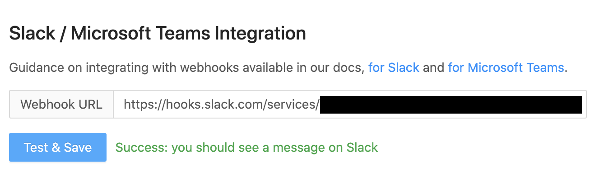

> For message formatting instructions, see [this dedicated page](/docs/integrate/webhooks/message-formatting).

## 1. Create app
Go to the [Slack page to create apps](https://api.slack.com/apps?new_app=1) and create a new app. Call it "PostHog" and connect it to the workspace of your choice.

Feel free to use an image from [here](/media) as the app's logo.

## 2. Create Webhook
Go to the 'Incoming Webhooks' page for your newly-created app and toggle 'Activate Incoming Webhooks' to turn it on. Then click on 'Add New Webhook to Workspace' and select the channel that the notifications will be posted to:

## 3. Setup webhook in PostHog
Copy the Webhook URL into the PostHog Setup page:

## 4. Add to Action

For each action that should be posted to Slack, select "Post to webhook when this action is triggered":

## 5. Celebrate!

