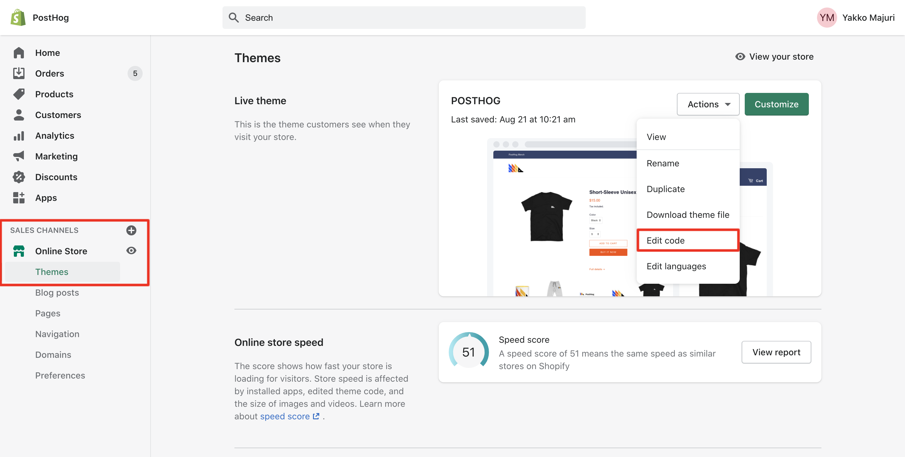
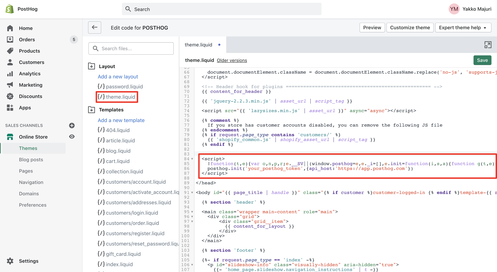
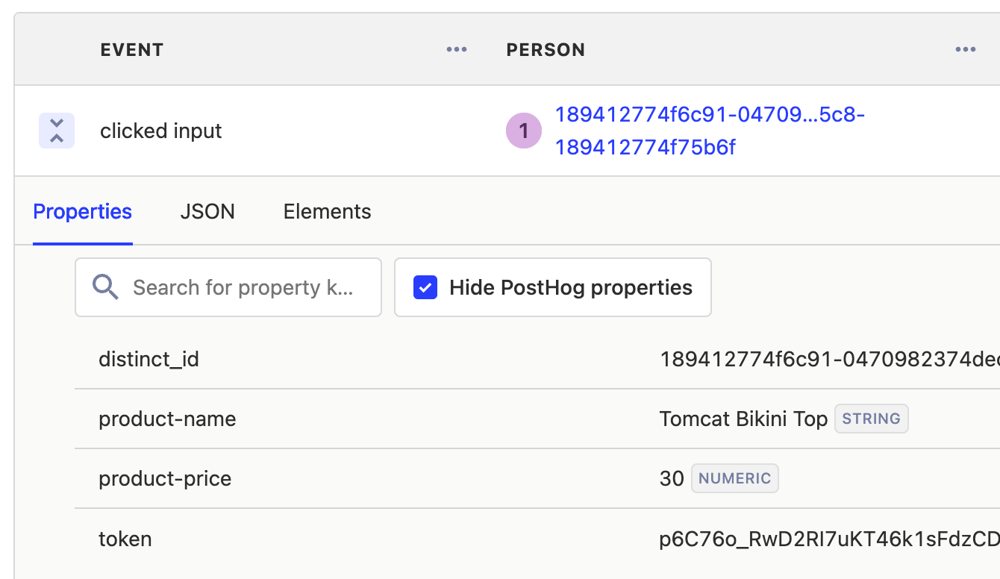
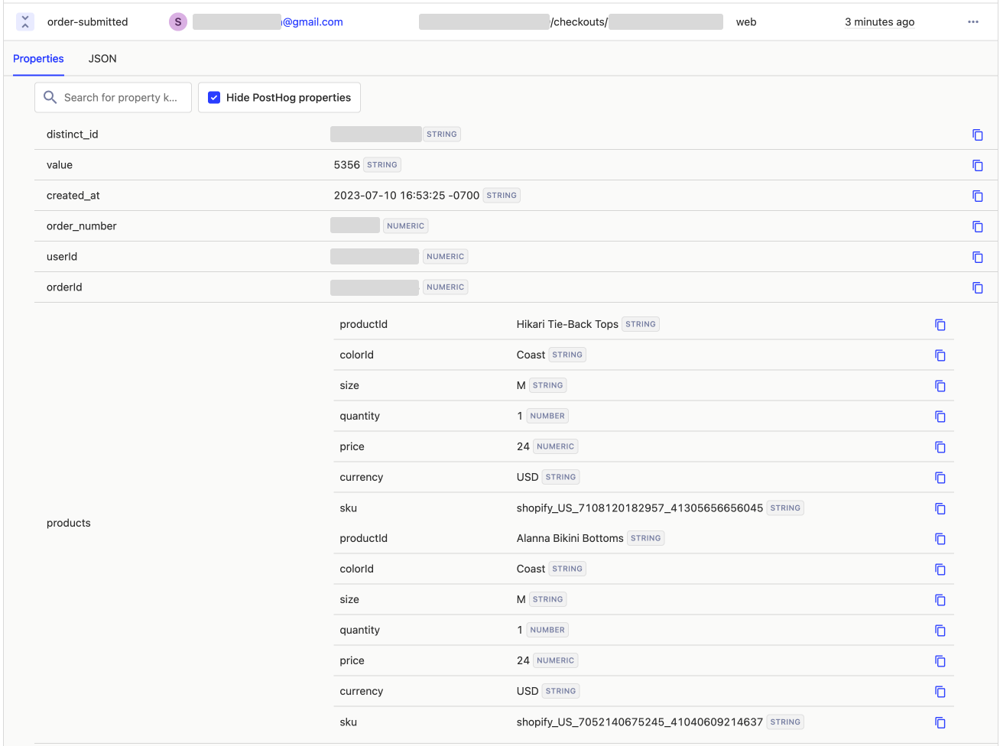

import eventLight from '../../images/tutorials/shopify/event-light.png';
import eventDark from '../../images/tutorials/shopify/event-dark.png';

Tracking your [Shopify](https://www.shopify.com/) store with PostHog can help you improve the user experience and increase conversion rates.

## Setting up a custom web pixel

The simplest way to add PostHog to Shopify is using a [custom web pixel](https://shopify.dev/docs/api/web-pixels-api#custom-web-pixels). To set this up, first, go to the [customer events](https://admin.shopify.com/settings/customer_events) tab in your store settings, click "Add custom pixel," and give your pixel a name.

Next, add code that contains:

1. The customer events you want to subscribe to. You can find a complete list in Shopify's [Web Pixels API documentation](https://shopify.dev/docs/api/web-pixels-api/standard-events).

2. Your PostHog JavaScript snippet which you can get from [your project settings](https://us.posthog.com/settings/project#snippet).

3. The rest of your PostHog capture logic. 

For example, we use a custom pixel in [our merch store](https://merch.posthog.com/) to identify customers and capture a `merch store order submitted` event with details like `userID`, `order_number`, `product_id`, `price`, and more.

```js
analytics.subscribe("checkout_completed", (event) => {
  !function(t,e){var o,n,p,r;e.__SV||(window.posthog=e,e._i=[],e.init=function(i,s,a){function g(t,e){var o=e.split(".");2==o.length&&(t=t[o[0]],e=o[1]),t[e]=function(){t.push([e].concat(Array.prototype.slice.call(arguments,0)))}}(p=t.createElement("script")).type="text/javascript",p.async=!0,p.src=s.api_host+"/static/array.js",(r=t.getElementsByTagName("script")[0]).parentNode.insertBefore(p,r);var u=e;for(void 0!==a?u=e[a]=[]:a="posthog",u.people=u.people||[],u.toString=function(t){var e="posthog";return"posthog"!==a&&(e+="."+a),t||(e+=" (stub)"),e},u.people.toString=function(){return u.toString(1)+".people (stub)"},o="capture identify alias people.set people.set_once set_config register register_once unregister opt_out_capturing has_opted_out_capturing opt_in_capturing reset isFeatureEnabled onFeatureFlags getFeatureFlag getFeatureFlagPayload reloadFeatureFlags group updateEarlyAccessFeatureEnrollment getEarlyAccessFeatures getActiveMatchingSurveys getSurveys onSessionId".split(" "),n=0;n<o.length;n++)g(u,o[n]);e._i.push([i,s,a])},e.__SV=1)}(document,window.posthog||[]);
  posthog.init('<ph_project_api_key>',{api_host:'<ph_instance_address>'})
  const checkout = event.data.checkout;

  posthog.identify(checkout.email, {
      email: checkout.email,
      first_name: checkout.billingAddress.firstName,
      last_name:  checkout.billingAddress.lastName,
    }
  )
  posthog.capture('merch store order submitted', {
    value: checkout.totalPrice.amount,
    created_at: event.timestamp,
    order_number: checkout.order.id,
    userId: event.clientId,
    order_id: checkout.order.id,
    products: checkout.lineItems.map((item) => {
      return {
        product_id: item.id,
        title: item.variant.product.title,
        quantity: item.quantity,
        price: item.variant.price.amount,
        currency: item.variant.price.currencyCode,
        sku: item.variant.sku,
        size: item.variant.product.size
      };
    }),
  })
});
```

With this, every time a Shopify `checkout_completed` event fires (when a user completes a purchase), PostHog captures the event.

<ProductScreenshot 
  imageLight={eventLight} 
  imageDark={eventDark} 
  alt="Shopify events in PostHog" 
/>

## Installing PostHog in a Shopify theme

To have unrestricted access to the features of PostHog in your Shopify store, you can install PostHog in your Shopify theme. To do this:

1. Get your PostHog JavaScript snippet from [your project settings](https://us.posthog.com/settings/project#snippet)
1. Login to your Shopify dashboard
1. Go to 'Online Store' -> 'Themes' (see image below)
1. On your theme, click 'Actions' -> 'Edit code' (see image below)



1. You should now be seeing a code editor. Click on `theme.liquid` under 'Layout' on the left sidebar (see image below)
1. Navigate until you see the closing `</head>` tag. Paste your snippet there, before that tag, like in the image below:



1. Click the green save button on the top right and you're good to go - PostHog should now capturing events on your Shopify store!

> To confirm PostHog is configured correctly, visit your store and then check if the events from your session appear in PostHog. This may take a few minutes.

### Advanced tracking

It can be useful to track additional events on your Shopify store, such as when a user adds an item to their cart or completes a purchase.

Although [autocapture](/docs/product-analytics/autocapture) does capture these events, you may need to add additional metadata. This information can be used in further analysis in aggregate or when understanding behavior of an individual user.

> The following requires some knowledge of HTML and Shopify's [Liquid templating engine](https://shopify.dev/docs/api/liquid).

#### Add data attributes to buttons

To track _which_ product a user adds to their cart, we can use a `data-ph-capture-attribute` on the 'Add to cart' button (generally in `product.liquid` in Shopify). While this still requires adding code, it's less involved than creating a custom event. For example, capturing the product title and price (divided by 100) looks like this:

```html
<input type="submit" class="add-to-cart-button" value="{{ 'products.product.add_to_cart' | t }}" 
    data-ph-capture-attribute-product-name="{{product.title}}" 
    data-ph-capture-attribute-product-price="{{product.price | divided_by: 100 }}"
/>
```

Once set up, the _Add to cart_ button autocapture event in PostHog will include the properties for each of the attributes prefixed with `data-ph-capture-attribute-` and their values.



#### Use custom events and properties

> This requires a Shopify Plus account because you'll need to modify your store's checkout settings. This option is available in the Shopify admin by navigating to _Settings_ → _Checkout_ → _Order status page_ → _Additional scripts_.

If you want to capture orders more accurately, you can do so using a custom event. These enable you to [add properties](/docs/getting-started/send-events#sending-custom-properties-on-an-event) for any of the fields in your order including price, order number, size, and currency. 

To add a custom event to your Shopify checkout page, add a script like this to your checkout settings:

> This code should be used as a guide and may need to be modified depending on the setup of your store.

```html

<script>
    posthog.capture('order_submitted', {
        value: '{{ order.total_price }}', 
        created_at: '{{ order.created_at }}', 
        order_number: '{{ order.order_number }}',
        userId: '{{ customer.id }}',
        order_id: '{{ checkout.order_id }}',
        "products": [{
            "product_id": '{{ line_item.product.type }}',
            "color_id": '{{ line_item.variant.option1 }}',
            "size": '{{ line_item.variant.option2 }}',
            "quantity": {{ line_item.quantity }},
            "price": {{ line_item.final_price| divided_by: 100.0 }},
            "currency": '{{ checkout.currency }}',
            "sku": '{{ line_item.product_id }}_{{ line_item.variant_id }}',
            }, ]
    });
</script>

```

> **Tip:** Be sure to wrap the code in `` to ensure the event is only sent once.

Once setup, you can see the order's total price including taxes (`value`) and the array of products that were ordered with specific info about the variants in PostHog:



## What can you do with this data?

You can use this data to answer questions like:

- Which products are being _left in the cart_ most often?
- Which products are being _purchased together_ most often?
- Which marketing campaigns are driving sales of different products?
- How does regionality of shoppers affect the products they buy?
