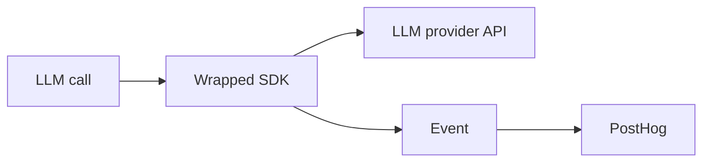
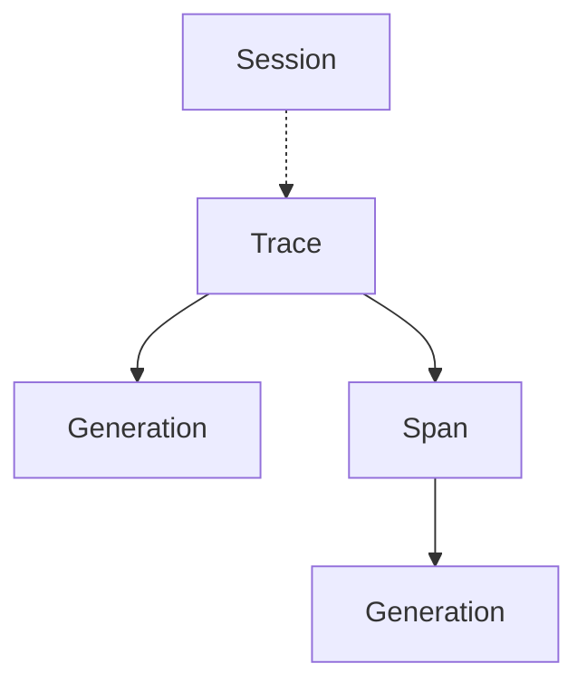

import OSButton from 'components/OSButton'

This page covers how your LLM calls become analytics in PostHog and defines key concepts for LLM Analytics.

## How LLM calls become events

PostHog's LLM Analytics works by wrapping your existing LLM provider's SDK to capture requests and responses. Your API calls still go directly to your provider, but the wrapper extracts metadata from each call and sends it to PostHog as an event.

Events sent to PostHog are called **generations**. A generation represents a single LLM call. For example, when you send a prompt to Claude and get a response back, that's one generation.

Generations are represented using the event name `$ai_generation`. Each generation captures the model, provider, input, output, token counts, latency, and cost.

## Generation properties

### Tokens and costs

**Tokens** are the units LLMs use to process text. LLM providers charge based on token usage:

- **Input tokens** are tokens used in the message you send to an LLM
- **Output tokens** are tokens used in the message you receive from an LLM

PostHog automatically calculates costs by matching your model and provider against pricing data. We use OpenRouter's pricing as our primary source, with fallback to manually maintained pricing for additional models.

You can also [set custom pricing](/docs/llm-analytics/calculating-costs) if you have negotiated rates or use unsupported models.

### Message roles

When you send messages to an LLM, each message has a **role** that tells the model how to interpret it:

| Role | Purpose | Example |
|------|---------|---------|
| `system` | Instructions that define the assistant's behavior | "You are a helpful assistant that speaks like a pirate" |
| `user` | Messages from the end user | "What's the weather today?" |
| `assistant` | Previous model responses, used for conversation history | "Arrr, it be sunny with a chance of scurvy!" |

PostHog captures the full message array with roles intact, so you can see exactly what context the model had when it generated a response.

## Grouping related events

Most LLM applications involve multiple calls. Traces, spans, and sessions let you see how they connect:

Here's a breakdown of this hierarchy:

| Term | Definition | Example |
|------|------------|---------|
| [Session](/docs/llm-analytics/sessions) | Groups multiple traces together | A user's conversation thread |
| [Trace](/docs/llm-analytics/traces) | Contains generations and spans for a single request | One chatbot message and response |
| [Span](/docs/llm-analytics/spans) | Tracks an operation within a trace | A retrieval step or function call |
| [Generation](/docs/llm-analytics/generations) | An LLM call, tracked as `$ai_generation` events | Sending a prompt to Claude |
| [Embedding](/docs/llm-analytics/embeddings) | Converts text into vectors | Vectorizing documents for RAG |
