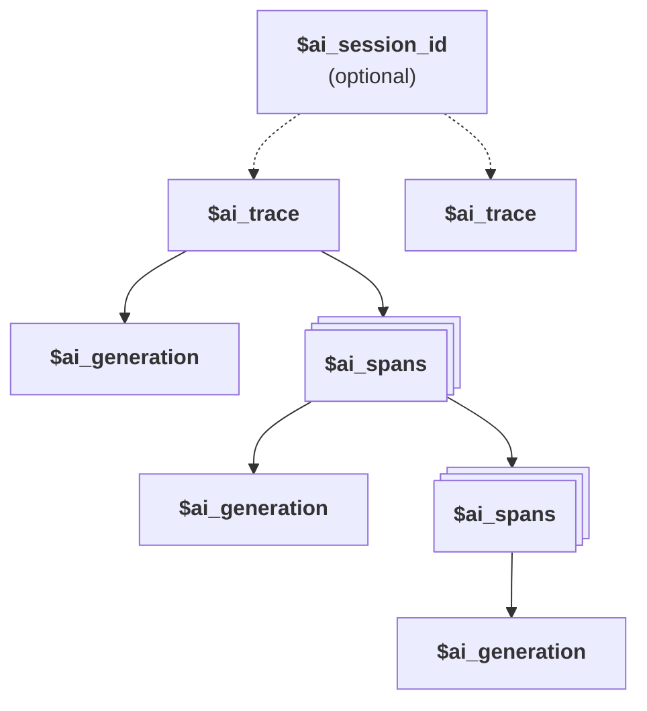

import TraceEventSnippet from "./_snippets/trace-event.mdx"

Traces are a collection of [generations](/docs/llm-analytics/generations) and [spans](/docs/llm-analytics/spans) that capture a full interaction between a user and an LLM. The [traces tab](https://app.posthog.com/llm-analytics/traces) lists them along with the properties autocaptured by PostHog like the person, total cost, total latency, and more.

## Sessions vs Traces

- **Trace** (`$ai_trace_id`): Groups related generations and spans together. Required for all LLM analytics events.
- **Session** (`$ai_session_id`): Optional property that groups multiple traces together based on your chosen grouping strategy.

See the [Sessions](/docs/llm-analytics/sessions) documentation for more details on how to use `$ai_session_id`.

## Trace timeline

Clicking on a trace opens a timeline of the interaction with all the generation and span events. The trace timeline enables you to see the entire conversation, profiling details, and the individual generations and spans.

<ProductScreenshot
  imageLight="https://res.cloudinary.com/dmukukwp6/image/upload/llma_traces_25e203aa50.png"
  imageDark="https://res.cloudinary.com/dmukukwp6/image/upload/llma_traces_dark_dd6ad555dc.png"
  alt="LLM traces"
  classes="rounded"
/>

<Caption>A trace presents LLM event data in a timeline, tree-structured view </Caption>

## AI event hierarchy

Traces consist of the following event hierarchy:

1. (Optional) A session (`$ai_session_id`) can group multiple traces together.
2. A trace (`$ai_trace_id`) is the top-level required grouping for LLM events.
3. A trace can contain multiple spans and generations.
4. A span can be the parent of other spans.
5. A generation can be the child of a span or trace.

## Event properties

<TraceEventSnippet />

## User feedback

The **Feedback** tab in the trace view displays user feedback collected via [PostHog Surveys](/docs/surveys). This enables you to see thumbs up/down ratings and follow-up responses directly alongside trace data.

If no feedback exists for a trace, the Feedback tab provides a wizard to create a new survey pre-configured for thumbs up/down feedback with an optional follow-up question for negative responses.

For implementation details on collecting feedback and linking it to traces, see [Collecting feedback](/docs/llm-analytics/collecting-feedback).