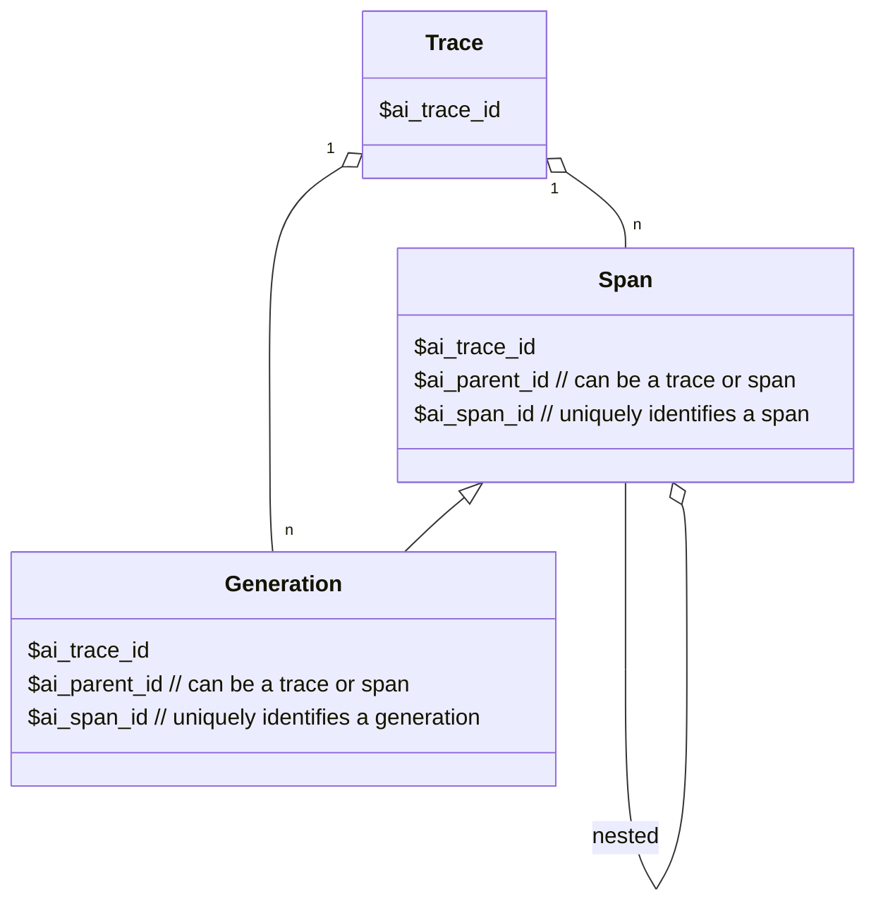

import TraceEvent from "./_snippets/trace-event.mdx"

Traces are a collection of [generations](/docs/llm-analytics/generations) and [spans](/docs/llm-analytics/spans) that capture a full interaction between a user and an LLM. The [traces tab](https://app.posthog.com/llm-analytics/traces) lists them along with the properties autocaptured by PostHog like the person, total cost, total latency, and more.

## AI event hierarchy

The flowchart in text

Traces consist of the following hierarchy: 

1. A trace is the top-level entity.
2. A trace contains spans and generations.
3. A span can be the parent of other spans.
4. A generation can be the child of a span or trace.

## Trace timeline

Clicking on a trace opens a timeline of the interaction with all the generation and span events enabling you to see the entire conversation, details about the trace, and the individual generation and span events.

<ProductScreenshot
  imageLight="https://res.cloudinary.com/dmukukwp6/image/upload/llma_traces_25e203aa50.png"
  imageDark="https://res.cloudinary.com/dmukukwp6/image/upload/llma_traces_dark_dd6ad555dc.png"
  alt="LLM traces"
  classes="rounded"
/>

## Event properties

<TraceEvent />
