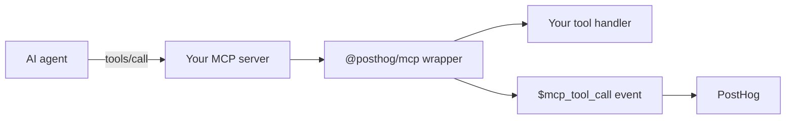

import CalloutBox from 'components/Docs/CalloutBox'
import OSButton from 'components/OSButton'

<CalloutBox icon="IconInfo" title="MCP analytics is in alpha" type="fyi">

`@posthog/mcp` is a TypeScript SDK for instrumenting Model Context Protocol (MCP) servers with PostHog analytics. It's published on npm as a `0.1.x` release while we build it in public. The API, event names, properties, and tracing behavior may change before the SDK reaches `1.0`. Don't depend on it for production reporting yet. Today, only TypeScript MCP servers are supported — a Python SDK is on the roadmap.

</CalloutBox>

MCP analytics helps you understand how AI agents actually use the MCP server you ship: which tools get called, how often, what intent the agent had, where calls are failing, what tools the agent asked for but you don't offer yet, and how individual sessions flow end to end.

The SDK wraps your existing MCP server and emits PostHog events on every tool call, resource read, prompt fetch, and initialize handshake. You can keep using whatever tooling you already have on top of PostHog — insights, dashboards, alerts, error tracking — without any additional ingestion plumbing.

<CalloutBox icon="IconInfo" title="No dedicated UI yet — by design, for now" type="fyi">

There isn't an "MCP analytics" scene in PostHog yet. Today you query and visualize MCP events through the surfaces you already use: [Product analytics](/docs/product-analytics) for trends and funnels, the [SQL editor](/docs/data-warehouse/sql) for ad-hoc HogQL, [Dashboards](/docs/product-analytics/dashboards) for at-a-glance views, and [Error tracking](/docs/error-tracking) for `$exception` events. A purpose-built UI is on the roadmap — when it ships, the events on this page won't change shape.

</CalloutBox>

<OSButton variant="primary" asLink to="/docs/mcp-analytics/start-here">
Get started
</OSButton>

## What you can answer

- Which tools is each MCP client calling, and how often?
- What is the agent actually trying to do (`$mcp_intent`)?
- Which tools are advertised in `tools/list` responses but never get called?
- What's the error rate and p95 latency of a given tool?
- Did an agent hit `get_more_tools` because the right capability didn't exist?
- How does a single MCP session unfold across tool calls?

{/* TODO: ProductScreenshot of an MCP analytics dashboard showing tool call volume, error rate, latency, and intent samples */}

## How it works

`instrument(server, options)` patches your MCP server's request handlers. When the agent calls a tool, the SDK:

1. Builds a structured event with the tool name, parameters, response, duration, and error state.
2. Runs the payload through redaction, sanitization (image/audio/binary stubs, sensitive-key masking), and truncation.
3. Sends it to PostHog via [`@posthog/core`](https://github.com/PostHog/posthog-js/tree/main/packages/core), batched and flushed automatically.

Your tool handlers are untouched. The only payload change the agent sees is an optional injected `context` argument (see [Capturing agent intent](/docs/mcp-analytics/intent)) and an optional injected `conversation_id` argument (see [Conversation IDs](/docs/mcp-analytics/conversation-id)).



## Quick install

```bash
pnpm add @posthog/mcp
```

```ts
import { Server } from "@modelcontextprotocol/sdk/server/index.js"
import { track } from "@posthog/mcp"

const server = new Server({ name: "my-mcp-server", version: "1.0.0" })

instrument(server, {
  projectToken: process.env.POSTHOG_PROJECT_TOKEN,
})
```

That's the minimum. With this in place, every `tools/call`, `tools/list`, `initialize`, `resources/read`, and `prompts/get` request emits a PostHog event prefixed with `$mcp_*`.

<OSButton variant="primary" asLink to="/docs/mcp-analytics/installation">
Full installation guide
</OSButton>

## Where to go next

- **[Getting started](/docs/mcp-analytics/start-here)** — the guided onboarding flow
- **[Installation](/docs/mcp-analytics/installation)** — full setup, server type variants, BYO PostHog client
- **[Capturing agent intent](/docs/mcp-analytics/intent)** — the `context` argument and `intentFallback`
- **[Conversation IDs](/docs/mcp-analytics/conversation-id)** — stitching multi-turn conversations together
- **[Identifying users](/docs/mcp-analytics/identifying-users)** — attaching events to your own users
- **[LLM analytics integration](/docs/mcp-analytics/ai-tracing)** — emit `$ai_span` so MCP traffic appears in LLM analytics
- **[Missing capability tracking](/docs/mcp-analytics/missing-capability)** — the `get_more_tools` virtual tool
- **[Custom events and metadata](/docs/mcp-analytics/custom-events)** — `publishCustomEvent` and `eventProperties`
- **[Privacy and redaction](/docs/mcp-analytics/privacy)** — what's sanitized automatically, customer redaction hook
- **[Event and property reference](/docs/mcp-analytics/events)** — every event the SDK emits and what's on it
- **[Sample queries](/docs/mcp-analytics/queries)** — HogQL recipes for the most common dashboards

## Building in public

The SDK source lives in the [`posthog-js` monorepo](https://github.com/PostHog/posthog-js/tree/main/packages/mcp) alongside the rest of PostHog's JavaScript and TypeScript SDKs. Issues, PRs, and feedback are welcome. We started from a duplicated copy of the MIT-licensed [MCPcat TypeScript SDK](https://github.com/MCPCat/mcpcat-typescript-sdk) — the event schema, identity model, and feature surface have since diverged.
