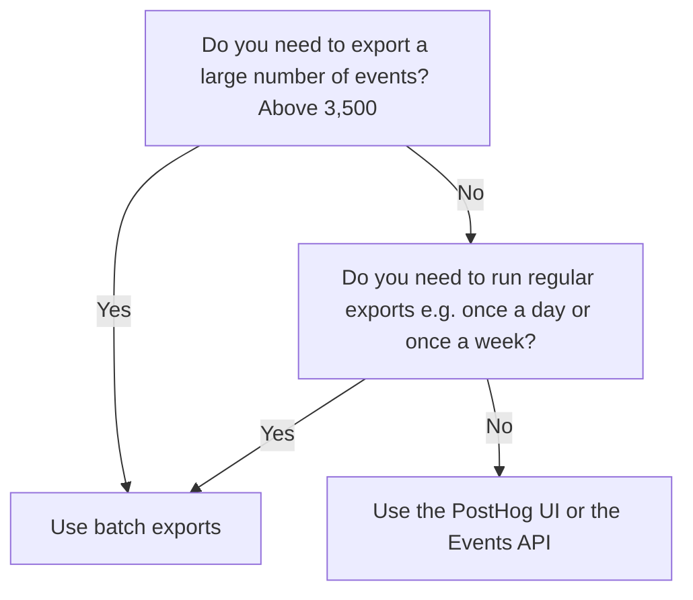

At PostHog we believe in your right to own your data - this means being able to export the raw events whenever you want.

There are several ways to export your events depending on your use case:

Method | When? | Limitations
--- | --- | ---
PostHog UI - click "Export" on the events table | You need to export a small number of events | 3,500 events
Events API | Great for one-off smaller exports | 1 day date range and 3,500 events
[Batch exports](/batch_exports) | You need to export a large number of events, can be used for continuous exports | No limits

If you're looking to migrate to a new PostHog instance follow the [migrating between PostHog instances guide](/docs/migrate/migrate-between-cloud-and-self-hosted).

## Not sure which export method to use?

Here's a decision tree you might find useful:

## Why are there limitations on the PostHog UI export and the events API?

The PostHog UI and the events API are designed to quickly respond with a small number of events. To prevent your queries running slower when another user is trying to export large numbers of events we've built a separate system for managing the exporting of large number of events using apps.
