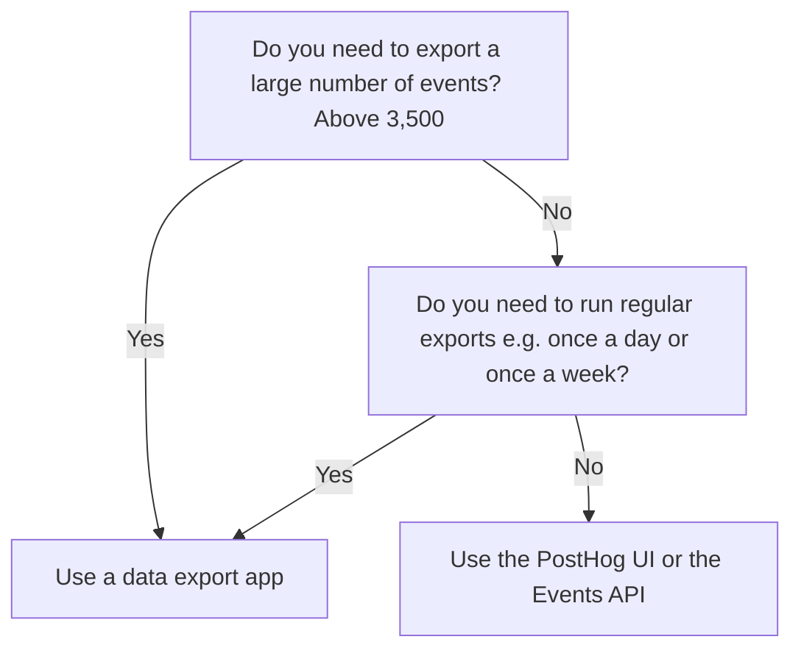

At PostHog we believe in your right to own your data - this means being able to export the raw events whenever you want.

There are several ways to export your events depending on your use case:

1. Use the PostHog UI to filter the events table and then click "Export". Great for quickly getting access to the events you need. Limited to 3,500 events.
2. Use the events API. Great for one-off smaller exports. Limited to a 1 day date range and 3,500 events.
3. Use [a data export app](/apps?filter=type&value=data-out). Great for exporting a very large number of events, and you can stream new data to keep your destination up to date. No limits.
   - Popular apps for data export include the [S3](/apps/s3-export), [Google Cloud Storage](/apps/google-cloud-export), [BigQuery](/apps/bigquery-export), [PostgreSQL](/apps/postgres-export), [Redshift](/apps/redshift-export), [Snowflake](/apps/snowflake-export). See the [full list of data export apps](/apps?filter=type&value=data-out).
   - To export your historical data you'll want to connect the app and then run a historical export.
   - Additionally, these apps stream all new events to the destination. This keeps your destination up to date with new events as they come in.

If you're looking to migrate to a new PostHog instance follow the [migrating between PostHog instances guide](/docs/migrate/migrate-between-cloud-and-self-hosted.mdx).

## Not sure which export method to use?

Here's a decision tree you might find useful:

## Why are there limitations on the PostHog UI export and the events API?

The PostHog UI and the events API are designed to quickly respond with a small number of events. To prevent your queries running slower when another using is trying to export large numbers of events we've built a separate system for managing the exporting of large number of events using apps.
