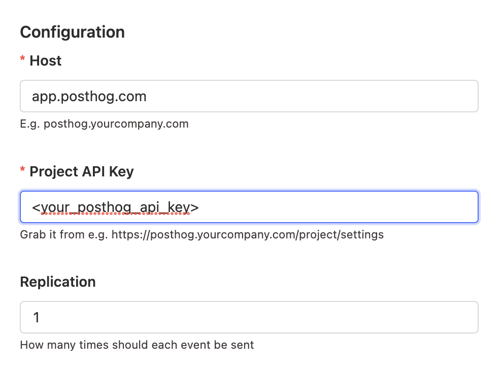

> If you're attempting this migration, feel free to ask questions and provide feedback via [raising a support ticket in the app](https://app.posthog.com/home#supportModal). 

## Requirements

-   An existing project, either
    - on PostHog cloud
    - on a self-hosted PostHog instance running at least `1.30.0` (For upgrade instructions, take a look at [this guide](/docs/runbook/upgrading-posthog)) 
-   A new project on [PostHog Cloud](/docs/getting-started/start-here)

## Approach

This migration has 3 steps:

1. [Migrate your metadata](#migrate-your-metadata) (projects, dashboards, insights, actions, cohorts, feature flags, experiments, annotations).
2. [Migrate your events](#migrate-your-events), this also creates the necessary person, person distinct ID, and related records.
3. [Switch tracking in your product](#switching-tracking-in-you-product) to set-up replication from the old project if needed and to start sending events to the new project.

## Migrate your metadata

To migrate metadata like projects, dashboards, insights, actions, feature flags, and more, use the [PostHog migrate metadata script](https://github.com/PostHog/posthog-migrate-meta). This requires:

1. Installing TypeScript and `ts-node`. Run `npm install -g typescript ts-node` in your 
2. Your old instance project API key.
3. Your new cloud instance project API key, which you can get from your [project settings](https://app.posthog.com/project/settings). 

> **Note:** This process has the following caveats:
> 1. Every object's "created by" information will appear as if it was created by you.
> 2. Every object's "created at" information will appear as if it was created at the time you ran this script.

1. Clone the repo and cd into it
    ```bash
    git clone https://github.com/PostHog/posthog-migrate-meta
    cd posthog-migrate-meta
    ```
2. Install the dependencies by running `yarn`
3. Run the script
    ```bash
    ts-node --source [posthog instance you want to migrate from] --sourcekey [personal api key for that instance] --destination [posthog instance you want to migrate to.] --destinationkey [personal api key for destination instance]
    ```

For more information on the options see the [repo's readme](https://github.com/PostHog/posthog-migrate-meta)

## Migrate your events

First, disable all the apps in the destination cloud project (e.g. GeoIP). Keeping these enable may change events you are migrating.

If you're migrating from our cloud instance, e.g. from US cloud to EU cloud, ask us to do the events migration for you by [raising a support ticket in the app](https://app.posthog.com/home#supportModal).

To migrate your events, you can read data directly from your ClickHouse cluster and ingest the data with the Python library using our [self-hosted migration tool](https://github.com/PostHog/posthog-migration-tools).

First, clone the repo and install the requirements.

```bash
git clone https://github.com/PostHog/posthog-migration-tools
cd posthog-migration-tools
pip3 install -r requirements.txt
```

Next, run the migration script with your ClickHouse details, PostHog details, start date, end date, and fetch limit.

```bash
python3 ./migrate.py \
   --clickhouse-url https://some.clickhouse.cluster:8443 \
   --clickhouse-user default \
   --clickhouse-password some-password \
   --clickhouse-database posthog \
   --team-id 1234 \
   --posthog-url https://app.posthog.com \
   --posthog-api-token "abx123" \
   --start-date 2023-06-18T13:00:00Z \
   --end-date 2023-06-18T13:10:00 \
   --fetch-limit 10000
```

This script prints a "cursor" in the case the migration fails. It can be used to resume from where it got to with by adding the `--cursor` argument to the command above.

```bash:
python3 ./migrate.py \
   --clickhouse-url https://some.clickhouse.cluster:8443 \
   --clickhouse-user default \
   --clickhouse-password some-password \
   --clickhouse-database posthog \
   --team-id 1234 \
   --posthog-url https://app.posthog.com \
   --posthog-api-token "abx123" \
   --start-date 2023-06-18T13:00:00Z \
   --end-date 2023-06-18T13:10:00 \
   --fetch-limit 10000 \
   --cursor the-cursor-value-from-the-output
```

> **Notes:**
> - This script adds a `$lib` property of `posthog-python`, overriding any `$lib` property already set.
> - If the script fails for some reason, just run it again with the latest cursor. There are some transient issues that can happen that are solved by re-running the script.

## Switching tracking in you product

To make sure you don't miss any events, complete the two previous steps **first**, so you can switch tracking in your product without losing any events:

1. Enable [PostHog Replicator app](/docs/apps/replicator) (with GeoIP disabled) to forward events from your self-hosted instance to your cloud instance while not all clients have updated tracking code.
2. Run the [events migration](#migrate-your-events) for the time period after you finished the initial migration until you enabled the replicator app.

> **Note:** We didn't enable the replicator initially because we want events to be sent as close to "in order" as possible to avoid overriding person properties with older events.
This approach also helps minimize duplicates, which are eventually deduplicated, but it's better to avoid them in the first place.

### Installing the Replicator

Start by logging in to your existing self-hosted instance and navigating to the 'Apps' tab. Next, search for the 'Replicator' app and install it if it isn't already.



For the configuration:
- **Host**: either app.posthog.com for US or eu.posthog.com for EU
- **Project API Key**: the API key for the project in Cloud
- **Disable GeoIP**: toggle this on to make sure we keep original location rather than updating to the location of your server.

After clicking save and activating it (toggle on the left side), the Replicator will begin forwarding incoming events to Cloud. Note that it may take around 15-20 minutes for the first events to arrive.

### Switching tracking code

Now that we've migrated our events, the next step is to switch over tracking within your product to direct any new events to your new PostHog cloud instance.

First, if you are using the Replicator, ensure that it is still running on your self-hosted instance. Any events sent to your old instance will be forwarded as long as it is running.

2. Re-enable any apps that you disabled earlier (e.g. GeoIP).

3. Begin swapping out your Project API key and instance address within all the areas of your product that you track. Once done, events using the new API key will go directly to your Cloud instance.

4. Once you've double-checked that no more events are coming to the old instance, deactivate the Replicator app.

## Migrating your custom apps

If the app was filtering or transforming events before ingestion:

1. (fastest option) check to see if we already have an app that does what you need. You can see the list of apps [here](/docs/cdp), look for ingestion filtering and event transformation.
2. (also fast) you could move this logic from the PostHog app into your client before you send the event. 
3. If you can make your app generalizable enough that others can benefit then [submit your app](/docs/apps/build/tutorial#submitting-your-app) to the store.

    - To make it generalizable you'll want to convert anything specific to your configuration into a plugin.json config value

If the app was used to send events to a custom destination:

1. (fastest option) check to see if we already have an app that does what you need. You can see the list of apps [here](/docs/cdp), look for batch exports and destinations. 
2. (also fast) Convert your app to work as a webhook. We are soon releasing a webhook destination. You can subscribe for updates on the [roadmap](https://github.com/PostHog/posthog/issues/13989)
3. If you can make your app generalizable enough that others can benefit then [submit your app](/docs/apps/build/tutorial#submitting-your-app) to the store.

    - To make it generalizable you'll want to convert anything specific to your configuration into a plugin.json config value

If the options above don't work and you were previously paying a substantial amount self-hosting then email us at [sales@posthog.com](mailto:sales@posthog.com) with a link to the public GitHub repo and we can see if it's appropriate as a private cloud app.
