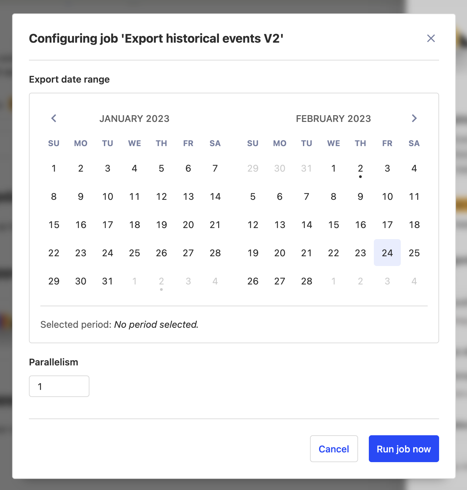

import MigratingEvents from "./snippets/migrating-events.mdx"

> If you're attempting this migration, feel free to ask questions and provide feedback via the [PostHog Communty Slack workspace](/slack) or [a GitHub issue](https://github.com/PostHog/posthog.com/issues).

## Requirements

-   An existing PostHog instance running at least `1.30.0` (For upgrade instructions, take a look at [this guide](/docs/runbook/upgrading-posthog))
-   A new project on [PostHog Cloud](/docs/quickstart)

## Approach

This migration has two parts:

1. [Migrate your events](#migrate-your-events), this will also create the necessary person, person distinct ID, and related records.
2. [Migrate your metadata](#migrate-your-metadata) (projects, dashboards, insights, actions, cohorts, feature flags, experiments, annotations).

## Migrate your events

To migrate your events, we'll be using the [PostHog Replicator app](/docs/apps/replicator), which will allows us to stream new events to PostHog Cloud as well as migrating historical data.

> **Note** Before starting, make sure the GeoIP plugin is deactivated on Cloud!

### Installing the Replicator

Start by logging in to your exisitng self-hosted instance and navigating to the 'Apps' tab. Next, search for the 'Replicator' app and install it if it isn't already.


For the configuration:
- `Host`: the hostname of your new PostHog instance, either `app.posthog.com` or `eu.posthog.com` depending on where your project is set up
- `Project API Key`: the API key for the new project that you want to send events to - found in the project settings page.

After clicking save and activating it (toggle on the left side), the Replicator will start to run.
Any events added to your old instance will be replicated to your project in Cloud.
It may take around 15-20 minutes for events to first show up.

### Exporting historical events

Now that the Replicator is sending new events, we'll set up a batch job to export past events.
First, go back to the configuration menu and click the gear next to "Export historical events" under "Jobs", which will open the following popup.



On the calendar, select a start and end date for the range you would like to export, and then click "Run job now."
This will begin the process of exporting historical events to our Cloud project.
Depending on the amount of data you have stored this may take 
(and might take a while). You can see the progress in logs or by clicking the "App metrics" button (graph) and going to the "Historical exports" tab.

9. To track progress of the export you can click the graph icon next to the Replicator app and then click on the "Historical Exports" tab
10. Re-enable the GeoIP plugin
11. Swap out the PostHog API key and host wherever you're sending events from

## Migrate your metadata

Follow the instructions on the [PostHog migrate metadata repo](https://github.com/PostHog/posthog-migrate-meta):

> **Note**
> This process has the following caveats:
> 1. Project API Key. You'll need to replace the API key in your code with the new API key.
> 2. "created by" information. Every object will appear as if it was created by you.
> 3. "created at" information. Every object will appear as if it was created on the time you ran this script.

1. Clone the repo and cd into it
    ```bash
    git clone https://github.com/PostHog/posthog-migrate-meta
    cd posthog-migrate-meta
    ```
2. Install the dependencies by running `yarn`
3. Run the script
    ```bash
    ts-node --source [posthog instance you want to migrate from] --sourcekey [personal api key for that instance] --destination [posthog instance you want to migrate to.] --destinationkey [personal api key for destination instance]
    ```

For more information on the options see the [repo's readme](https://github.com/PostHog/posthog-migrate-meta)

## Migrating your custom apps if you are moving from self-hosted to cloud

If the app was previously extracting events using the [scheduled tasks api](/docs/apps/build/reference#scheduled-tasks):

1. (fastest option) you could move this logic from the app into scheduled tasks on your server potentially using a cron job
2. If you can make your app generalizable enough that others can benefit then [submit your app](https://posthog.com/docs/apps/build/tutorial#submitting-your-app) to the store.
    - To make it generalizable you'll want to convert anything specific to your configuration into a plugin.json config value

If the app was transforming events before ingestion:

1. (fastest option) you could move this logic from the app into your client before you send the event
2. If you can make your app generalizable enough that others can benefit then [submit your app](https://posthog.com/docs/apps/build/tutorial#submitting-your-app) to the store.
    - To make it generalizable you'll want to convert anything specific to your configuration into a plugin.json config value

If the app was used to send events to a custom destination:

1. (fastest option) Convert your app to work as a webhook. We are soon releasing a webhook destination. You can subscribe for updates on the [roadmap](https://github.com/PostHog/posthog/issues/13989)
2. If you can make your app generalizable enough that others can benefit then [submit your app](https://posthog.com/docs/apps/build/tutorial#submitting-your-app) to the store.

    - To make it generalizable you'll want to convert anything specific to your configuration into a plugin.json config value

    If the options above don't work and you were previously paying a substantial amount self-hosting then email us at [hey@posthog.com](mailto:hey@posthog.com) with a link to the public github repo and we can see if it's appropriate as a private cloud app.
