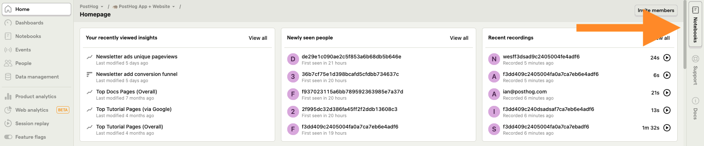
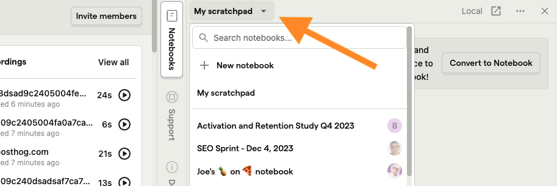
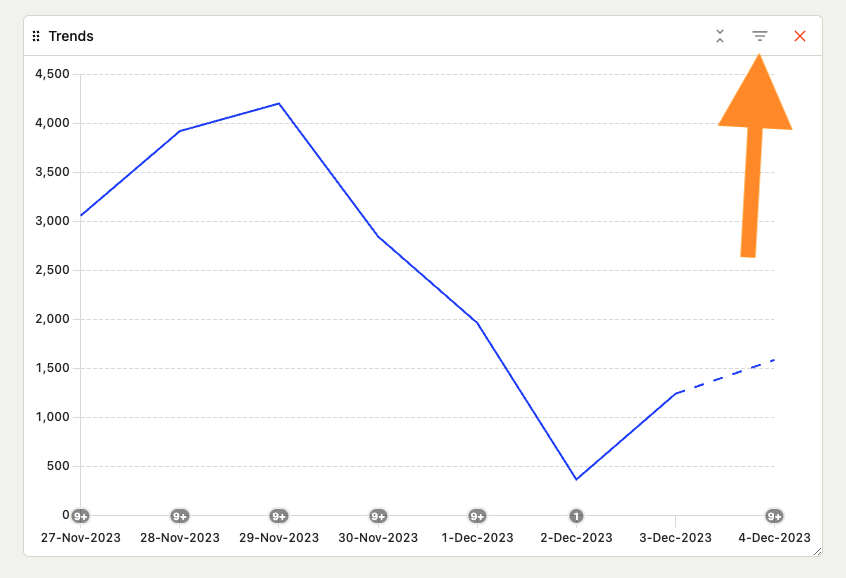
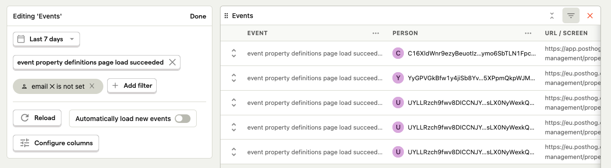
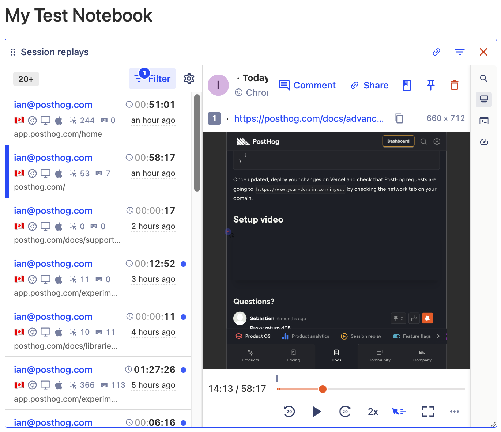
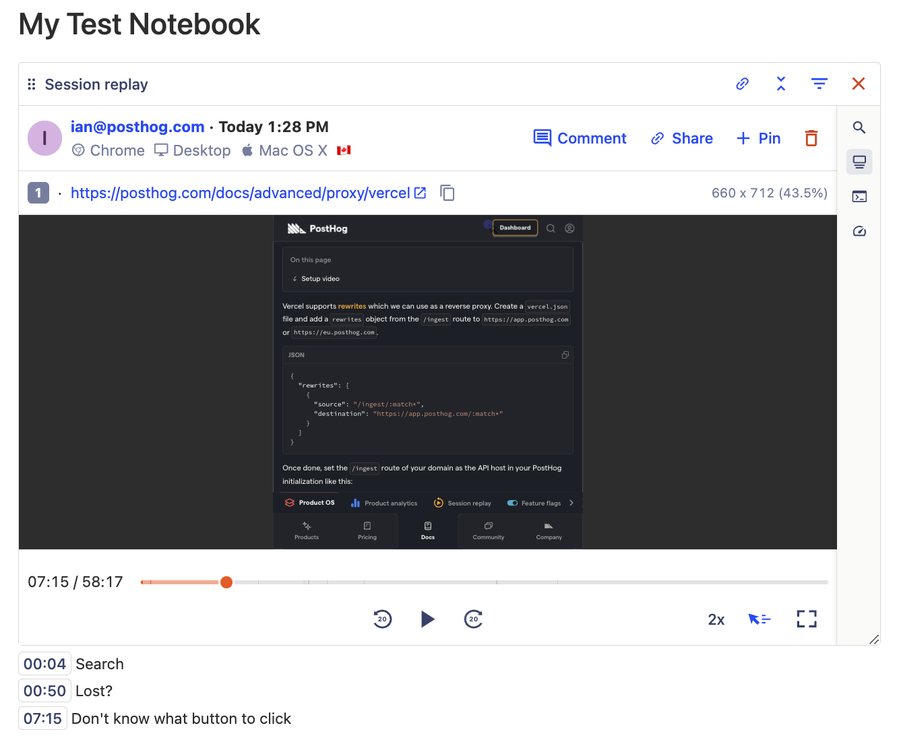
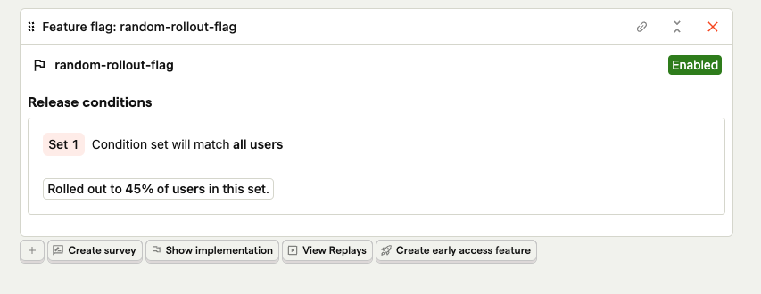
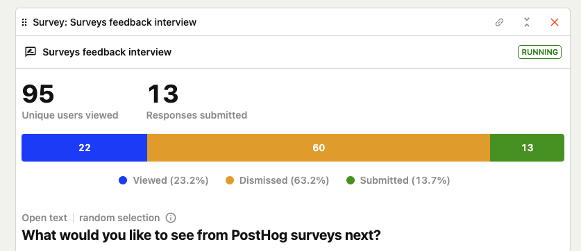

> [Notebooks are currently in **public beta**](/docs/getting-started/enable-betas). This means it's not yet a perfect experience, but we'd love to know your thoughts. Please [share your feedback](http://app.posthog.com/home#supportModal) and [follow our roadmap](https://github.com/PostHog/posthog/issues/15680)!

Notebooks enable you to combine the tools of PostHog into a single space for analysis. Rather than jumping between dashboards, insights, replays, experiment results, and more, your chain of analysis exists on a single page.

It provides a flexible interface for organizing ad-hoc analysis, bug investigations, internal documentation, and feature releases by yourself or with your team.

You can get started with notebooks by going to [the notebook tab](https://app.posthog.com/notebooks) in your PostHog instance and clicking "New notebook."

## Accessing the notebook popover

Critical to combining the functionality of PostHog is being able to access notebooks from anywhere, like a scratchpad for analysis which you can organize and clean up later.

You can access a notebook by clicking the journal icon in the navbar (next to the notification bell) or by clicking and dragging a link anywhere in PostHog.

To switch the notebook that opens in the popover, click the title button in the top left of the popover.

## Adding content to notebooks

To start adding content to notebooks, start typing. There are three main ways to add content to notebooks:

1. **Slash commands.** Within a notebook, type `/` and a menu will pop up with options for you. For example, `/trend` creates a trend insight.

2. **Click the `+` icon on an empty line**. This opens the same menu as slash commands.

3. **Dragging to popover.** From the other sections in PostHog, click and hold a link and a popover notebook shows up on the right side you can drag into. 

You can rearrange content in notebooks by dragging and dropping components into a different order.

## Notebook content types

### Text

Notebooks supports the standard text editing features via Markdown. These include:

- \# Heading 1
- \## Heading 2
- \### Heading 3
- \- List
- `1.` Numbered list
- [] Check list
- \**bold**
- \_italic\_
- \`code\`

### Insights

You can add all of PostHog's insight types natively in Notebooks. These include trends, funnels, retention, paths, stickiness, lifecycle, and SQL.

Each of them can be completely customized within notebooks like you would in insights. To do this, click the three-line reverse pyramid icon.

You can add insights from the insights list by clicking, holding, and dragging the name onto the right-side pop-over.

### Events, persons, groups, cohorts

On top of insights, you can add event, person, group, and cohort lists or entries. They provide a summary of the event, person, group, or cohort and let you click in to get more details.

For example, you can customize event lists to show a specific event and related columns over a period of time. 

### Session replays and playlists

You can add both individual replays and filtered playlists of replays to notebooks. 

Within playlists in notebooks, you can see new replays, update the filter such as countries or URLs, and pin replays to the playlist.

While watching an individual replay, you can click the "comment" to add commentary at different timestamps, share, view performance data and console logs, search events, and more.

If there are specific replays important to your analysis, you can save them to a notebook using the notebook icon. You can also drag and drop them from the session replay action.

### Feature flags

You can add a feature flag by dragging and dropping its link into your notebook.

Once you add a feature flag to your notebook, you can see its status, release conditions, implementation code, and related session replays. Using it, you can create surveys and early access features. 

### Surveys

You can add a survey by dragging and dropping its link into your notebook. 

Once you add one, you can see its status, views, dismissals, and submissions. Depending on the survey type, you can also see more details or visualizations for the responses. 

### Images

You can add both images (.png, .jpg, .jpeg, .bmp) and GIFs to your notebooks using the slash command or by dragging and dropping. 

### Links

You can create preview links for areas within PostHog, like dashboards and notebooks, by dragging and dropping them into notebooks.

You can create external links by highlighting text and then pasting the link in the box.

## Frequently asked questions

### How much do notebooks cost?

Notebooks are free. [Sign up for free](https://app.posthog.com/signup) to try them out.

### What are the differences between dashboards and notebooks?

Notebooks incorporate all the components of PostHog. Dashboards specifically focus on analytics, insights, and events. 

Dashboards are great for metrics you want to check repeatedly and understanding the status of your product. Notebooks are great for doing analysis and piecing data together into a narrative.

### Can I share a notebook?

Yes, members of your organization can access and edit the notebooks you create. You can click the share icon at the top of your notebook to get a link to provide them direct access.

Sharing externally isn't available yet, but you can request it in the notebook sharing menu.

### Do notebooks support real-time multiplayer editing?

No. Although other people can see and edit your notebooks, they can't edit them at the same time. We do conflict detection and warn you of potential conflicts when you are trying to save (overwrite or revert).