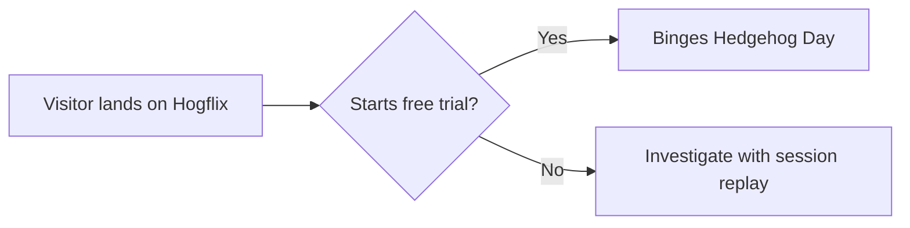

import { ProductScreenshot } from "components/ProductScreenshot";
import { ProductVideo } from "components/ProductVideo";
export const popoverLight =
  "https://res.cloudinary.com/dmukukwp6/video/upload/posthog.com/contents/images/docs/notebooks/popover-light-mode.mp4";
export const popoverDark =
  "https://res.cloudinary.com/dmukukwp6/video/upload/posthog.com/contents/images/docs/notebooks/popover-dark-mode.mp4";
export const switchLight =
  "https://res.cloudinary.com/dmukukwp6/video/upload/posthog.com/contents/images/docs/notebooks/switch-light-mode.mp4";
export const switchDark =
  "https://res.cloudinary.com/dmukukwp6/video/upload/posthog.com/contents/images/docs/notebooks/switch-dark-mode.mp4";
export const slashLight =
  "https://res.cloudinary.com/dmukukwp6/video/upload/posthog.com/contents/images/docs/notebooks/slash-light-mode.mp4";
export const slashDark =
  "https://res.cloudinary.com/dmukukwp6/video/upload/posthog.com/contents/images/docs/notebooks/slash-dark-mode.mp4";
export const plusLight =
  "https://res.cloudinary.com/dmukukwp6/video/upload/posthog.com/contents/images/docs/notebooks/plus-light-mode.mp4";
export const plusDark =
  "https://res.cloudinary.com/dmukukwp6/video/upload/posthog.com/contents/images/docs/notebooks/plus-dark-mode.mp4";
export const dragLight =
  "https://res.cloudinary.com/dmukukwp6/video/upload/posthog.com/contents/images/docs/notebooks/drag-light-mode.mp4";
export const dragDark =
  "https://res.cloudinary.com/dmukukwp6/video/upload/posthog.com/contents/images/docs/notebooks/drag-dark-mode.mp4";
export const insightsLight =
  "https://res.cloudinary.com/dmukukwp6/video/upload/posthog.com/contents/images/docs/notebooks/insights-light-mode.mp4";
export const insightsDark =
  "https://res.cloudinary.com/dmukukwp6/video/upload/posthog.com/contents/images/docs/notebooks/insights-dark-mode.mp4";
export const eventsLight =
  "https://res.cloudinary.com/dmukukwp6/image/upload/posthog.com/contents/images/docs/notebooks/events-light-mode.png";
export const eventsDark =
  "https://res.cloudinary.com/dmukukwp6/image/upload/posthog.com/contents/images/docs/notebooks/events-dark-mode.png";
export const playlistLight =
  "https://res.cloudinary.com/dmukukwp6/video/upload/posthog.com/contents/images/docs/notebooks/playlist-light-mode.mp4";
export const playlistDark =
  "https://res.cloudinary.com/dmukukwp6/video/upload/posthog.com/contents/images/docs/notebooks/playlist-dark-mode.mp4";
export const replayLight =
  "https://res.cloudinary.com/dmukukwp6/video/upload/posthog.com/contents/images/docs/notebooks/replay-light-mode.mp4";
export const replayDark =
  "https://res.cloudinary.com/dmukukwp6/video/upload/posthog.com/contents/images/docs/notebooks/replay-dark-mode.mp4";
export const flagLight =
  "https://res.cloudinary.com/dmukukwp6/image/upload/posthog.com/contents/images/docs/notebooks/flag-light-mode.png";
export const flagDark =
  "https://res.cloudinary.com/dmukukwp6/image/upload/posthog.com/contents/images/docs/notebooks/flag-dark-mode.png";
export const surveyLight =
  "https://res.cloudinary.com/dmukukwp6/image/upload/posthog.com/contents/images/docs/notebooks/survey-light-mode.png";
export const surveyDark =
  "https://res.cloudinary.com/dmukukwp6/image/upload/posthog.com/contents/images/docs/notebooks/survey-dark-mode.png";

Notebooks enable you to combine the tools of PostHog into a single space for analysis. Rather than jumping between dashboards, insights, replays, experiment results, and more, your chain of analysis exists on a single page.

Notebooks are built out of **cells**. A SQL cell runs [HogQL](/docs/data-warehouse/sql) against your PostHog and [data warehouse](/docs/data-warehouse) data. A Python cell runs in a sandboxed kernel that can read and reshape any previous cell's result. Markdown cells hold prose. Component cells embed insights, replays, feature flags, surveys, and other PostHog objects. It's one page for the query, the analysis, the visualization, and the narrative.

It provides a flexible interface for organizing ad-hoc analysis, bug investigations, internal documentation, and feature releases by yourself or with your team.

You can get started with notebooks by going to [the notebook tab](https://app.posthog.com/notebooks) in your PostHog instance and clicking "New notebook."

> **In beta.** Executable SQL and Python cells and the sandbox kernel that powers them are rolling out behind a feature flag. Some features described below (the executable-cell types, the kernel, cross-cell dataframes, and the notebook cell tools over MCP) may not be visible in your project yet. Ask your PostHog contact if you'd like early access.

## Accessing the notebook popover

Critical to combining the functionality of PostHog is being able to access notebooks from anywhere, like a scratchpad for analysis which you can organize and clean up later.

You can access a notebook by clicking it in the sidebar or by clicking and dragging a link anywhere in PostHog.

<ProductVideo
  videoLight={popoverLight}
  videoDark={popoverDark}
  alt="Popover icon"
  classes="rounded"
/>

To switch the notebook that opens in the popover, click the title button in the top left of the popover.

<ProductVideo
  videoLight={switchLight}
  videoDark={switchDark}
  alt="Switch popover notebook"
  classes="rounded"
/>

## Adding content to notebooks

To start adding content to notebooks, start typing. There are three main ways to add content to notebooks:

1. **Slash commands.** Within a notebook, type `/` and a menu will pop up with options for you. For example, `/trend` creates a trend insight.

<ProductVideo videoLight={slashLight} videoDark={slashDark} alt="Slash command" classes="rounded" />

2. **Click the `+` icon on an empty line**. This opens the same menu as slash commands.

<ProductVideo videoLight={plusLight} videoDark={plusDark} alt="Plus icon" classes="rounded" />

3. **Dragging to popover.** From the other sections in PostHog, click and hold a link and a popover notebook shows up on the right side you can drag into.

<ProductVideo videoLight={dragLight} videoDark={dragDark} alt="Drag and drop" classes="rounded" />

You can rearrange content in notebooks by dragging and dropping components into a different order.

## Executable cells

Every SQL and Python cell has:

- **Code**, in HogQL for a SQL cell or Python for a Python cell.
- A **run button** that dispatches the code and streams back the result. Results are stored on the cell, so the notebook still shows the last result when you reopen it.
- A **result view** below the code, with the table (SQL), rendered figures (Python matplotlib), and any `stdout`/`stderr`.
- A **title** in the cell header. Set it to say what the cell shows, so a reader can skim the notebook without reading the code.
- A **dataframe name** other cells can reference (see below).

Add an executable cell with the slash menu (`/sql`, `/python`) or the `+` button on an empty line. A notebook holds at most 50 cells.

### SQL cells

SQL cells run HogQL against your events, persons, sessions, and any synced [data warehouse](/docs/data-warehouse) tables. The result renders as a table you can chart.

A SQL cell that references a dataframe another cell created (for example a Python cell's `pandas.DataFrame`) runs on the notebook's local DuckDB engine automatically. The syntax is the same as for a ClickHouse-backed query, so you can join local dataframes with warehouse tables in a single cell.

### Python cells

Python cells run in a sandboxed kernel with pandas, numpy, scipy, scikit-learn, and matplotlib preinstalled. Use them for analysis a query can't express: reshaping a SQL result, joining across dataframes, statistics, clustering, forecasting, plotting.

The first Python cell in a notebook starts the kernel, which takes a few seconds. Subsequent cells reuse the same kernel, so dataframes stay in memory across runs. SQL-only notebooks never start a kernel.

You can configure the kernel's CPU cores, memory, and idle timeout from the **compute menu** at the top of the notebook. Changing these while a kernel is running requires a restart, which clears any materialized dataframes.

### Sharing data between cells

Every SQL and Python cell produces a named **dataframe** (`sql_df`, `df`, or a name you pick). Other cells reference that dataframe by name:

- A Python cell reads it as a `pandas.DataFrame` variable.
- A SQL cell reads it as a table via the local DuckDB engine.

PostHog tracks the dependency graph across cells and marks a downstream cell as **stale** when an upstream cell's code changes. Re-run stale cells in dependency order (top-down) to bring the notebook back in sync.

## Notebook content types

### Text

Notebooks supports the standard text editing features via Markdown. These include:

- \# Heading 1
- \## Heading 2
- \### Heading 3
- \- List
- `1.` Numbered list
- [] Check list
- \*\*bold\*\*
- \_italic\_
- \`code\`

### Block titles

All component blocks – insights, queries, code blocks, and others – support custom titles. In edit mode, click the title field in the block toolbar to type a title. The field shows a contextual placeholder (e.g. the insight name or "Add a title") until you set your own.

Press **Enter** or click away to save the title. Press **Escape** to cancel without saving. In view mode, saved titles display as read-only text in the toolbar.

### Insights

You can add all of PostHog's insight types natively in Notebooks. These include trends, funnels, retention, paths, stickiness, lifecycle, and SQL.

Each of them can be completely customized within notebooks like you would in insights. To do this, click the three-line reverse pyramid icon.

<ProductVideo videoLight={insightsLight} videoDark={insightsDark} alt="Insight" classes="rounded" />

You can add insights from the insights list by clicking, holding, and dragging the title onto the right-side popover.

### Events, persons, groups, cohorts

On top of insights, you can add event, person, group, and cohort lists or entries. They provide a summary of the event, person, group, or cohort and let you click in to get more details or filter.

For example, you can customize event lists to show a specific event and related columns over a period of time.

<ProductScreenshot imageLight={eventsLight} imageDark={eventsDark} alt="Events" classes="rounded" />

### Session replays and playlists

You can add both individual replays and filtered playlists of replays to notebooks.

Within playlists in notebooks, you can see new replays, update the filter such as countries or URLs, and pin replays to the playlist.

If there are specific replays important to your analysis, you can save them to a notebook by clicking the "Comment" button. You can also drag and drop them from the session replay action.

<ProductVideo
  videoLight={playlistLight}
  videoDark={playlistDark}
  alt="Playlist"
  classes="rounded"
/>

While watching an individual replay in the notebook, you can click the "Comment" button to add commentary at different timestamps. You can also share the session replay, view performance data and console logs, search events, and more.

<ProductVideo
  videoLight={replayLight}
  videoDark={replayDark}
  alt="Replay with comments"
  classes="rounded"
/>

### Feature flags

You can add a feature flag by dragging and dropping its link into your notebook.

Once you add a feature flag to your notebook, you can see its status, release conditions, implementation code, and related session replays. Using it, you can create surveys and early access features.

<ProductScreenshot imageLight={flagLight} imageDark={flagDark} alt="Flag" classes="rounded" />

### Surveys

You can add a survey by dragging and dropping its link into your notebook.

Once you add one, you can see its status, views, dismissals, and submissions. Depending on the survey type, you can also see more details or visualizations for the responses.

<ProductScreenshot imageLight={surveyLight} imageDark={surveyDark} alt="Survey" classes="rounded" />

### Images

You can add both images (.png, .jpg, .jpeg, .bmp) and GIFs to your notebooks using the slash command or by dragging and dropping.

### Links

You can create preview links for areas within PostHog, like dashboards and notebooks, by dragging and dropping them into notebooks.

You can create external links by highlighting text and then pasting the link in the box.

### LaTeX

You can include mathematical formulas and equations in your notebooks using LaTeX notation. This is perfect for data analysis, statistical explanations, or any mathematical documentation you need to include.

You can add LaTeX content in two ways:

1. Using the slash command and selecting **LaTeX** to create a dedicated math block.
2. Inline by wrapping your formula with double dollar signs (`$$`). For example, typing `$$x = \frac{-b \pm \sqrt{b^2 - 4ac}}{2a}$$` will render as a formatted equation.

### Tables

You can add tables to your notebooks for organizing data.

To add a table:

- Use the slash command `/table` or click the **+** icon and select **Table**
- Paste tabular data directly from Excel, Google Sheets, or any CSV/TSV source

When you click inside a table, a menu appears to add or delete rows and columns.

### Mermaid diagrams

Sometimes your analysis needs boxes and arrows. Notebooks render [Mermaid](https://mermaid.js.org/) diagrams, so you can sketch a user flow or decision tree right next to the insights that prove (or disprove) it.

To add one, create a fenced code block with the `mermaid` language identifier:

````

```mermaid
flowchart LR
    A[Visitor lands on Hogflix] --> B{Starts free trial?}
    B -->|Yes| C[Binges Hedgehog Day]
    B -->|No| D[Investigate with session replay]
```
````

which renders as:


```mermaid
flowchart LR
    A[Visitor lands on Hogflix] --> B{Starts free trial?}
    B -->|Yes| C[Binges Hedgehog Day]
    B -->|No| D[Investigate with session replay]
```

Flowcharts, sequence diagrams, class diagrams, and [anything else Mermaid supports](https://mermaid.js.org/intro/) all work.

Diagrams render in view mode. In edit mode you see the raw source and can edit it directly. If your syntax is invalid, you get the source back with an error message instead of a diagram.

## Canvas

A canvas is like a Notebook whose entire contents is persisted in the URL so that it can be easily shared with members of your organisation. Canvases support all the same content types as Notebooks but do not get persisted to the database or come with any form of history tracking. They are a great way of doing some quick explorations that you may want to share with a colleague but don't necessarily need to save for future use. The shareable link changes as you make edits, so updates to you notebook will require a new link to be shared.

## Editing notebooks over MCP

If you've [connected the PostHog MCP server](/docs/model-context-protocol#get-started-in-30-seconds) to your AI coding agent, it can create notebooks and drive cells on your behalf. The notebook tools cover:

- Creating a markdown notebook with an initial title and body.
- Adding a cell (SQL, Python, markdown, saved insight, or component). SQL and Python cells run immediately.
- Updating a cell's code and re-running it, with a list of downstream cells that are now stale.
- Deleting a cell, with a list of any dataframe references now orphaned.
- Reading the notebook's current state: title, markdown, cells, dependencies, and which cells are stale.
- Listing the kernel's live dataframes with columns, types, and row counts.
- Configuring the kernel's compute (CPU, memory, idle timeout).

See the [notebook tools in the MCP reference](/docs/model-context-protocol/tools) for the full list, and the [MCP use cases](/docs/model-context-protocol/use-cases#analyze-data-in-a-notebook) for prompt examples.

## Frequently asked questions

### How much do notebooks cost?

Notebooks are free. [Sign up for free](https://app.posthog.com/signup) to try them out.

### What are the differences between dashboards and notebooks?

Notebooks incorporate all the components of PostHog. Dashboards specifically focus on analytics, insights, and events.

Dashboards are great for metrics you want to check repeatedly and understanding the status of your product. Notebooks are great for doing analysis and piecing data together into a narrative.

### Can I share a notebook?

Yes, members of your organization can access and edit the notebooks you create. You can click the share icon at the top of your notebook to get a link to provide them direct access.

Sharing externally isn't available yet, but you can request it in the notebook sharing menu.

### Do notebooks support real-time multiplayer editing?

No. Although other people can see and edit your notebooks, they can't edit them at the same time. We do conflict detection and warn you of potential conflicts when you are trying to save (overwrite or revert).
