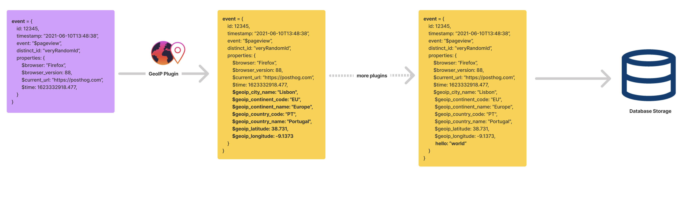
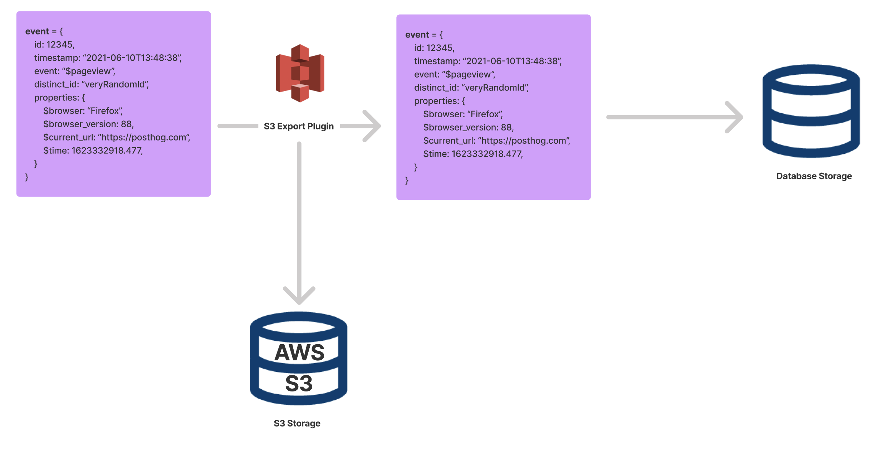
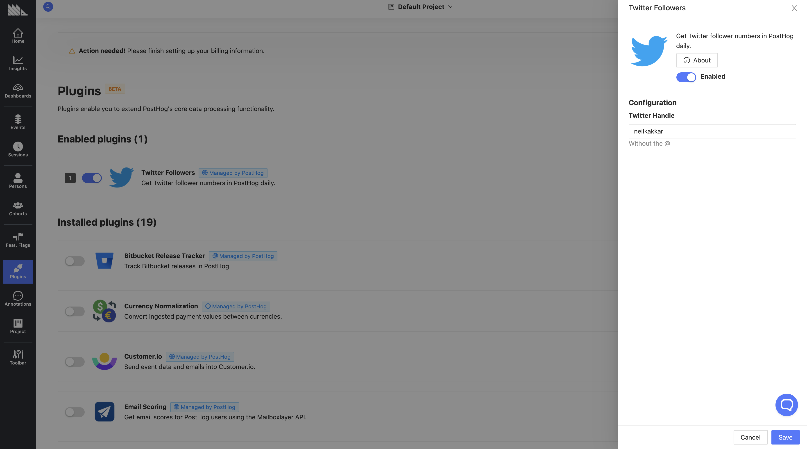

A great way to understand what you can do with [plugins](/docs/plugins/overview) is to understand how data flows throw plugins.

There are 2 big concepts to remember:

1. Every plugin acts on a single event coming in.

2. Plugins act on events before they are stored.

Each plugin can add more information to the event, or even modify existing properties. For example, the [GeoIP plugin](https://posthog.com/plugins/geoip) is a plugin that adds GeoIP information to the event.

Note that the output of one plugin goes into the next plugin. Here's how this looks:



However, this isn't all. Plugins _don't_ have to modify events at all: they can do other things when an event comes in.

For example, you can send an event to AWS S3 whenever you see it in PostHog. Indeed, the [S3 plugin](https://posthog.com/plugins/s3-export) does exactly that. In this case, it doesn't matter if the S3 export succeeds or not, the event will always be stored.



There's also some plugins that enqueue jobs to run in the future. More information about jobs in [the developer reference](/docs/plugins/build/reference#jobs-1).

Now, how do you make all of this happen? Every plugin has two files: `index.js` and `plugin.json`. The index file has code for the entire plugin, and the JSON file has configuration for user inputs. This config is what you see in the PostHog UI:



We have some special function names that allow you to process an event, like in the GeoIP plugin, or to do something else entirely, like in the S3 export plugin. We expect `index.js` to export these special functions.

Two notable ones are `processEvent` and `onEvent`. Both of them take in a single event and the meta object. More details on the meta object [in the developer reference](/docs/plugins/build/reference#pluginmeta), but one key property is `meta.config`, which allows your code to read the configuration values set by users. Yes, the same configuration you set via `plugin.json`.

If you want to add new properties to your event, like in the GeoIP Plugin, you'd use the `processEvent` function. Here's a sample plugin that adds the `hello` property to the event.

```js
/* Runs on every event */
export function processEvent(event, meta) {
    // Some events (like $identify) don't have properties
    if (event.properties) {
        event.properties['hello'] = `Hello ${meta.config.name || 'world'}`
    }
    // Return the event to ingest, return nothing to discard  
    return event
}
```

Note how you need to return the event to ensure the chain continues. If you return `null` or `undefined`, you're telling us to discard this event. For example, the [Schema enforcer plugin](https://github.com/PostHog/posthog-schema-enforcer-plugin) does precisely this for events that don't adhere to a schema.

`onEvent` is what you'd use to do something else, like exporting to S3. For example, the below plugin logs the current URL on $pageview type events:

```js
/* Runs on every event */
export function onEvent(event, meta) {

    if (event.event === "$pageview") {
        // these logs appear in the UI
        console.log(event.$current_url)
    }

    // Don't need to return event, any return value is discarded, and the event is not modified
}
```

As you can imagine, this plugin is pretty useless, since PostHog can already show you this information. But it serves to explain how things work. Note how you can choose what kind of events you want to operate on, using the existing event properties.

That's all for the crash course. There's a lot you can do with plugins, like running specific jobs every hour, sending events elsewhere via HTTP endpoints, modifying events coming in before they're stored, etc. 

## Next steps

1. For in-depth information on all the special functions which allow you to do this, check out [the developer reference](/docs/plugins/build/reference)
2. For building your own plugin from start to finish, check out [the tutorial](/docs/plugins/build/tutorial)