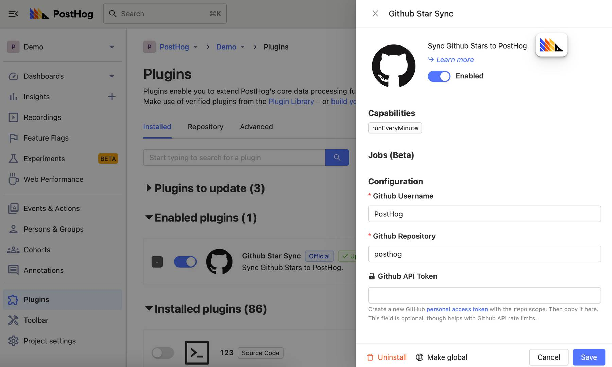

PostHog makes it possible to build your own [plugins](/docs/plugins/overview) and integrate with other platforms. So, if [our integration library](/integrations) is missing something you need then you may still be able to create it yourself. You can even share plugins with us, so they can be used by other users too!

Plugins can add more information to an event, modify existing properties, import or export data, or trigger a range of other activities. There are also some plugins that enqueue jobs to run in the future. Find out more about jobs in [our developer reference docs](/docs/plugins/build/reference#jobs-1). 

## Building your own plugin

Now, how do you make all of this happen? Each plugin has two files: `index.js` and `plugin.json`. The index file has code for the entire plugin, and the JSON file has configuration for user inputs. This config is what you see in PostHog:



We have some special function names which enable you to process an event, like in the GeoIP plugin, or to do something else entirely, like in the S3 export plugin. We expect `index.js` to export these special functions.

Two notable functions to be aware of are `processEvent` and `onEvent`. Both of these take in a single event and the meta object. You can find out more about meta objects [in our developer reference docs](/docs/plugins/build/reference#pluginmeta), but one key property is `meta.config`. This property enables your code to read the configuration values set by users via `plugin.json`.

If you want to add new properties to your event, like the GeoIP plugin does, use the `processEvent` function. Here's an example plugin that adds the `hello` property to events.

```js
/* Runs on every event */
export function processEvent(event, meta) {
    // Some events (like $identify) don't have properties
    if (event.properties) {
        event.properties['hello'] = `Hello ${meta.config.name || 'world'}`
    }
    // Return the event to ingest, return nothing to discard  
    return event
}
```

Note how you need to return the event to ensure the chain continues. If you return `null` or `undefined`, you're telling PostHog to discard this event. For example, the [Schema enforcer plugin](https://github.com/PostHog/posthog-schema-enforcer-plugin) does precisely this for events that don't adhere to a schema.

To do something elese, like exporting to S3, use the `onEvent` function. For example, the below plugin logs the current URL on $pageview type events:

```js
/* Runs on every event */
export function onEvent(event, meta) {

    if (event.event === "$pageview") {
        // these logs appear in the UI
        console.log(event.$current_url)
    }

    // Don't need to return event, any return value is discarded, and the event is not modified
}
```

This plugin is admittedly useless since PostHog can already show you this information, but it serves to explain how things work. Note how you can choose what kind of events you want to operate on by using the existing event properties.

## Documentation guidelines

To ensure that plugins are useful to others, we require that plugins submitted to [our integration library](/integrations) follow some guidelines. This helps us ensure we describe plugins correctly and give other users the information they need to use a plugin correctly. 

We encourage you to add more info, screenshots, etc., if you feel it is useful, but as a minimum we require that plugins submitted to [hey@posthog.com](mailto:hey@posthog.com?subject=Submit%20Plugin%20to%20Repository&body=Plugin%20GitHub%20link%3A) answer the follow questions. 

- What does your plugin do?
- What steps must users take to enable your plugin correctly?
- What configuration options exist within your plugin?
- What requirements does your plugin have?
- Does your plugin need a specific version of PostHog?

## Adding your plugin to PostHog

Once you've built your own plugin, you can submit it our [integration library](/integrations). This means everyone else can use your plugin too, including users on PostHog Cloud. Here's how:

1. If you built a plugin inside the PostHog editor, you first need to [convert it to a GitHub repository](#converting-a-source-plugin-to-a-github-repository). You can skip this step if you've already created it as a GitHub repo.

2. Plugins need documentation, so that other users know how to use them and we know how to describe them. Create a README.MD for your GitHub repo that follows our [plugin documentation guidelines](#documentation-guidelines). 

3. Finally, [email your plugin GitHub URL to hey@posthog.com](mailto:hey@posthog.com?subject=Submit%20Plugin%20to%20Repository&body=Plugin%20GitHub%20link%3A) so we can take a look.

Once we get your email, we review the plugin to ensure it's secure, performant, and adheres to best practices. Then, we add it to our official repository and make it available for everyone to use.

## Next steps

That's all for the crash course. There's a lot you can do with plugins, such as running specific jobs every hour, sending events elsewhere via HTTP endpoints or modifying events before they're stored. Here are some additional resources to help you get started in building your own plugin for PostHog:

1. For in-depth information on all the special functions, check out [the developer reference docs](/docs/plugins/build/reference).
2. For building your own plugin from start to finish, check out [our tutorial](/docs/plugins/build/tutorial).
3. To ask questions or collaborate with others in the community, join [the #Contributing channel in our community Slack group](/slack).