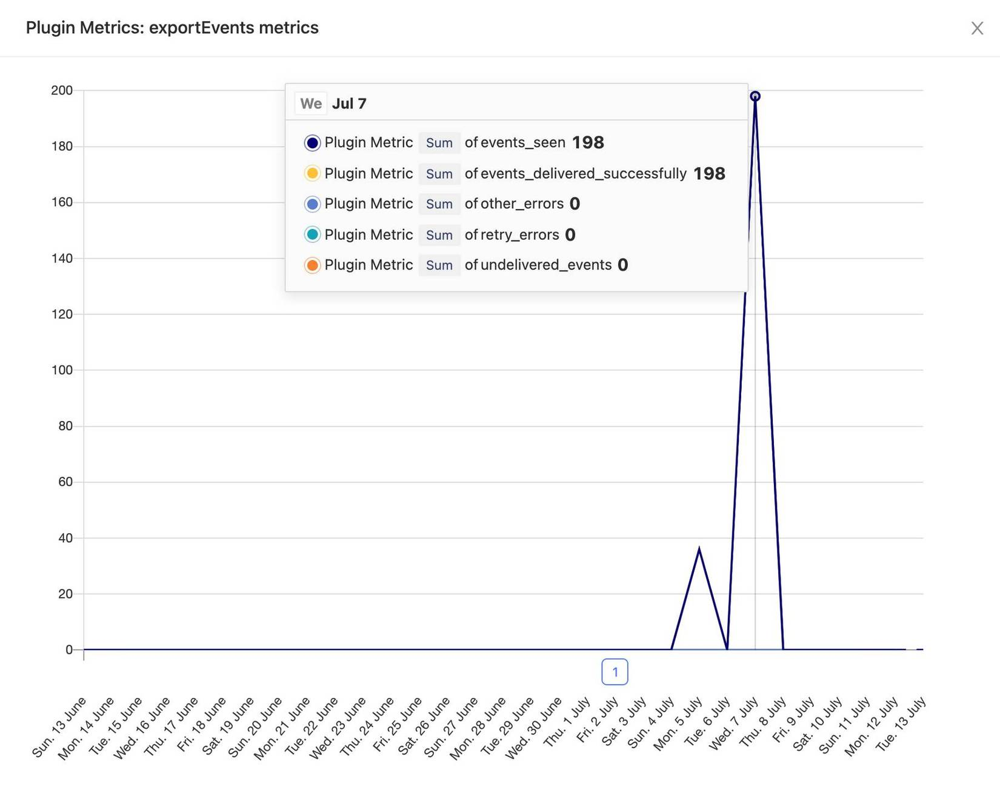

> **Note:** It's worth reading the [Building plugins overview](./overview) for a quick introduction to how to build your own plugin.

## plugin.json file

A `plugin.json` file is structured as follows:

```json
{
  "name": "<plugin_display_name>",
  "url": "<repo_url>",
  "description": "<description>",
  "main": "<entry_point>",
  "config": [
    {
      "markdown": "Custom markdown block before the fields,\n[Use links](http://example.com) and other goodies!"
    },
    {
      "key": "param1",
      "name": "<param1_name>",
      "type": "<param1_type>",
      "default": "<param1_default_value>",
      "hint": "<param1_hint_value>",
      "required": true,
      "secret": true
    },
    {
      "name": "<param2_name>",
      "type": "<param2_type>",
      "default": "<param2_default_value>",
      "required": false,
    }
  ]
}
```

Here's an example `plugin.json` file from our ['Hello world plugin'](https://github.com/PostHog/helloworldplugin):

```json
{
  "name": "Hello World",
  "url": "https://github.com/PostHog/helloworldplugin",
  "description": "Greet the World and Foo a Bar, JS edition!",
  "main": "index.js",
  "config": [
    {
      "markdown": "This is a sample plugin!"
    },
    {
      "key": "bar",
      "name": "What's in the bar?",
      "type": "string",
      "default": "baz",
      "hint": "This will be sent in a **property**",
      "required": false
    }
  ]
}
```

Most options in this file are self-explanatory, but there are a few worth exploring further:

### main

`main` determines the entry point for your plugin, where your `setupPlugin` and `processEvent` functions are. More on these later.

### config

`config` consists of an array of objects that each pertain to a specific configuration field or markdown explanation for your plugin.

Each object in a config can have the following properties:

|   Key    |                    Type                    |                                                                           Description                                                                           |
| :------: | :----------------------------------------: | :-------------------------------------------------------------------------------------------------------------------------------------------------------------: |
|   type   | `"string"` or `"attachment"` or `"choice"` | Determines the type of the field - "attachment" asks the user for an upload, and "choice" requires the config object to have a `choices` array, explained below |
|   key    |                  `string`                  |                                     The key of the plugin config field, used to reference the value from inside the plugin                                      |
|   name   |                  `string`                  |                                          Displayable name of the field - appears on the plugin setup in the PostHog UI                                          |
| default  |                  `string`                  |                                                                   Default value of the field                                                                    |
|   hint   |                  `string`                  |                                             More information about the field, displayed under the in the PostHog UI                                             |
| markdown |                  `string`                  |                                                             Markdown to be displayed with the field                                                             |
|  order   |                  `number`                  |                                                                           Deprecated                                                                            |
| required |                 `boolean`                  |                                               Specifies if the user needs to provide a value for the field or not                                               |
|  secret  |                 `boolean`                  |                     Secret values are write-only and never shown to the user again - useful for plugins that ask for API Keys, for example                      |
| choices  |                  `string[]`                   |                           Only accepted on configs with `type` equal to `"choice"` - an array of choices (of type `string`) to be presented to the user                            |

> **Note:** You can have a config field that only contains `markdown`. This won't be used to configure your plugin but can be placed anywhere in the `config` array and is useful for customizing the content of your plugin's configuration step in the PostHog UI.

## PluginMeta

> Check out [Plugin Types](/docs/plugins/types) for a full spec of types for plugin authors.

**Every plugin server function** is called by the plugin server with an object of type `PluginMeta` that will always contain the object `cache`, and can also include `global`, `attachments`, and `config`, which you can use in your logic. 

Here's what they do:

### config

Gives you access to the plugin config values as described in `plugin.json` and configured via the PostHog interface.

Example:
```js
export async function processEvent(event, { config }) {
    event.properties['greeting'] = config.greeting
    return event
})
```

### cache

A way to store values that persist across special function calls. The values are stored in [Redis](https://redis.io/), an in-memory store.

The `cache` type is defined as follows:

```js
interface CacheExtension {
    set: (key: string, value: unknown, ttlSeconds?: number, options?: CacheOptions) => Promise<void>
    get: (key: string, defaultValue: unknown, options?: CacheOptions) => Promise<unknown>
    incr: (key: string) => Promise<number>
    expire: (key: string, ttlSeconds: number) => Promise<boolean>
    lpush: (key: string, elementOrArray: unknown[]) => Promise<number>
    lrange: (key: string, startIndex: number, endIndex: number) => Promise<string[]>
    llen: (key: string) => Promise<number>
}
```

Storing values is done via `cache.set`, which takes a key and a value, as well as an optional value in seconds after which the key will expire.

Retrieving values uses `cache.get`, which takes the key of the value to be retrieved, as well as a default value in case the key does not exist.

You can also use `cache.incr` to increment numerical values by 1, and `cache.expire` to make keys _volatile_, meaning they will expire after the specified number of seconds.

Methods `cache.lpush`, `cache.lrange`, and `cache.llen` enable operations on Redis lists.

All the above methods represent their equivalent Redis commands – see Redis documentation:

- [SET](https://redis.io/commands/set)
- [GET](https://redis.io/commands/get)
- [INCR](https://redis.io/commands/incr)
- [EXPIRE](https://redis.io/commands/expire)
- [LPUSH](https://redis.io/commands/lpush)
- [LRANGE](https://redis.io/commands/lrange)
- [LLEN](https://redis.io/commands/llen)

Example:
```js
export function processEvent(event, { config, cache }) {
    const counterValue = (await cache.get('greeting_counter', 0))
    cache.set('greeting_counter', counterValue + 1)
    if (!event.properties) event.properties = {}
    event.properties['greeting_counter'] = counterValue
    return event
}
```

### global

The `global` object is used for sharing functionality between `setupPlugin` and the rest of the special functions, like `processEvent`, `onEvent`, or `runEveryMinute`, since global scope does not work in the context of PostHog plugins. 

Example:
```js
export function setupPlugin({ global, config }) {
    global.eventsToTrack = config.split(',') 
}

export function processEvent(event, { global, config }) {
    if(global.eventsToTrack.indexOf(event.event)) {
        // Do something
    }
}
```


### attachments

Attachments gives access to files uploaded by the user for config parameters of type `attachment`. An `attachment` has the following type definition:

```js
interface PluginAttachment {
    content_type: string
    file_name: string
    contents: any
}
```

As such, accessing the contents of an uploaded file can be done with `attachments.attachmentName.contents`.

Example:
```js
export function setupPlugin({ attachments, global }: Meta) {
    if (attachments.maxmindMmdb) {
        global.ipLookup = new Reader(attachments.maxmindMmdb.contents)
    }
}
```

### jobs

The `jobs` object gives you access to the jobs you specified in your plugin. See [Jobs](#jobs-1) for more information.

### geoip

`geoip` provides a way to interface with a [MaxMind](https://www.maxmind.com/en/home) database running in the plugin server to get location data for an IP. It is [primarily used for the PostHog GeoIP plugin](https://github.com/PostHog/posthog-plugin-geoip/blob/6412763f70a80cf3e1895e8a559a470d80abc9d5/index.ts#L12).

It has a `locate` method that takes an ip and returns an object possibly containing `city`, `location`, `postal`, and `subdivisions`.

Read more about the response from `geoip.locate` [here](https://github.com/maxmind/GeoIP2-node/blob/af20a9681c85445a73d3446e2a682f64d3b673db/src/models/City.ts).

## setupPlugin function

`setupPlugin` is a function you can use to dynamically set plugin configuration based on the user's inputs at the configuration step. 

You could, for example, check if an API Key inputted by the user is valid and throw an error if it isn't, prompting PostHog to ask for a new key.

It takes only an object of type `PluginMeta` as a parameter and does not return anything.

Example (from the [PostHog MaxMind Plugin](https://github.com/PostHog/posthog-maxmind-plugin)):

```js
export function setupPlugin({ attachments, global }) {
    if (attachments.maxmindMmdb) {
        global.ipLookup = new Reader(attachments.maxmindMmdb.contents)
    }
}
```

If you throw a `RetryError` (imported from `@posthog/plugin-scaffold`) in your `setupPlugin` function, PostHog will retry the initialization up to 10 times within an hour before disabling the plugin. Errors other than `RetryError` cause the plugin to be disabled automatically.

`RetryError` should be used to indicate an error that is dependent on an external service, meaning that retrying it may actually lead to a different outcome (success). If you throw a `RetryError` because parsing a config option fail, it will never actually succeed.

Example:

```js
import { RetryError } from '@posthog/plugin-scaffold'

// Good!
export function setupPlugin() {
    try {
      // call some API
    } catch {
      throw new RetryError('Service is down, retry later')
    }
}

// Bad!
export function setupPlugin({ config }) {
    let eventsToTrack
    try {
      // errors if array resulting from `split` has less than 6 elements
      eventsToTrack = config.split(',')[5] 
    } catch {
      throw new RetryError('I will retry but never succeed')
    }
}
```

## processEvent function

> If you were using `processEventBatch` before, you should now use `processEvent`. `processEventBatch` has been **deprecated**.

`processEvent` is the juice of your plugin. 

In essence, it takes an event as a parameter and returns an event as a result. In the process, this event can be:

- Modified
- Sent somewhere else
- Not returned (preventing ingestion)

It takes an event and an object of type `PluginMeta` as parameters and returns an event.

Here's an example (from the ['Hello World Plugin'](https://github.com/PostHog/helloworldplugin)):

```js
async function processEvent(event, { config, cache }) {
    const counter = await cache.get('counter', 0)
    cache.set('counter', counter + 1)

    if (event.properties) {
        event.properties['hello'] = 'world'
        event.properties['bar'] = config.bar
        event.properties['$counter'] = counter
    }

    return event
}
```

As you can see, the function receives the event before it is ingested by PostHog, adds properties to it (or modifies them), and returns the enriched event, which will then be ingested by PostHog (after all plugins run).

> Please note that `$snapshot` events (used for session recordings) do not go through `processEvent`. Instead, you can access them via the `onSnapshot` function described below.

## onEvent function

> **Minimum PostHog version:** 1.25.0 

`onEvent` works similarly to `processEvent`, except any returned value is ignored by the plugin server. In other words, `onEvent` can read an event but not modify it. 

In addition, `onEvent` functions will run after all enabled plugins have run `processEvent`. This ensures you will be receiving an event following all possible modifications to it.

This was originally built for and is particularly useful for export plugins. These plugins need to receive the "final form" of an event and send it out of PostHog, without having to modify it.

Here's a quick example:

```js
async function onEvent(event) {
    // do something to the event
    sendEventToSalesforce(event)

    // no need to return anything
}
```


## onSnapshot function

> **Minimum PostHog version:** 1.25.0

`onSnapshot` works exactly like `onEvent`. The only difference between the two is that `onSnapshot` receives session recording events, while `onEvent` receives all other events.

## Scheduled tasks

Plugins can also run scheduled tasks through the functions:

- `runEveryMinute`
- `runEveryHour`
- `runEveryDay`

These functions only take an object of type `PluginMeta` as a parameter and do not return anything.

Example usage:

```js
async function runEveryMinute({ config }) {
    const url = `https://api.github.com/repos/PostHog/posthog`
    const response = await fetch(url)
    const metrics = await response.json()

  // posthog.capture is also available in plugins by default
    posthog.capture('github metrics', { 
        stars: metrics.stargazers_count,
        open_issues: metrics.open_issues_count,
        forks: metrics.forks_count,
        subscribers: metrics.subscribers_count
    })
}
```

It's worth noting that the plugin server supports debouncing, meaning that the counter for the next task will only start once the previous task finishes. In other words, if a given task that runs "every minute" takes longer than a minute, the next task will only start one minute after the previous task finishes.

## teardownPlugin function

`teardownPlugin` is ran when a plugin VM is destroyed, because of, for example, a plugin server shutdown or an update to the plugin. It can be used to flush/complete any operations that may still be pending, like exporting events to a third-party service.

```js
async function teardownPlugin({ global }) {
  await global.buffer.flush()
}
```

## exportEvents

`exportEvents` was built to make exporting PostHog events to third-party services (like data warehouses) extremely easy. 

Example:

```js
async function exportEvents(events, meta) {
  try {
    // send events somewhere
  } catch {
    throw new RetryError('Service is down')
  }
}
```

In the background, `exportEvents` sets up asynchronous processing of batches and ensures the events in the batch have already been processed by all enabled plugins. In addition, if a `RetryError` is thrown, `exportEvents` is retried up to 15 times within 24 hours using an exponential backoff approach.

## Available packages and imports

Plugins have access to some special objects in the global scope, as well as a variety of libraries for importing. Scheduling functions (`setInterval`, `setTimeout` and `setImmediate`) are not available. Use jobs instead.

### Global

#### `fetch`

<blockquote class="warning-note">

⚠️ Be very careful when using `fetch` to send events to a PostHog instance from `processEvent` or `onEvent`! The event captured will also be run through all the installed plugins and could potentially lead to an infinite loop of event generation.

</blockquote>

Equivalent to [node-fetch](https://www.npmjs.com/package/node-fetch).

#### posthog

The global `posthog` object gives you access to the following:

##### capture

<blockquote class="warning-note">

⚠️ Be very careful when calling `posthog.capture` from `processEvent` or `onEvent`! The event captured will also be run through all the installed plugins and could potentially lead to an infinite loop of event generation.

</blockquote>

Calling `posthog.capture` allows you to capture a new event under the same project the plugin is running in.

It takes 2 arguments, the first one being an event name (required), and the second one being an object with properties to set on the event (optional).

Plugins can pass `distinct_id` on the event properties to specify what user the event should be attributed to. If `distinct_id` is not specified, the event will be a attributed to a generic "Plugin Server" person.

Method signature:

```js
capture(event: string, properties?: Record<string, any>) => void
```
##### api

<blockquote class="warning-note">

⚠️ Be very careful when using `posthog.api.post` to send events to a PostHog instance from `processEvent` or `onEvent`! The event captured will also be run through all the installed plugins and could potentially lead to an infinite loop of event generation.

</blockquote>

`posthog.api` gives you access to the following 4 methods:

- `get(path: string, options?: ApiMethodOptions): Promise<Response>`
- `post(path: string, options?: ApiMethodOptions): Promise<Response>`
- `put(path: string, options?: ApiMethodOptions): Promise<Response>`
- `delete(path: string, options?: ApiMethodOptions): Promise<Response>`

These correspond to HTTP requests and make interacting with the PostHog API an easier process. By default, a personal API key will be provisioned for you and requests will automatically specify this key, as well as set the project the plugin is installed in as the project to use the API with.

You can override these defaults to interact with another PostHog project or instance. The options available are:


```js
interface ApiMethodOptions {
    // any data to send with the request, GET and DELETE will set these as URL params
    data: Record<string, any> 

    // posthog host, defaults to https://app.posthog.com
    host: string 

    // specifies the project to interact with
    projectApiKey: string 

    // authenticates the user
    personalApiKey: string 
}
```

**Example usage**

```js
await posthog.api.get(
  '/api/event', 
  { 
    data: { param: 'some param' }, 
    host: 'https://posthog.mydomain.com' 
  }
)
```

### Available imports

| Import name | Description |
| :---------: | :---------: | 
| `crypto`    | [Node.js standard lib's `crypto` module](https://nodejs.org/api/crypto.html) |
| `url`    | [Node.js standard lib's `url` module](https://nodejs.org/api/url.html) |
| `zlib`    | [Node.js standard lib's `zlib` module](https://nodejs.org/api/zlib.html) |
| `generic-pool`    | [`npm` package `generic-pool`](https://www.npmjs.com/package/generic-pool) |
| `pg`    | [`npm` package `node-postgres`](https://www.npmjs.com/package/pg) |
| `snowflake-sdk`    | [`npm` package `snowflake-sdk`](https://www.npmjs.com/package/snowflake-sdk) |
| `aws-sdk`    | [`npm` package `aws-sdk`](https://www.npmjs.com/package/aws-sdk) |
| `@google-cloud/bigquery`    | [`npm` package `@google-cloud/bigquery`](https://www.npmjs.com/package/@google-cloud/bigquery) |
| `node-fetch`    | [`npm` package `node-fetch`](https://www.npmjs.com/package/node-fetch) |
| `@posthog/plugin-scaffold`    | Types for PostHog plugins. [`npm` package `@posthog/plugin-scaffold`](https://www.npmjs.com/package/@posthog/plugin-scaffold) |
| `@posthog/plugin-contrib`    | Helpers for plugin devs maintained by PostHog. [`npm` package `@posthog/plugin-contrib`](https://www.npmjs.com/package/@posthog/plugin-contrib) |


#### Example 

Here's an example of the use of imports from the BigQuery plugin:

```js
import { createBuffer } from '@posthog/plugin-contrib'
import { Plugin, PluginMeta, PluginEvent, RetryError } from '@posthog/plugin-scaffold'
import { BigQuery, Table, TableField, TableMetadata } from '@google-cloud/bigquery'
```

You can also use `require` for imports.

## Logs

Plugins can make use of the `console` for logging and debugging. `console.log`, `console.warn`, `console.error`, `console.debug`, `console.info` are all supported.

These logs can be seen on the 'Logs' page of each plugin, which can be accessed on the 'Plugins' page of the PostHog UI.

## Jobs

> **Minimum PostHog version:** 1.25.0

Jobs are a way for plugin developers to schedule and run tasks asynchronously using a powerful scheduling API.

Jobs make possible use cases such as retrying failed requests, a key component of plugins that export data out of PostHog.

### Specifying jobs

To specify jobs, you should export a `jobs` object mapping string keys (job names) to functions (jobs), like so:

```js
export const jobs = {
    retryRequest: (request, meta) => {
        fetch(request.url, request.options)
    }
}
```

Job functions can optionally take a payload as their first argument, which can be of any type. They can also access the `meta` object, which is appended as an argument to all plugin functions, meaning that it will be the second argument in the presence of a payload, and the first (and only) argument in the absence of one.

### Triggering a job

Jobs are accessed as `jobs` via the `meta` object. Triggering a job works as follows:

```js
await jobs.retryRequest(request).runIn(30, 'seconds')
await jobs.retryRequest(request).runNow()
await jobs.retryRequest(request).runAt(new Date())
```

Having gotten a job function via its key from the `jobs` object calling the function with the desired payload will return another object with 3 functions that can be used to schedule your job. They are:

- `runNow`: Runs the job now, but does so asynchronously
- `runAt`: Takes a JavaScript `Date` object that specifies when the job should run
- `runIn`: Takes a duration as a `number` and a unit as a `string` specifying in how many units of time to run this job (e.g. 1 hour)

> Accepted values for the unit argument of `runIn` are: 'milliseconds', 'seconds', 'minutes', 'hours', 'days', 'weeks', 'months', 'quarters', and 'years'. The function will accept these in both singular (e.g. 'second') or plural (e.g. 'seconds') form.

All jobs return a promise that does not resolve to any value. 

### Full example

```js
export const jobs = {
    continueSearchingForTheTeapot: async (request, meta) => {
        await lookForTheTeapot(request)
    }
}

async function lookForTheTeapot (request) {
    const res = await fetch(request.url)
    if (res.status !== 418) {
        await jobs.lookForTheTeapot(request).runIn(30, 'seconds')
        return
    }
    console.log('found the teapot!')
}

export async function processEvent (event, { jobs }) {

    const request = { url: 'https://www.google.com/teapot' }
    await lookForTheTeapot(request)
    
    return event
}
```

## Metrics

> **Minimum PostHog version:** 1.27.0



Plugin metrics allow plugin developers to provide metrics for users about plugin performance. They will appear in a chart on the plugins page, which is made visible by clicking the chart icon for a specific plugin. 

This could be tracking the number of errors and successes when exporting events to another service, or the maximum amount of time taken for a request to a third-party API to complete, for example.
### Specifying metrics

To specify metrics, you should export a `metrics` object mapping string keys (metric names) to metric operations, like so:

```js
export const metrics = {
    'metric1': 'sum',
    'metric2': 'max',
    'metric3': 'min'
}
```

The supported metric operations are `sum`, `max`, and `min`. If you're using TypeScript, a handy enum is provided for you in `@posthog/plugin-scaffold`, called `MetricsOperation`. 

The metric operations correspond to property aggregation operations you can use in a PostHog trends graph. `sum` metrics will show a graph where all the values for the metric during the period will be added together. `max` and `min`, on the other hand, will create a graph showing the maximum or minimum values the property had in each time period.  
### Updating metrics

Each metric type has an operation it is allowed to perform. This is as follows:

| Metric type | Operation |
| :---------: | :--------: |
| `sum` | `increment` |
| `max` | `max` |
| `min` | `min` |

To update a metric, access `metrics` via the plugin's `meta` object, and you'll be able to call the respective methods on them, like so:

```js
export function processEvent(event, { metrics }) {
    metrics.metric1.increment(100) // sum is now 100
    metrics.metric1.increment(10) // sum is now 110
    metrics.metric1.increment(-10) // sum is now 100
    metrics['metric2'].max(5) // max is now 5
    metrics['metric2'].max(10) // max is now 10
    metrics['metric3'].min(4) // min is now 4
    metrics['metric3'].min(1) // max is now 1
}
```

### exportEvents

If your plugin uses `exportEvents`, some metrics will be automatically provided for you. These are:

- `events_seen`: How many events the `exportEvents` function has received for processing
- `events_delivered_successfully`: The number of events that were processed by the `exportEvents` function and no error was thrown
- `retry_errors`: The number of explicit errors of type `RetryError` thrown by the `exportEvents` function. These errors trigger retries to ensure the payload gets delivered.
- `other_errors`: Unexpected errors thrown by the `exportEvents` function. Any error beyond a `RetryError` is considered unexpected
- `undelivered_events`: The total number of events that could not be delivered at all. Events will count towards this total if `exportEvents` throws an unexpected error or the plugin exhausts all the retries triggered by a `RetryError`
