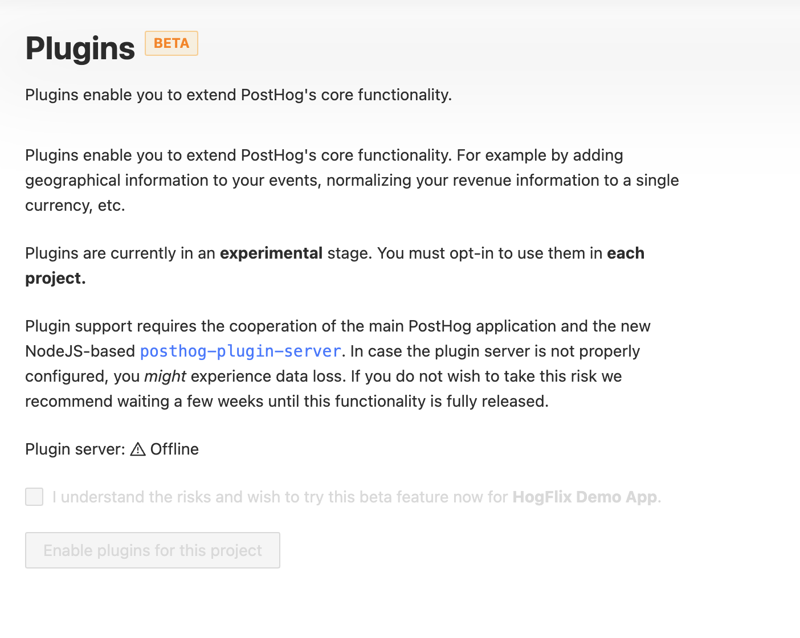

Plugins are currently BETA and require you to opt-in.

When you open "Settings" / "Project Plugins" in PostHog, you will see a screen
such as this:

### Enabling Plugins

To enable plugins, make sure the [plugin server](https://github.com/PostHog/posthog-plugin-server) is online, tick 
the checkbox and click the button to enable plugins.

### Plugin Server is Offline

If the plugin server is offline, you need to update your PostHog deployment and/or manually start
the plugin server.

#### Heroku

When you update to the latest version of PostHog, the plugin server should start automatically.

If it doesn't you need to make sure that a `worker` dyno is running. You have the choice
to enable any of the following dyno types:

- `celeryworker` - runs celery, the default background worker
- `pluginworker` - runs posthog-plugin-server 
- `worker` - contains both `celeryworker` and `pluginworker` inside one dyno

You must have both the celery and plugin workers running for PostHog to function properly.
You can either launch and scale them in separate dynos
or run the default `worker` dyno, which includes both of them.

#### AWS CloudFormation

Please [upgrade to the latest CloudFormation config](/docs/self-host/deploy/aws#updating-cloudformation-template) 
that combines all background workers into one task and activates the plugin server.

Previously we had separate tasks for `worker-beat` and `worker-celery`. In the latest version there is just one `worker`
that starts all three services: celery, celery-beat and plugins.

#### Helm / Kubernetes

Please upgrade to at least version `1.4.0` of the PostHog helm chart to add the `plugins` deployment.

#### Manual / Other

You must run the `bin/plugin-server` script to start the plugin server.

In case your deployment runs `bin/docker-worker`, the plugin server is started automatically.
