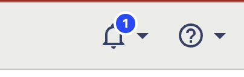

import { ProductScreenshot } from 'components/ProductScreenshot'
import ImgClipboardAuocaptureLight from '../../images/docs/autocapture/clipboard-activity-light.png'
import ImgClipboardAuocaptureDark from '../../images/docs/autocapture/clipboard-activity-dark.png'

> **Note:** Autocapture is available for our [JavaScript Web](/docs/libraries/js), [React](/docs/libraries/react), and [React Native](/docs/libraries/react-native) SDKs.

PostHog can capture frontend events automatically using autocapture, such as any `click`, `change of input`, or submission associated with a `button`, `form`, `input`, `select`, or `textarea`.

This means you don't need to manually instrument tracking for individual components, links, buttons, or other parts of your product.

Autocapture is **enabled by default**. 

## Disabling autocapture

You can also disable autocapture in your [project settings](https://us.posthog.com/project/settings), or by setting `autocapture: false` in the [config](/docs/libraries/js#config). If _one_ of these is disabled, autocapture is disabled.

> Disabling autocapture **does not disable [session recording](/docs/session-replay/manual)**. You can disable session recording by turning it off in your [project settings](https://app.posthog.com/project/settings), or using `disable_session_recording`.

## Configuring autocapture

> This section covers configuring autocapture in the JavaScript and React SDKs. For the React Native SDK, see our [React Native docs](/docs/libraries/react-native#autocapture).

### Reducing events with an allowlist

Autocapture enables you to start capturing events on your site quickly, but this can lead to large numbers of events. To counteract this, you can configure autocapture using allowlists. Allowlists are an array of allowed events – any events for elements not matching an item in the array are dropped.

For example, to only capture clicks on buttons on the docs section of the website that contain the data attribute `ph-autocapture`, you can do the following:

```js-web
posthog.init('<ph_project_api_key>', {
    api_host: '<ph_client_api_host>',
    autocapture: {
        dom_event_allowlist: ['click'], // DOM events from this list ['click', 'change', 'submit']
        url_allowlist: ['posthog.com./docs/.*'], // strings or RegExps
        element_allowlist: ['button'], // DOM elements from this list ['a', 'button', 'form', 'input', 'select', 'textarea', 'label']
        css_selector_allowlist: ['[ph-autocapture]'], // List of CSS selectors
    },
})
```
Allowlists only filter autocapture events – they don't affect the data collected by session recordings or custom events.

### Preventing sensitive data capture

For security reasons and to prevent sensitive data being captured, PostHog is conservative regarding `input` tags. We specifically only collect the `name`, `id`, and `class` attributes from `input` tags. If you need to collect more data from inputs, you should use [custom events](/docs/product-analytics/capture-events).

If there are specific elements you _don't_ want captured, add the `ph-no-capture` class name.

```html
<button class='ph-no-capture'>Sensitive information here</button>
```

## Capturing additional properties in autocapture events

If you add a data attribute onto an element in the format `data-ph-capture-attribute-some-key={someValue}`, then any autocapture event from that element or one of its children will have the property `some-key: 'someValue'` added to it. This can be useful when you want to add additional information to autocapture events. 

### Example 1: Get the value of an element on the page

For example, with a notification bell:



You can include the unread count in the autocapture event by adding the `data-ph-capture-attribute` class like this: 

```HTML
<div
    onClick={toggleNotificationsPopover}
    data-ph-capture-attribute-unread-notifications-count={unreadCount}
>
```

The autocapture event for clicks on the bell will include the unread count.

### Example 2: Tracking ecommerce metadata

You can also track metadata when a customer performs a transaction (such as adding an item to a cart or completing a purchase). Going beyond just knowing _User clicked 'Add to cart'_ is valuable in understanding _what_ users are interested in, even if they don't complete a transaction. It can also shed light onto which products users are interested in, when correlated with other information like marketing campaigns, regionality, or device type.

You can attach metadata to autocapture events by adding data attributes to the element that triggers the event. Below we'll record some metadata when a user adds an item to their cart, based on content available in the DOM.

```HTML
<button
    data-ph-capture-attribute-product-id={productId}
    data-ph-capture-attribute-product-name={productName}
    data-ph-capture-attribute-product-price={productPrice}
    data-ph-capture-attribute-product-quantity={productQuantity}
>
    Add to cart
</button>
```
Replace the `{productXx}` values with the relevant information available on the webpage. Now when the _Add to cart_ button is clicked, the autocapture event will include the product information in the event's properties, like:

```json
properties: {
    "product-id": "12345678"
    "product-name": "Red t-shirt"
    "product-price": "30"
    "product-quantity": "1"
}
```

## Autocaptured properties

Autocaptured events (and client-side custom events) have a number of default properties. These are distinguished by `$` prefix in their name, the PostHog logo next to them in the activity tab, and the verified event logo in the [data management tab](https://app.posthog.com/data-management/properties). These properties can be hidden in activity by checking the "Hide PostHog properties" box.

Autocaptured properties include:

- Timestamp (`$timestamp`)
- OS (`$os`)
- Browser (`$browser`)
- Browser Version (`$browser_version`)
- Device Type (`$device_type`)
- Current URL (`$current_url`)
- Host (`$host`)
- Path Name (`$pathname`)
- Screen Height (`$screen_height`)
- Screen Width (`$screen_width`)
- Viewport Height (`$viewport_height`)
- Viewport Width (`$viewport_width`)
- Library (`$lib`)
- Library Version (`$lib_version`)
- Search Engine (`$search_engine`)
- Referrer URL (`$referrer`)
- Referring Domain (`$referring_domain`)
- UTM Source (`$utm_source`)
- UTM Medium (`$utm_medium`)
- UTM Campaign (`$utm_campaign`)
- UTM term (`$utm_term`)
- Google Click ID (`$gclid`)
- Facebook Click ID (`$fbclid`)
- Microsoft Click ID (`$msclkid`)
- Active Feature Flags (`$active_feature_flags`)
- Plugins Succeeded (`$plugins_succeeded`)
- Plugins Failed (`$plugins_failed`)
- Plugins Deferred (`$plugins_deferred`)
- IP Address (`$ip`)

If enabled, [GeoIP data](/docs/cdp/geoip-enrichment) is added also as properties. 

## Autocapture for copied/cut data

Since v1.111.0 you can configure posthog-js to autocapture information that users copy or cut when on your page. 

```js-web
posthog.init('<ph_project_api_key>', {
    api_host: '<ph_client_api_host>',
    autocapture: {
        capture_copied_text: true,
        // any other autocapture config
    },
})
```

We then report the copied or cut text as a "Clipboard autocapture" event. You can use the `$selected_content` property in analysis. Or use the Activity page to view the copied content in context.

<ProductScreenshot
  imageLight={ImgClipboardAuocaptureLight} 
  imageDark={ImgClipboardAuocaptureDark} 
  alt="The activity view showing the copied content highlighted in context" 
  classes="rounded"
/>

Clipboard autocapture respects other privacy settings. So, for example, won't capture content from a password field.

> **Note:** browsers don't directly allow access to copied data for privacy reasons. So, when posthog-js sees a clipboard event we capture any text currently selected in the browser.

