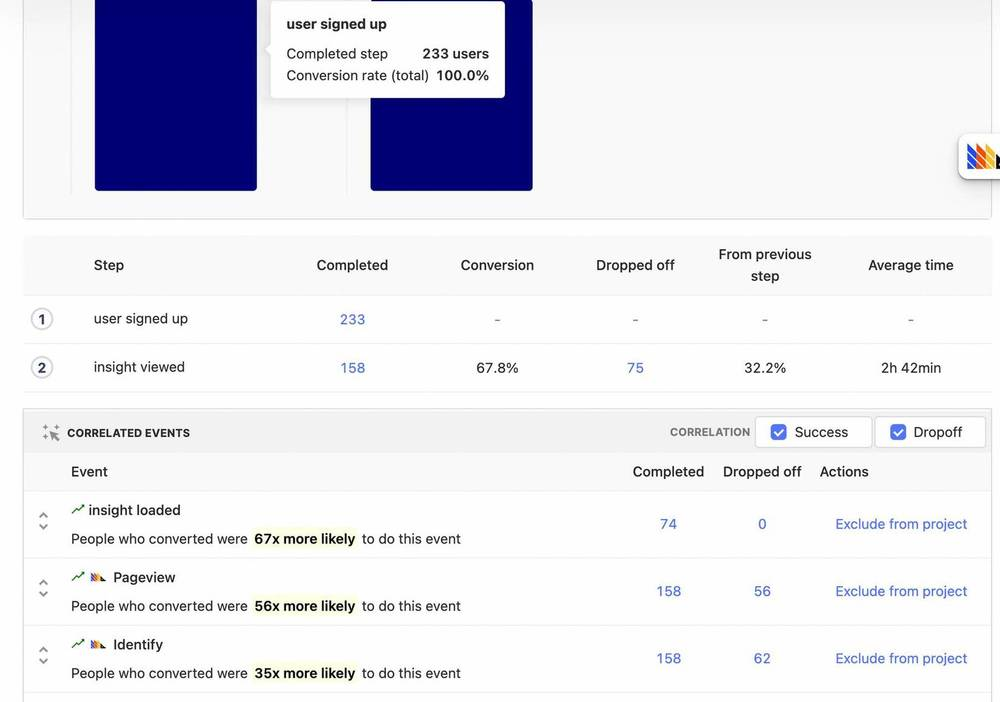
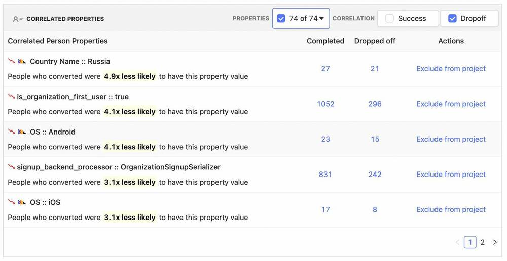
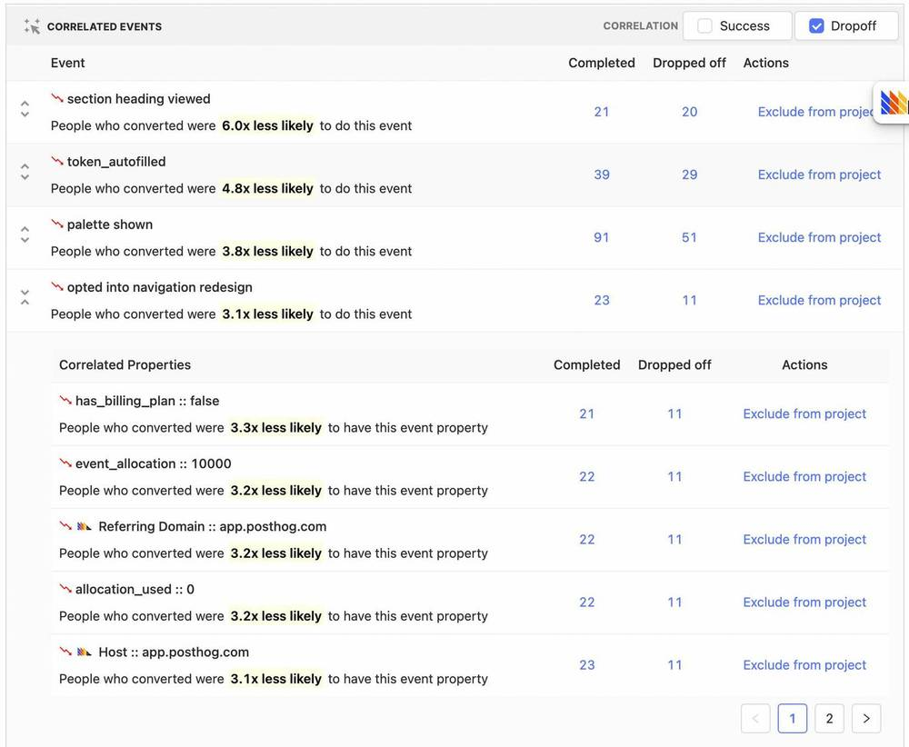
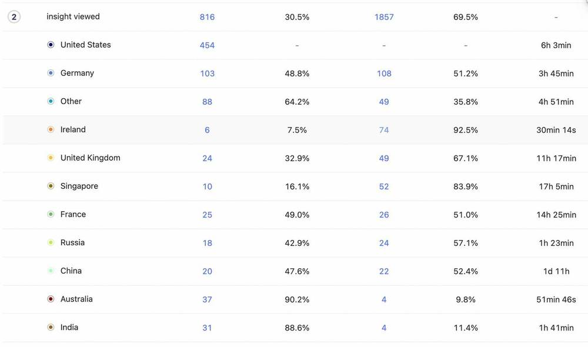

Correlation analysis is a feature within [funnels](/docs/product-analytics/funnels) that **automatically** highlights significant factors impacting the conversion rate of users within a funnel.

Funnels have the ability to directly compare conversion rates of users for a specific property via the breakdown feature, but this requires you to know what property to investigate. If you're not certain, correlation analysis is helpful because it can highlight significant events or properties automatically. 

Given a funnel, PostHog will calculate the conversion rate for different slices (either by events performed, properties they have or properties for the events they performed) and surface relevant signals. Below is an example of what correlation analysis might look like:

## Using correlation analysis

Suppose we have a funnel and we want to optimize it. The first thing we might want to do is identify if there is anything special about user that make them more or less likely to convert. With correlation analysis we can automatically identify which user properties are significant:

Above we can see that the conversion rate of people using Android and iOS are **4.1x** and **3.1x times less likely** to convert in our example funnel. However, we also see other properties that may be of interest, for instance the "Country
Name". This gives us some threads to pull on, perhaps we might look into internationalization, or ensure the app loads well in different regions.

Equally, we can see specific events that are correlated:

Above we see that in our example funnel, users that performed the "opted into navigation redesign" event were 3.1x times less likely to convert.

We can drill down further to see how this events properties are correlated as well. Click on the expand event button to the left and we see that people that opted for the redesign and did not have a billing plan were 3.3x times less likely to convert.

Where we go from here requires further investigation, but the important point is that we now have strings to pull on which hopefully end up with actionable insights.

## What to do with this newfound knowledge?

One route for further exploration might be to drill down to the people that were considered for this specific event correlation. We can do so by clicking on the "Completed" and "Dropped off" numbers within a row. In the above case, users for both "Completed" and "Dropped off" will have performed the "opted into navigation redesign". "Completed" means the users fully completed the funnel, where as "Dropped off" users will include users who entered the funnel, but failed to make it through to the end.

Another option might be to take, for instance, the "Country Name" property and add this as a funnel breakdown to further explore and understand the affect it has on the funnel:

## Making correlations accurate

You have better context on your product, and what could be a relevant signal or not. There will be some events and/or properties that perhaps have trivial correlations, or don't actually provide an actionable signal. To remove this
potential distractions, use either the property names drop down to ignore them in analysis for a funnel in particular, or use the _Exclude from project_ feature which will ensure that you and your team will not see correlations for these events and properties whilst within this project.

It's important to remember that the accuracy and therefore usefulness of any correlation is dependent on the sample size, if you've only got a handful of users for a specific correlation then it would be wise to try to increase this number. You can do this by, for instance, increasing the date range size of the funnel.

### Further reading

Want to know more about what's possible with Correlation in PostHog? Try these tutorials:

-   [How to correlate Sentry errors with PostHog data](/tutorials/sentry-plugin-tutorial)

Want more? Check our [full list of PostHog tutorials](https://posthog.com/tutorials).
