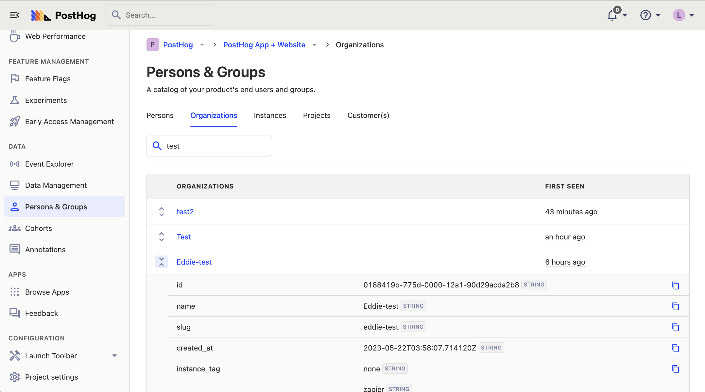
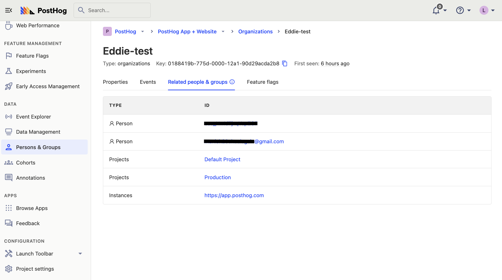
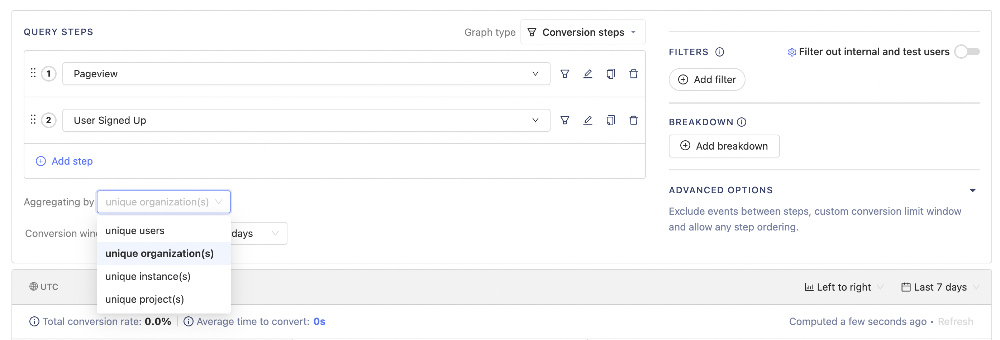
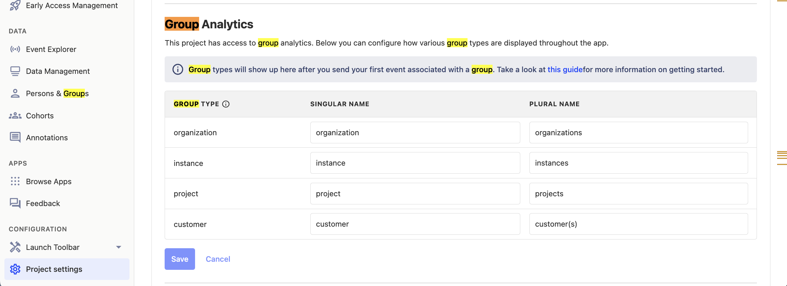

import JSGroupsIntro from "../\_snippets/groups-intro.mdx"
import JSGroupsVSCohorts from "../\_snippets/groups-vs-cohorts.mdx"
import JSCreateGroups from "../\_snippets/how-to-create-groups.mdx"
import JSSetGroupProperties from "../\_snippets/setting-group-properties.mdx"
import JSLinkEventsToGroups from "../\_snippets/how-to-link-events-to-groups.mdx"

<JSGroupsIntro />

## The difference between groups and cohorts

<JSGroupsVSCohorts />

## How to create groups

<JSCreateGroups />

## How to set group properties

<JSSetGroupProperties />

## How to capture group events

<JSLinkEventsToGroups />

### Advanced (server-side only): Capturing group events without a user

If you want to capture group events but don't want to associate them with a specific user, we recommend using a single static string as the distinct ID to capture these events. This can be anything you want, as long as it's the same for every group event:

<MultiLanguage >

```node
posthog.capture({
    event: 'group_event_name',
    distinctId: 'static_string_for_group_events',
    groups: { company: 'company_id_in_your_db' }
})
```

```python
posthog.capture('static_string_for_group_events', 
    'group_event_name', 
    groups={'company': 'company_id_in_your_db'}
)
```

```go
client.Enqueue(posthog.Capture{
    DistinctId: "static_string_for_group_events",
    Event: "group_event_name",
    Groups: posthog.NewGroups().
        Set("company", "company_id_in_your_db"),
})
```

```php
PostHog::capture(array(
    'distinctId' => 'static_string_for_group_events',
    'event' => 'group_event_name',
    '$groups' => array("company" => "company_id_in_your_db")
));
```

```bash
curl -v -L --header "Content-Type: application/json" -d '{
    "api_key": "<ph_project_api_key>",
    "event": "group_event_name",
    "distinct_id": "static_string_for_group_events",
    "properties": {
        "$groups": {"company": "company_id_in_your_db"}
    }
}' <ph_instance_address>/capture/
```

</MultiLanguage >

## Using groups in PostHog

Now that we have created our first group type, we can take a look at how to use groups within PostHog.

### Viewing groups and their properties

To view groups and their properties, head to the "Persons and Groups" tab on the navigation bar.

From here, you can select the group type you are interested in and view the groups and properties (by clicking the chevrons on the left).



You can also click on a specific group to see information such as all the events that have been sent by this group. From there, in the "Related people & groups" tab, you can also see all of the persons who have sent events that were associated with this group, as well as all the other groups associated with the events.



### How to view group insights

You can use groups in [insights](/docs/product-analytics/insights) to view aggregated events based on group type.

For example, let's say that we wanted to see a graph showing how many different organizations have signed up recently:

To do this, expand the menu next to the event you've chosen. This lists of all the group types available. Next, select the option for "Unique" with your group type name, such as "Unique organizations." This shows a graph with the total number of groups (organizations) that have signed up (as opposed to individual users).


### Using groups with funnels

Another place where group analytics can be used is within funnels.

For example, you may want to understand how organizations move from their first visit to eventually signing up. You can do this by setting the "Aggregating by" field to "Unique organizations."

This shows how many organizations have made it through, as well as the percentage of organizations that dropped off. It's also possible to see exactly which specific groups dropped off at each step.



### Using groups with feature flags

Groups in feature flags enable you to rollout a feature by group type (like `company`), instead of users.

To do this, create a feature flag as you normally would, and select the group type you wish to "Match by", using the drop down in the "Release conditions" section:


You also need to update your event tracking code for the feature flag to determine the groups of the current user.

<MultiLanguage>

```js-web
// Make sure you have called posthog.group() earlier in that session

if (posthog.isFeatureEnabled('new-groups-feature')) {
    // Do something
}
```

```python
if posthog.feature_enabled("new-groups-feature", "user_distinct_id", groups={"company": "company_id_in_your_db"}):
    # Do something
```

```php
if (PostHog::isFeatureEnabled('new-groups-feature', 'user_distinct_id', false, array("company" => "company_id_in_your_db"))) {
    // Do something
}
```

```node
const isFlagEnabled = await posthog.isFeatureEnabled('new-groups-feature', 'user_distinct_id', false, { company: 'company_id_in_your_db' })

if (isFlagEnabled) {
    // Toggle feature-flag specific behavior
}
```

</MultiLanguage>

### Renaming group types

You can change how group types are displayed in the insights interface and throughout PostHog by in project settings.



## Limitations

-   A maximum of 5 group types can be created per project.
-   Multiple groups of the same type cannot assigned to a single event (e.g., Company A & Company B).
-   Groups are not currently supported for the following insights:
    -   Lifecycle - Expected soon.
    -   User paths - These only support user level analytics.
-   Only groups with known properties are shown under 'Persons & groups'.
- Currently there is no functionality within the app to delete groups. If you need to delete a group for privacy or security reasons, please [use the support modal](https://app.posthog.com/home#supportModal=support%3Adata_management).

## Further reading

- [When and how to run group-targeted A/B tests](/blog/running-group-targeted-ab-tests)
