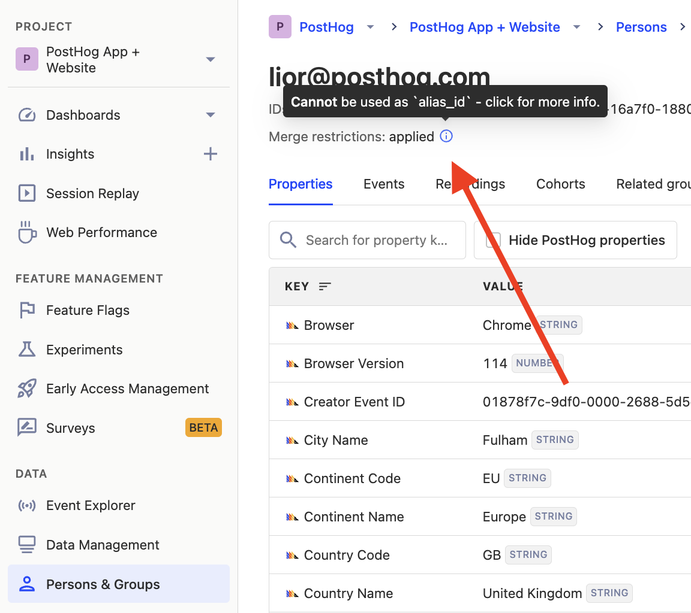

import JSIdentifyIntro from "../\_snippets/identify-intro.mdx"
import JSIdentifyHowItWorks from "../\_snippets/identify-how-it-works"
import JSIdentifyWhenToCall from "../\_snippets/identify-when-to-call.mdx"
import JSIdentifyUseUniqueIds from "../\_snippets/identify-use-unique-ids.mdx"
import JSIdentifyReset from "../\_snippets/identify-reset.mdx"
import JSIdentifySetUserProperties from "../\_snippets/identify-setting-user-properties.mdx"

<JSIdentifyIntro/> 

## How identify works

<JSIdentifyHowItWorks/>

## Best practices when using identify

### 1. Call `identify` as soon as you're able to

<JSIdentifyWhenToCall/>

### 2. Use unique strings for distinct IDs

<JSIdentifyUseUniqueIds/>

### 3. Reset after logout

<JSIdentifyReset/>

### 4. Setting user properties

<JSIdentifySetUserProperties/>

## Alias: Assigning multiple distinct IDs to the same user 

Sometimes, you want to assign multiple distinct IDs to a single user. For example, if a distinct ID which is typically used on the frontend is not available in certain parts of your backend code, you can use `alias` to connect the frontend distinct ID to one accessible on the backend. This will merge all past and future events into the same user.

In the below example, we assign the user with `distinct_id` another ID: `alias_id`. This means that any events submitted using either `distinct_id` or `alias_id` will be associated with the same user.

<MultiLanguage selector="tabs">

```node
client.alias({
    distinctId: 'distinct_id',
    alias: 'alias_id',
})
```

```js-web
posthog.alias('alias_id', 'distinct_id');
```

```python
posthog.alias('distinct_id', 'alias_id', )
```

```php
PostHog::alias(array(
  'distinctId' => 'distinct_id',
  'alias' => 'alias_id'
));
```

```ruby
posthog.alias({
  distinct_id: "distinct_id",
  alias: "alias_id",
})
```

```go
client.Enqueue(posthog.Alias{
  DistinctId: "distinct_id",
  Alias: "alias_id",
})
```

```java
posthog.alias("distinct_id", "alias_id");
```

```bash
curl -v -L --header "Content-Type: application/json" -d '{
    "api_key": "<ph_project_api_key>",
    "properties": {
        "distinct_id": "distinct_id",
        "alias": "alias_id"
    },
    "timestamp": "2020-08-16 09:03:11.913767",
    "event": "$create_alias"
}' https://app.posthog.com/capture/
```

</MultiLanguage>

There are two requirements when assigning an `alias_id`:

1. It cannot be associated with more than one `distinct_id`.
2. The `alias_id` **must not** have been previously used as the `distinct_id` argument of an `identify()` or `alias()` call. For example: Assume we previously called `posthog.identify('distinct_id_one')`. It is not possible to use `distinct_id_one` as an alias ID:

<MultiLanguage selector="tabs">

```node
// Assume we previously identified a user with 'distinct_id_one' using posthog.identify('distinct_id_one')
// ❌ The following is not possible:
// You cannot use distinct_id_one as an alias for any_other_id
client.alias({
    distinctId: 'any_other_id',
    alias: 'distinct_id_one',
})
```

```js-web
// Assume we previously identified a user with 'distinct_id_one' using posthog.identify('distinct_id_one')
// ❌ The following is not possible:
// You cannot use distinct_id_one as an alias for any_other_id
client.alias({
    distinctId: 'any_other_id',
    alias: 'distinct_id_one',
})
```

```python
# Assume we previously identified a user with 'distinct_id_one' using posthog.identify('distinct_id_one')
# ❌ The following is not possible:
# You cannot use distinct_id_one as an alias for any_other_id
posthog.alias('distinct_id_one', 'any_other_id');
```

```php
# Assume we previously identified a user with 'distinct_id_one' using posthog.identify('distinct_id_one')
# ❌ The following is not possible:
# You cannot use distinct_id_one as an alias for any_other_id
PostHog::alias(array(
  'distinctId' => 'any_other_id',
  'alias' => 'distinct_id_one'
));
```

```ruby
# Assume we previously identified a user with 'distinct_id_one' using posthog.identify('distinct_id_one')
# ❌ The following is not possible:
# You cannot use distinct_id_one as an alias for any_other_id
posthog.alias({
  distinct_id: "any_other_id",
  alias: "distinct_id_one",
})
```

```go
// Assume we previously identified a user with 'distinct_id_one' using posthog.identify('distinct_id_one')
// ❌ The following is not possible:
// You cannot use distinct_id_one as an alias for any_other_id
client.Enqueue(posthog.Alias{
  DistinctId: "any_other_id",
  Alias: "distinct_id_one",
})
```

```java
// Assume we previously identified a user with 'distinct_id_one' using posthog.identify('distinct_id_one')
// ❌ The following is not possible:
// You cannot use distinct_id_one as an alias for any_other_id
posthog.alias("any_other_id", "distinct_id_one");
```

</MultiLanguage>

You can view whether a user can be merged into another user using `alias` when [viewing their properties](/docs/data/user-properties#how-to-view-user-properties) in the PostHog app: Under their ID, you'll see `Merge restrictions`. This will indicate whether there are merge restrictions or not – i.e., whether you can use their ID as an `alias_id` or not.



> Note that when calling `alias` in the frontend SDKs, if you have set any properties onto the anonymous user, they will be merged into the user with `distinct_id`. For more details, see the FAQ on [how properties are managed when identifying anonymous users](/docs/data/identify#how-are-properties-managed-when-identifying-anonymous-users).

## Troubleshooting and FAQs

### What happens if you call `identify` or `alias` with invalid inputs?

When calling either of these with invalid inputs (such as in the examples described in this doc e.g., using null strings with `identify`, or by trying to use a distinct ID of another user as an alias ID), the following will happen:

1. We process the event normally (it will be ingested and show up in the UI).
2. Merging users will be refused and an ingestion warning will be logged (see [ingestion warnings](/manual/data-management#ingestion-warnings) for more details).
3. The event will be only be tied to the user associated with `distinct_id`.

PostHog also has built-in protections to stop the most common distinct ID mistakes. See the FAQ at the end of this page for more details.

- We do not allow identifying users with empty space strings of any length – e.g.,`' '`, `'       '`, etc.
- We do not allow identifying users with the following strings (case insensitive):
    - `anonymous`
    - `guest`
    - `distinctid`
    - `distinct_id`
    - `id`
    - `not_authenticated`
    - `email`
    - `undefined`
    - `true`
    - `false`

- We do not allow identifying users with the following strings (case sensitive):
  - `[object Object]` 
  - `NaN`
  - `None`
  - `none`
  - `null`
  - `0`

- We do not allow identifying a user that has already been identified with a different distinct ID. For example:

<MultiLanguage selector="tabs">

```js-web
posthog.identify(
    'distinct_id_one',
    {} 
    {}, 
);
posthog.identify(
    'distinct_id_two',
    {} 
    {}, 
);
// ❌ Not possible, since we already identified this user with "distinct_id_one"
// so we cannot identify them again with a different distinct ID "distinct_id_two"
```

```Android
PostHog.identify(distinctId = "distinct_id_one")
PostHog.identify(distinctId = "distinct_id_two")
// ❌ Not possible, since we already identified this user with "distinct_id_one"
// so we cannot identify them again with a different distinct ID "distinct_id_two"
```

```iOS
posthog.identify("distinct_id_one", 
          properties: [])
posthog.identify("distinct_id_two", 
          properties: [])
// ❌ Not possible, since we already identified this user with "distinct_id_one"
// so we cannot identify them again with a different distinct ID "distinct_id_two"
```

</MultiLanguage>


### How to handle duplicates of the same user

It may happen that, due to implementation issues, the same user in your product has multiple users in PostHog associated with them. In these cases, you can use `$merge_dangerously` to merge multiple PostHog users into a single user.
   
> **Warning:** Merging users with `merge_dangerously` is irreversible and has no safeguards! Be careful not to merge users who should not be merged together.
> 
> Due to the dangers, we don't recommend you merge users frequently, but rather as a one-off for recovering from implementation problems.

Merging users is done by sending a `$merge_dangerously` event:

<MultiLanguage selector="tabs">

```node
client.capture({
    distinctId: 'distinct_id_of_user_to_merge_into',
    event: '$merge_dangerously',
    properties: {
        alias: 'distinct_id_of_user_to_be_merged',
    },
})
```

```js-web
// This will merge distinct_id_of_user_to_be_merged into the user sending this event
posthog.capture({
    '$merge_dangerously',
    {
        alias: 'distinct_id_of_user_to_be_merged',
    },
})
```

```py
posthog.capture('distinct_id_of_user_to_merge_into', 
  '$merge_dangerously', 
  {'alias': 'distinct_id_of_user_to_be_merged'})
```

```go
client.Enqueue(posthog.Capture{
  DistinctId: "distinct_id_of_user_to_merge_into",
  Event:      "$merge_dangerously",
  Properties: posthog.NewProperties().
    Set("alias", "distinct_id_of_user_to_be_merged"),
})
```

```ruby
posthog.capture({
    distinct_id: 'distinct_id_of_user_to_merge_into',
    event: '$merge_dangerously',
    properties: {
        alias: 'distinct_id_of_user_to_be_merged'
    }
})
```

```bash
curl -v -L --header "Content-Type: application/json" -d '{
    "api_key": "<ph_project_api_key>",
    "properties": {
      "alias": "distinct_id_of_user_to_be_merged"
    },
    "timestamp": "2020-08-16 09:03:11.913767",
    "distinct_id": "distinct_id_of_user_to_merge_into",
    "event": "$merge_dangerously"
}' https://app.posthog.com/capture/
```

</MultiLanguage>

### How to split a merged user back into separate users

If you've accidentally linked distinct IDs together that represent different users, or you've made a mistake when merging users, it's possible to split their combined user back into separate users. You can do this in the PostHog app by navigating to the user you'd like split, and then clicking "Split IDs" in the top right corner. 

> **Warning:** This will treat the distinct IDs as separate users for future events. However, there is no guarantee as to how past events will be treated – they may be be considered separate users, or be considered a single user for some or all events.


### How are properties managed when merging users?

When a `User B` is merged into another `User A`, all the properties of the `User B` are added to `User A`. If there is a conflict, the properties of `User A` are prioritized over `User B`. For example:

```node
/* Assume User A has the properties:
{ 
        name: 'User A',
        location: 'London',
}
*/

/* Assume User B has the properties:
{ 
        name: 'User B',
        location: 'Rome',
        phone: '0800-POSTHOG',
}
*/

client.capture({
    distinctId: 'distinct_id_of_user_A',
    event: '$merge_dangerously',
    properties: {
        alias: 'distinct_id_of_user_B',
    },
})

/* User B has merged into User A. The resulting user will now have properties:
{ 
  name: 'User A',
  location: 'London', 
  phone: '0800-POSTHOG', 
}
*/
```

### How are properties managed when identifying anonymous users?

When an anonymous user is identified as `User A`, all the properties of the anonymous user are added to `User A`. If there is a conflict, the properties of `User A` are prioritized over the anonymous user. For example:

```js-web
/* Assume existing User A has the properties:
{ 
        name: 'User A',
        location: 'London',
        timezone: 'GMT',
}
*/

/* Assume User A uses your app on a new device, 
but has not yet logged in and so identify has not been called.
They are still an "anonymous user"

New properties are set for this "anonymous user"
*/
posthog.capture(
    'event_name', 
    { 
        $set: { 
            name: 'Anonymous User',
            phone: '0800-POSTHOG',
          },
    }
)

// After log in, we identify the user as User A
client.identify({
    distinctId: 'user_A',
    properties: {
        timezone: 'GMT+8',
    },
})

/* User A will now have properties:
{ 
  name: 'User A',
  location: 'London', 
  phone: '0800-POSTHOG', 
  timezone: 'GMT+8' 
}
*/
```
