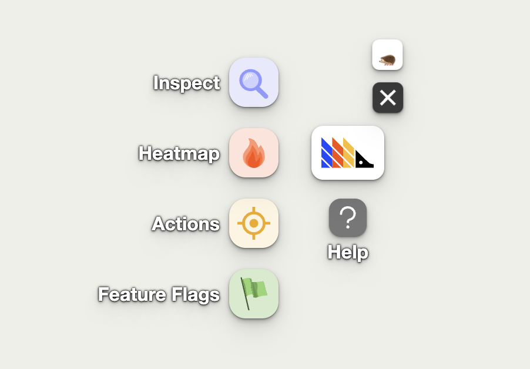

The toolbar is like "Inspect Element" for PostHog features and data. When enabled, the toolbar appears as an overlay **on your product or website** (it's not visible to your users). With it, you can interact with elements to [create actions](/tutorials/how-to-capture-events-the-easy-way), visualize heatmaps, override feature flags, and more.



## How to launch the toolbar

1. In your PostHog instance, go to '[Launch Toolbar](https://app.posthog.com/toolbar)' in the left-hand menu
2. Click 'Enable the PostHog toolbar'
3. Add the URLs you wish to enable the toolbar for. Only you will be able to see it – not your users.
4. Click Save and then Launch.    
5. A new window will open with toolbar on your website. Click on the toolbar to interact with it.


## Heatmaps 

Heatmaps is a feature in the toolbar that shows you how users are interacting with elements on your website or app. 

> **Note:** To use heatmaps, [autocapture](/docs/data/autocapture) must be enabled.

To view your heatmaps, click on the toolbar and then click on the red fire (🔥) icon.


With the heatmap on, clickable elements on your website will have a red overlay with numbers on them. Here's an example of our website with the heatmap enabled:


Each number in the top right box of each element represents the number of clicks it received. The number in the top left of the element is the number of rage-clicks. 

Numbers at the bottom or top of the screen indicate that there are more elements that are not currently being displayed on the page.

### How to create an action from a heatmap

Once you have enabled the heatmap, click on any element. You will then be able to create an [action](/docs/data/actions) from it.


### Changing the date range

You can change the date range of the heatmap by clicking on the number next to the 🔥 icon on the toolbar to open the heatmap menu.


### Loading more data

If you have many events, you may need to load more data to see everything on the heatmap. To do this, click on the load more button in the heatmap menu.


### Matching links by their target URL

By default, the toolbar matches clicks using the elements on the page, and not by their target URLs (i.e., `href` attribute). This is fine for most scenarios where you have static elements with the same target URL. However, this may not be ideal for dynamic lists that have different target URLs depending on the underlying data.

For example, consider the following screenshot of a list of elements for "Newly seen persons" from the PostHog app:


The "Newly seen persons" shows the most recent list of persons using the app and is constantly being updated as new users use the app. In the heatmap, we see 106 clicks for the **first element**. This doesn't mean that the this specific person in the list received 106 clicks, but rather that the first element in the list received 106 elements, regardless of which person was shown.

If we were more interested in the number of clicks each specific person in the list received (regardless of which position they appeared in), then we can turn on "Match links by their target URL" in the heatmap menu. This matches clicks to elements based on their target URLs.


For example, if we enable this for our previous example, we see much fewer clicks. This is because we are now seeing clicks on each specific user:


### Combining heatmaps from similar pages using wildcards

If you have similar pages that are mostly the same but have dynamic content based on an identifier in the URL (e.g., product pages on an ecommerce site), you can search and display their combined heatmap using wildcards `*` in the heatmap menu.

For example, if the product pages on an ecommerce site use a URL format of `https://yourwebsite.com/products/product-id`, you can use the wildcard URL `https://yourwebsite.com/products/*` to display a combined heatmap from all the product pages.


## Creating actions from the toolbar

The toolbar enables you to easily create [actions](/docs/data/actions) by clicking elements directly on your website. 

To do this, click on the 🔍 Inspect button on the toolbar. This will add a blue overlay to your website. Then, if you click on an element, you will be shown the option to create an action from it.


You can also create a more advanced action using the following additional options:

### 1. Add another element

If you want your action to cover more than one element, you can click 'Add another element' right above 'Create Action'. 

This is an `OR` operation, meaning that the action will be recorded if either Element A _or_ Element B are clicked. 

This is useful if you have various buttons that take you to the same page, for instance, and only care that the user clicks one of them. A common use case for this is leveraging the action as a [funnel step](/docs/user-guides/funnels). 

### 2. Element filters

These are used by PostHog to find the specific element you're creating the action for. 

- **Link target:** Where a click on the element leads to (if available).

- **Text:** Inner text of the element (if available).

- **Page URL:** If you have the same element at the same position in various pages (e.g. navbar elements), the default action will capture them all. To prevent this, you can set an exact URL or specify a pattern for pages where this exact action should be recorded.

- **Selector:** Path to the element on the page. If you're not happy with the selector PostHog is using automatically, you could, for example, select elements based on their `id` or `data-attr`. You can type a selector into the "Selector" field in the action creation modal to do this.


Or in the same modal, click "Edit the selector" to use our element picker to build the selector you want.


## Viewing your existing actions

You can view your existing actions on your page by clicking the "Actions" button on the Toolbar. This will highlight any elements that are associated with an action. This is a useful way to check that elements are associated with the correct actions.

By clicking on a specific element, you can update or delete the action.

The number in the green box on the top left of the element is the **action's index** in your list of actions (and **does not** represent how many times that action was triggered). The number in the yellow box next to the "Actions" button in the toolbar represents the total number of actions you have created.


## Overriding feature flags with the toolbar

The toolbar also enables you to test your feature flags. You can enable, disable, or override your feature flags, and then view how your website or app changes with the new feature flags values.

To do this, click on the "Feature Flags" button in the toolbar, search for any feature flag, and click on the toggles to change its value. 

Overriding feature flags will only affect *your* browser. You may also need to refresh the page to see how your change affect your website. It does not affect feature flags evaluation for your backend.

 

## Troubleshooting and FAQ

### Toolbar not loading or displaying

When launched, the toolbar injects an API token in the format `#__posthog=JSON` in your site's URL, like this: `http://mysite.com/#__posthog=JSON`.

The toolbar won't load if you have a frontend that overrides the injected API token (the information after the #) before the `posthog-js` library (or snippet) loads and has a chance to read the API token.

To solve this, retrieve the `__posthog` JSON from the URL before it is overridden and call `posthog.loadToolbar(JSON)` in your code:

```js-web
const toolbarJSON = new URLSearchParams(window.location.hash.substring(1)).get('__posthog')
if (toolbarJSON) {
    posthog.loadToolbar(JSON.parse(toolbarJSON))
}
```

We are also working on other solutions. Go to [the related issue](https://github.com/PostHog/posthog/issues/9100) to see progress updates (and encourage us to get it done faster!).