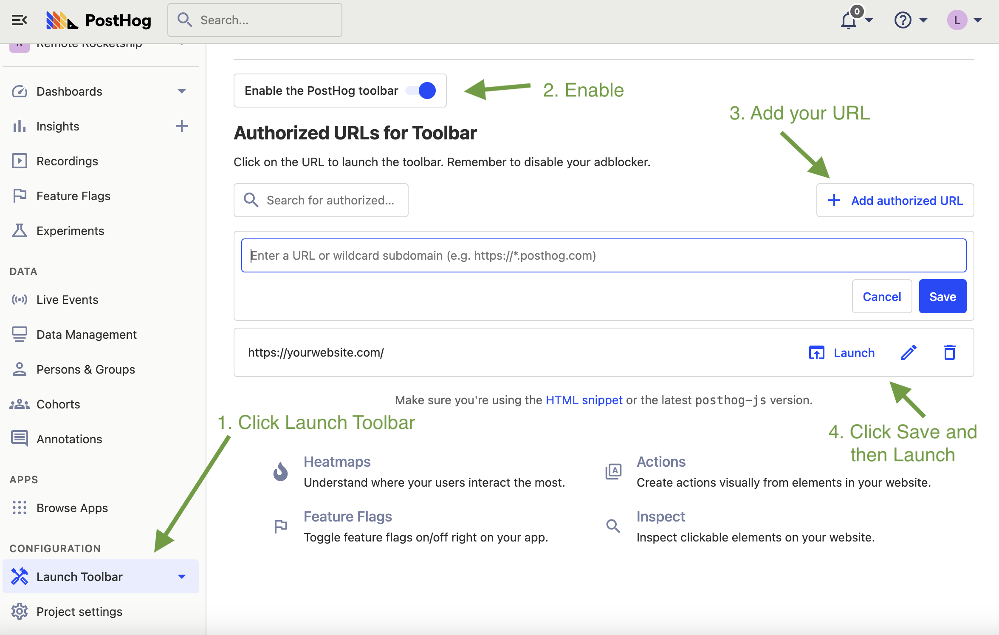

In simple terms, the Toolbar is like 'Inspect Element' in a dev tool, but for user behavior.

When enabled, the Toolbar appears as an overlay **on your product or website**. It is not visible to your users. With it you can seamlessly interact with the elements to create Actions, get information about the most frequently triggered events, visualize statistics via a heatmap, and more.


> For an in-depth tutorial on how to visualize user behavior, check out our [Toolbar tutorial](/docs/tutorials/toolbar)

## How to activate the Toolbar

1. Go to 'Launch Toolbar' in the left-hand menu
2. Click 'Enable PostHog Toolbar'
3. Add the URLs you wish to enable the toolbar for. Only you will be able to see it (and not your users).
4. Click Save and then Launch.    
5. A new window will open with toolbar on your website. Click on the toolbar to interact with it.



## Toolbar features
  
-   **Inspect.** With the PostHog Toolbar, you are able to get the `class` and `id` of an element much faster and without any extra noise. Click the element to inspect and you'll have access to everything you need to know about that element.
-   **Heatmap.** Easily see the ranking of which parts of the page your users are interacting with the most.
-   **Actions.** Inspect an element, see how often it has triggered an event, and immediately create an [Action](/docs/user-guides/actions) with that data. With the Toolbar, everything you need to tailor your analytics is right in front of you: your website, the user data, and the functionality to create an Action.
-   **Feature flags.** See which feature flags are turned on for a particular page.

## Toolbar not loading or displaying?

When launched, the toolbar injects an API token in the format `#__posthog=JSON` in your site's URL, like this: `http://mysite.com/#__posthog=JSON`.

The toolbar won't load if you have a frontend that overrides the injected API token (the information after the #) before the `posthog-js` library (or snippet) loads and has a chance to read the API token.

To solve this, get the `__posthog` JSON from the URL before it is overridden and call `posthog.loadToolbar(JSON)`:

```js
const toolbarJSON = new URLSearchParams(window.location.hash.substring(1)).get('__posthog')
if (toolbarJSON) {
    posthog.loadToolbar(JSON.parse(toolbarJSON))
}
```

We are also working on other solutions. Go to [the related issue](https://github.com/PostHog/posthog/issues/9100) to see progress (and encourage us to get it done faster).