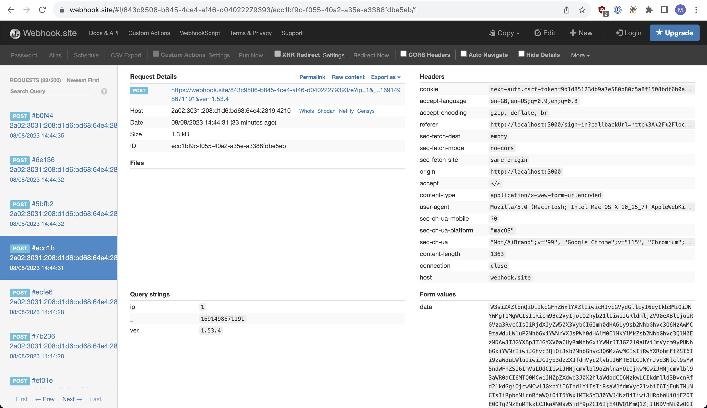
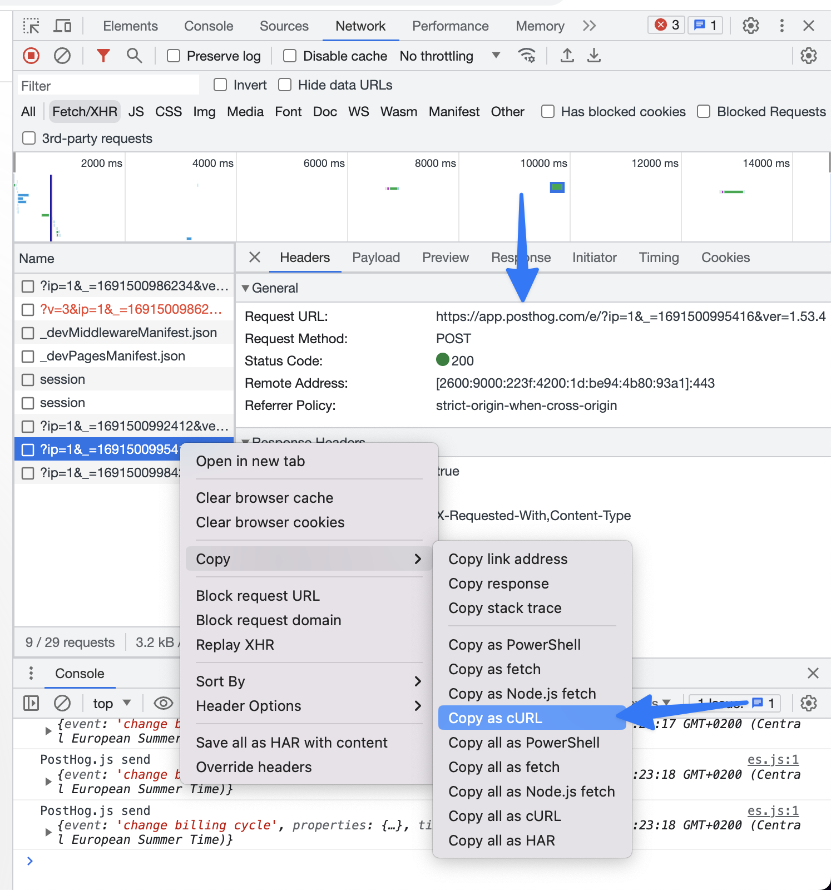

## Why are events not appearing in my project?

There are a few common reasons that you may not see events appear in your project:

### 1. The library is being configured incorrectly. (this is usually the issue)

The main reason that certain evets are missing is usually a misconfiguration.

> Warning: Make sure to not use sensitive data while debugging using third-party tools.

1. Visit [webhook.site](https://webhook.site/) and copy “Your unique URL”.
2. In your PostHog [initialization code](https://posthog.com/docs/product-analytics/installation), replace "https://app.posthog.com" or "https://eu.posthog.com" if using the EU Cloud) with the URL you copied from webhook.site. For example:

<MultiLanguage>

```Web
posthog.init('<ph_project_api_key>', { api_host: '<https://webhook.site/843c9506-b845-4ce4-af46-d04022279393>' }) // Replace with the URL you copied from webhook.site
```

```node
const client = new PostHog(
    '_6SG-F7I1vCuZ-HdJL3VZQqjBlaSb1_20hDPwqMNnGI',
    
{ host: '<https://webhook.site/843c9506-b845-4ce4-af46-d04022279393>' } // Replace with the URL you copied from webhook.site
)
```

```react
// src/index.js
import React from 'react';
import ReactDOM from 'react-dom/client';
import App from './App';

import { PostHogProvider} from 'posthog-js/react'

const options = {
  api_host: '<https://webhook.site/843c9506-b845-4ce4-af46-d04022279393>' } // Replace with the URL you copied from webhook.site
}

const root = ReactDOM.createRoot(document.getElementById('root'));
root.render(
  <React.StrictMode>
    <PostHogProvider 
      apiKey={process.env.REACT_APP_PUBLIC_POSTHOG_KEY}
      options={options}
    >
      <App />
    </PostHogProvider>
  </React.StrictMode>
);
```

```ruby
posthog = PostHog::Client.new({
  api_key: "<ph_project_api_key>",
  host: "<https://webhook.site/843c9506-b845-4ce4-af46-d04022279393>", # Replace with the URL you copied from webhook.site
  on_error: Proc.new { |status, msg| print msg }
})
```

</MultiLanguage>

3. Make sure that the SDK sends a couple of events.
4. See if the incoming events arrive as expected.



### 2. There is a bug within the library being used.

Certain events could fail to reach PostHog if there is a bug in the used library. (this is quite uncommon)

#### Web libraries
1. Open the devtools and switch to the network tab.
2. Look for the failed requests to app.posthog.com/e (or eu.posthog.com/e if using the EU Cloud).
3. Right click one of those request and click Copy -> Copy as cURL.



3. See how to [Report your specific issue](/docs/product-analytics/troubleshooting#report-your-specific-issue) to get further support.

#### Other libraries
See the respective debugging guides, e.g. [Node.js debugging](https://posthog.com/docs/libraries/node#debugging-and-exceptions).

### 3. Events are not ingested after being received by PostHog.

If the library is configured correctly and successfully sending events to PostHog. Events could get lost in the ingestion pipeline e.g. when there is an [active incident](https://status.posthog.com).

#### Web libraries
1. Open the devtools and switch to the network tab.
2. Right click one of the network requests to posthog.com/e (or eu.posthog.com/e if using the EU Cloud) and select Copy -> Copy as cURL.
3. Format the request as specified in [Report your specific issue](/docs/product-analytics/troubleshooting#report-your-specific-issue)
4. Try to send the cURL directly.
5. Wait 1 hour and check if the event is still not visible in PostHog. Also make sure PostHog cloud is not experiencing an [active incident](https://status.posthog.com) as that could cause an ingestion lag.
6. See how to [Report your specific issue](/docs/product-analytics/troubleshooting#report-your-specific-issue) to get further support.

#### Other libraries
1. Track your outgoing network requests using something like [Wireshark](https://www.wireshark.org/).
2. Format the request as specified in [Report your specific issue](/docs/product-analytics/troubleshooting#report-your-specific-issue)
3. Try to send the cURL directly.
4. Wait 1 hour and check if the event is still not visible in PostHog. Also make sure PostHog cloud is not experiencing an [active incident](https://status.posthog.com) as that could cause an ingestion lag.
5. See how to [Report your specific issue](/docs/product-analytics/troubleshooting#report-your-specific-issue) to get further support.

## Report your specific issue

1. The copied cURL command will look similar to this:
```
curl 'http://localhost:3000/e?ip=1&_=1691496272289&ver=1.53.4' \
  -H 'Origin: http://localhost:3000' \
  --data-raw 'data=W3siZXZlbnQiOiJjaGFuZ2UgYmlsbGluZyBjeWNsZSIsInByb3BlcnRpZXMiOnsiJG9zIjoiTWFjIE9TIFgiLCIkYnJvd3NlciI6IkNocm9tZSIsIiRkZXZpY2VfdHlwZSI6IkRlc2t0b3AiLCIkY3VycmVudF91cmwiOiJodHRwOi8vbG9jYWxob3N0OjMwMDAvcHJpY2luZyIsIiRob3N0IjoibG9jYWxob3N0OjMwMDAiLCIkcGF0aG5hbWUiOiIvcHJpY2luZyIsIiRicm93c2VyX3ZlcnNpb24iOjExNSwiJGJyb3dzZXJfbGFuZ3VhZ2UiOiJlbi1HQiIsIiRzY3JlZW5faGVpZ2h0Ijo5MDAsIiRzY3JlZW5fd2lkdGgiOjE0NDAsIiR2aWV3cG9ydF9oZWlnaHQiOjc5MCwiJHZpZXdwb3J0X3dpZHRoIjo3OTcsIiRsaWIiOiJ3ZWIiLCIkbGliX3ZlcnNpb24iOiIxLjUzLjQiLCIkaW5zZXJ0X2lkIjoicnNsdm9pYXlocjEydXRvbSIsIiR0aW1lIjoxNjkxNDk2MjcxLjc5NywiZGlzdGluY3RfaWQiOiIxODlkNTA4YjBmNDRkNzAtMDBmN2E5MmRkNmE0MzgtMWE1MjU2MzQtMTNjNjgwLTE4OWQ1MDhiMGY1NTJlZSIsIiRkZXZpY2VfaWQiOiIxODlkMTM4ZmMxZjJjMzYtMGQ4MmQ4Njc4NjA4YmUtMWI1MjU2MzQtMTNjNjgwLTE4OWQxMzhmYzIwM2M2NCIsIiRyZWZlcnJlciI6IiRkaXJlY3QiLCIkcmVmZXJyaW5nX2RvbWFpbiI6IiRkaXJlY3QiLCJ0b2tlbiI6InRlc3QiLCIkc2Vzc2lvbl9pZCI6IjE4OWQ1MDhjZmIxMWViMi0wZjkyMjU2YTk1OTBhNS0xYTUyNTYzNC0xM2M2ODAtMTg5ZDUwOGNmYjI0MWZiIiwiJHdpbmRvd19pZCI6IjE4OWQ1MDhjZmIzNDc0Yy0wNmQ2Mzc2NWI3NGEzZi0xYTUyNTYzNC0xM2M2ODAtMTg5ZDUwOGNmYjQ0NzVlIiwiJHBhZ2V2aWV3X2lkIjoiMTg5ZDUwOGFlMjYzOWJmLTAyYjFjNzgwZTRmMDktMWE1MjU2MzQtMTNjNjgwLTE4OWQ1MDhhZTI3NDMxZCJ9LCJvZmZzZXQiOjQ5Mn1d' \
  --compressed
```

2. Copy the base64 encoded string right after `--data-raw 'data=`.

3. Visit [base64decode.org](https://www.base64decode.org/) and paste the encoded string.

4. Click decode and paste the decoded output into this format:.

```
POST https://[your-instance].com/capture/
Content-Type: application/json
Body:
{
    "api_key": "<ph_project_api_key>",
    "event": "[event name]",
    "distinct_id": "[your users' distinct id]",
    "properties": {
        "key1": "value1",
        "key2": "value2"
    },
    "timestamp": "[optional timestamp in ISO 8601 format]"
}
```

5. [Send a support ticket via the app](https://app.posthog.com/home#supportModal=bug%3Aingestion) (or contact the [EU-Cloud support](https://eu.posthog.com/home#supportModal=bug%3Aingestion)). Make sure to include the request from the previous step in the following format:
```
# Library:
// e.g.
// posthog-python https://posthog.com/docs/libraries/python

# Library initialization:
// e.g.
// from posthog import Posthog
// posthog = Posthog(phc_yourAPIKey, host='app_or_eu.posthog.com')

# What was called:
// e.g.
// posthog.capture(
//     "Bob", 
//     "user signed up", 
//     {
//         "login_type": "email", 
//         "is_free_trial": "true"
//     }
// )

# Network request
// [include request from previous step here]

# What was expected to happen:
// e.g.
// To see the network call include the login_type property.

# What actually happened:
// e.g.
// The "login_type" property was missing.
```
