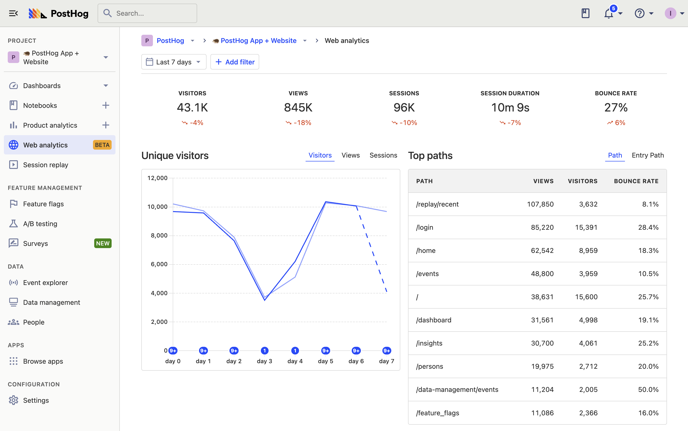

import WebInstall from '../integrate/_snippets/install-web.mdx'

> Web analytics are currently in [public beta](/docs/getting-started/enable-betas). This means it's not yet a perfect experience, but we'd love to know your thoughts. Please [share your feedback](http://app.posthog.com/home#supportModal) and [follow our roadmap](https://github.com/PostHog/posthog/issues/18547).

Web analytics enables you to easily track and monitor the most important metrics for your website. It provides a simplified dashboard that includes essential metrics like visitors, views, sessions, session duration, bounce rate, paths, referrers, and more.

Web analytics is great for marketing teams looking for a simpler way to keep track of their site-specific analytics in PostHog. 

## Get started with web analytics

Getting started is a simple three-step process.

### 1. Install the PostHog on your website

Follow the [installation instructions](/docs/product-analytics/installation) to install either the JavaScript snippet or the JavaScript Web SDK to the website you want to track.

> [Single page apps](/tutorials/single-page-app-pageviews) might require you to manually implement capturing `pageview` and `pageleave` events every navigation change. See our tutorials on how to do this in [React](/tutorials/single-page-app-pageviews), [Next.js](/docs/libraries/next-js#client-side-setup), [Vue](/docs/libraries/vue-js#capturing-page-views), and [Svelte](/tutorials/svelte-analytics#capturing-pageviews-and-pageleaves).

### 2. Enable the web analytics beta

In PostHog, click your profile icon in the top right and then click "Feature preview." In the feature preview modal, enable "Web Analytics Dashboard"

### 3. Go to the web analytics dashboard

Now, you can click the newly added [web analytics tab](https://app.posthog.com/web) to go to the dashboard.

## Filtering your dashboard

Like other dashboards in PostHog, the web analytics dashboard is filterable. This means you can filter for data with certain event or person property values. Options include browser, path name, device type, country, and UTMs. Just click the "Add filter" button next to the date range at the top of the dashboard.

This enables you to dive into specific stats for regions, parts of the site, and specific marketing campaigns. 

## Frequently asked questions

### Where is my world map?

All good web analytics dashboards need to include a world map. Ours includes it too. If you can't see it, you need to enable the [GeoIP app](https://app.posthog.com/project/apps/74).

### Do stats include bots and crawlers?

No, we automatically block bots and crawlers. You can see exactly which ones [we block here](https://github.com/PostHog/posthog-js/blob/master/src/utils/blocked-uas.ts).