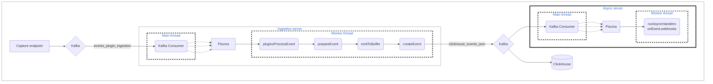

```mermaid
flowchart LR
   subgraph Main [ ]
        direction LR

        ClickHouse[(ClickHouse)]

        PluginServerIngestion(Plugin server<BR>mode=ingestion)
        PluginServerAsync(Plugin server<BR>mode=async)

        KafkaPlugins{Kafka}
        KafkaCH{Kafka}

        Django[Capture endpoint]

        subgraph PluginServerIngestion [Ingestion server]
            direction LR

            KafkaConsumerIngestion(Kafka Consumer)

            ProcessEvent(Plugins processEvent)
            CreateEvent(Ingest event)


            subgraph MainThreadIngestion [Main thread]
                KafkaConsumerIngestion
            end

            subgraph WorkerThreadIngestion [Worker thread]
                ProcessEvent(pluginsProcessEvent)
                PrepareEvent(prepareEvent)
                EmitToBuffer(emitToBuffer)
                CreateEvent(createEvent)
            end

        PiscinaIngestion[Piscina]

        end

        subgraph PluginServerAsync [Async server]

            direction LR

            KafkaConsumer(Kafka Consumer)
            AsyncHandlers(runAsyncHandlers<BR>onEvent,webhooks)
            Piscina(Piscina)

            subgraph MainThread [Main thread]
                KafkaConsumer
            end

            subgraph WorkerThread [Worker thread]
                AsyncHandlers
            end


        end

        Django --> KafkaPlugins
        KafkaPlugins -->|events_plugin_ingestion| KafkaConsumerIngestion


        KafkaConsumerIngestion -.-> PiscinaIngestion
        KafkaConsumerIngestion -.-> PiscinaIngestion
        KafkaConsumerIngestion -.-> PiscinaIngestion


        PiscinaIngestion --> ProcessEvent
        ProcessEvent --> PrepareEvent
        PrepareEvent --> EmitToBuffer
        EmitToBuffer --> CreateEvent

        CreateEvent -->|clickhouse_events_json| KafkaCH

        KafkaCH --> ClickHouse
        KafkaCH --> KafkaConsumer


        KafkaConsumer -.-> Piscina
        KafkaConsumer -.-> Piscina
        KafkaConsumer -.-> Piscina

        Piscina --> AsyncHandlers

        %% Styling
        
        class PluginServerAsync plugingraph;
        class Main,MainThread,WorkerThread,MainThreadIngestion,WorkerThreadIngestion sgraph;

        classDef plugingraph fill:#fff,stroke-width:3px,stroke:#000;
        classDef sgraph fill:#fff,stroke-width:3px,stroke-dasharray:5,stroke:#000;
        classDef cluster fill:#fff,stroke:#bbb,stroke-width:2px,color:#326ce5;
    end
```
