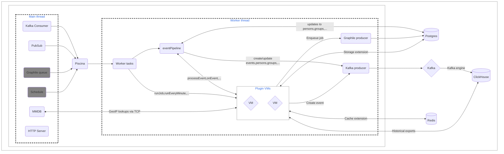

```mermaid
flowchart LR
    subgraph Wrapper [ ]
        direction LR
        
        Redis[(Redis)]
        ClickHouse[(ClickHouse)]
        Postgres[(Postgres)]

        Kafka{Kafka}

        subgraph PluginServer [ ]
        
            direction LR

            KafkaConsumer(Kafka Consumer)
            Graphile(Graphile queue)
            HttpServer(HTTP Server)
            PubSub(PubSub)
            Piscina(Piscina)
            Schedule(Schedule)
            WorkerTasks(Worker tasks)
            VM1{VM}
            VM2{VM}

            EventPipeline(eventPipeline)
            GraphileProducer(Graphile producer)
            KafkaProducer(Kafka producer)
            MMDB(MMDB)

            subgraph MainThread [Main thread]
                KafkaConsumer
                Graphile
                Schedule
                PubSub
                HttpServer
                MMDB
            end

            subgraph WorkerThread [Worker thread]
                WorkerTasks
                
                EventPipeline
                GraphileProducer
                KafkaProducer

                subgraph VMs [Plugin VMs]
                    VM1
                    VM2
                end

            end

        end

        KafkaConsumer --> Piscina
        PubSub --> Piscina
        Graphile --> Piscina
        Schedule --> Piscina

        Piscina --> WorkerTasks

        WorkerTasks --> EventPipeline

        EventPipeline <-->|processEvent,onEvent,...| VMs
        VMs -->|Create event| KafkaProducer
        EventPipeline -->|create/update<BR>events,persons,groups,...| KafkaProducer
        EventPipeline <-->|updates to persons,groups,...| Postgres

        WorkerTasks -->|runJob,runEveryMinute,...| VMs

        VMs --> |Enqueue job| GraphileProducer
        VMs <---> |Cache extension| Redis
        VMs <--->|Storage extension| Postgres
        VMs <--->|Historical exports| ClickHouse

        KafkaProducer --> Kafka
        Kafka -->|Kafka engine| ClickHouse
        GraphileProducer --> Postgres


        MMDB <-->|GeoIP lookups via TCP| VMs


        %% Styles 

        class MainThread,WorkerThread sgraph;
        class Graphile,Schedule OptionalServices;

        classDef sgraph fill:#fff,stroke-width:3px,stroke-dasharray:5,stroke:#000;
        classDef cluster fill:#fff,stroke:#bbb,stroke-width:2px,color:#326ce5;
        classDef OptionalServices fill:#848383;

    end
```