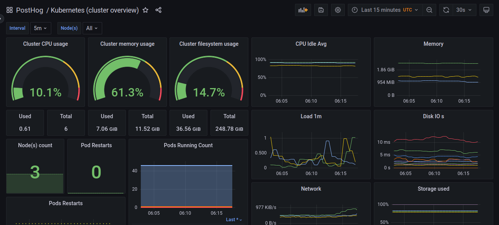
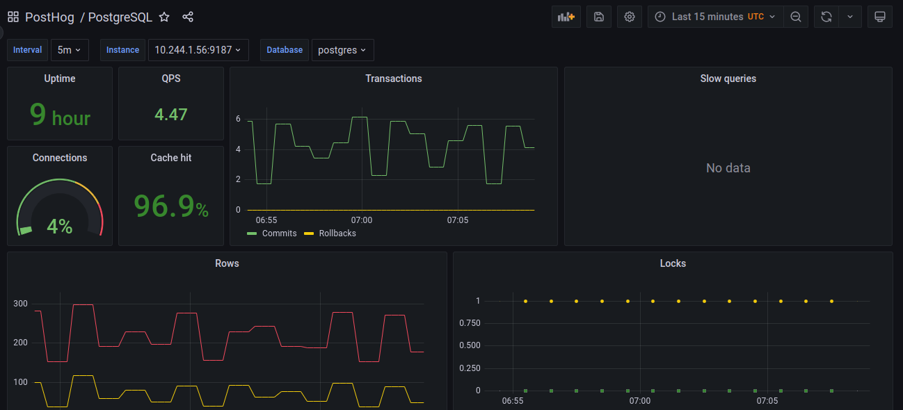
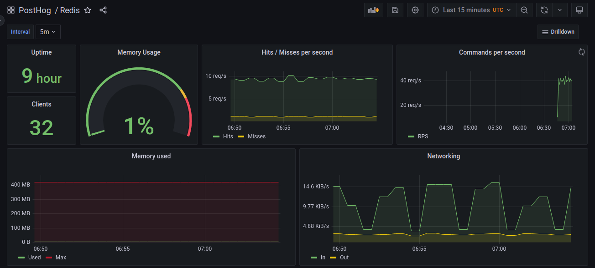
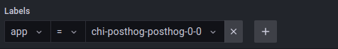
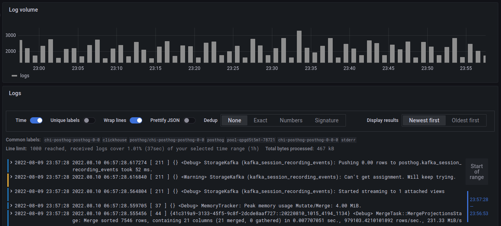

This guide covers how to configure monitoring of your self-hosted deployment through Grafana.
If you are targeting a production use-case, we _highly_ recommend setting up all of these options.

## Getting started

By default, the PostHog Helm chart does not come with Grafana enabled, so we will need to update our config values in order to install it.

> **Note: ** This guide requires you to be running a Helm chart version of at least `26.0.6`. If you are running an older version, take a look at our guide on [how to upgrade PostHog](/docs/runbook/upgrading-posthog)

## Setting up cluster monitoring

This section covers setting up basic monitoring for the entire Kubernetes cluster, and provides basic metrics such as CPU usage, memory usage, and disk IOs.

To set up basic monitoring, we will need to enable the following two charts:

-   [grafana/grafana](https://github.com/grafana/helm-charts/tree/main/charts/grafana)
-   [prometheus-community/prometheus](https://github.com/prometheus-community/helm-charts/tree/main/charts/prometheus)

which can be done by adding the following lines to our `values.yaml`

```yaml
grafana:
    enabled: true
prometheus:
    enabled: true
    alertmanager:
        enabled: true
```

Next, we'll need to upgrade our deployment to spin-up the additional services, which can be done using the following command:

```
helm upgrade -f values.yaml --timeout 30m --namespace posthog posthog posthog/posthog --atomic --wait --wait-for-jobs --debug
```

### Connecting to Grafana

Once our deployment is back up and running, we can now log in to Grafana to see our dashboards.
By default, a single user is created with the username `admin` and an auto-generated password can be fetched by running:

```
kubectl -n posthog get secret posthog-grafana -o jsonpath="{.data.admin-password}" | base64 --decode
```

Next, we'll connect to Grafana by port-forwarding into the `posthog-grafana` service:

```
kubectl -n posthog port-forward svc/posthog-grafana 8080:80
```

Our Grafana dashboard should now be available at `localhost:8080`, and we can log in using the username `admin` along with the password we just retrieved.



Finally, if we now go to the list of Dashboards and navigate to PostHog > Kubernetes (cluster overview), you should see a pre-configured dashboard with a number of metrics related to our cluster!

For more information on configuring and using Grafana, check out the [official docs](https://grafana.com/docs/grafana/latest/getting-started/)

## Setting up service-specific monitoring

While the basic cluster-overview monitoring is useful for monitoring overall cluster health, there is still a lot of important information about each service within PostHog that isn't available.
To fix this, PostHog includes a number of exporters for Prometheus that allow us to stream metrics from specific services into their own separate dashboard.

For more information on the configuration values for each service, check out [ALL_VALUES.md](https://github.com/PostHog/charts-clickhouse/blob/main/charts/posthog/ALL_VALUES.md) for the full list of configuration options.

### Kafka monitoring

For streaming information from Kafka, we use the [prometheus-community/prometheus-kafka-exporter](https://github.com/prometheus-community/helm-charts/tree/main/charts/prometheus-kafka-exporter) chart, which can be installed by setting `prometheus-kafka-exporter.enabled` to `true` in your `values.yaml` file.
If you are using an external Kafka service, you can use the `prometheus-kafka-exporter.kafkaServer` option to set the location for your managed service.

### PostgreSQL monitoring

For streaming information from Postgres, we use the [prometheus-community/prometheus-postgres-exporter](https://github.com/prometheus-community/helm-charts/tree/main/charts/prometheus-postgres-exporter) chart, which can be installed by setting `prometheus-postgres-exporter.enabled` to `true` in your `values.yaml` file.
If you are using an external Postgres deployment, you can use the `prometheus-postgres-exporter.config.datasource` option to set the location for your managed service.



_A sample of the default Postgres dashboard_

### Redis monitoring

For streaming information from Redis, we use the [prometheus-community/prometheus-redis-exporter](https://github.com/prometheus-community/helm-charts/tree/main/charts/prometheus-redis-exporter) chart, which can be installed by setting `prometheus-redis-exporter.enabled` to `true` in your `values.yaml` file.
If you are using an external Redis service, you can use the `prometheus-redis-exporter.redisAddress` option to set the location for your managed service.



_A sample of the default Redis dashboard_

## Configure log-aggregation with Loki

This section covers setting up aggregation for logs using Loki, which allows you to query and explore logs from all of your services.
This step requires that you already have Grafana set-up, which you can do by following the instructions in the [basic cluster monitoring](#setting-up-cluster-monitoring) section.

To set this up, we will need to enable the following two charts:

-   [grafana/loki](https://github.com/grafana/helm-charts/tree/main/charts/loki)
-   [grafana/promtail](https://github.com/grafana/helm-charts/tree/main/charts/promtail)

which can be done by adding the following values to your configuration:

```yaml
loki:
    enabled: true
promtail:
    enabled: true
```

Once again, we will need to upgrade our deployment for the new changes go into effect, which can be done by following command:

```
helm upgrade -f values.yaml --timeout 30m --namespace posthog posthog posthog/posthog --atomic --wait --wait-for-jobs --debug
```

After our deployment is finished, we can log back in to Grafana, and navigate to the 'Explore' tab to start viewing our logs.

Let's try viewing the logs for Clickhouse.
To start, we'll switch our datasource in the top bar from 'Prometheus' to 'Loki', which will open up the Query Builder.
We can create a query for this by setting the `app` label to equal `chi-posthog-posthog-0-0`, which will show us only the logs which are labeled as part of the Clickhouse app.



Running this query, we'll see we get back a graph showing our log-volume over time, as well as a list of the log lines that matched our query!



For more information on how to configure Loki and how to write more advanced queries, we'd recommend you checkout the [Loki docs](https://grafana.com/docs/loki/latest/?pg=oss-loki&plcmt=quick-links).
