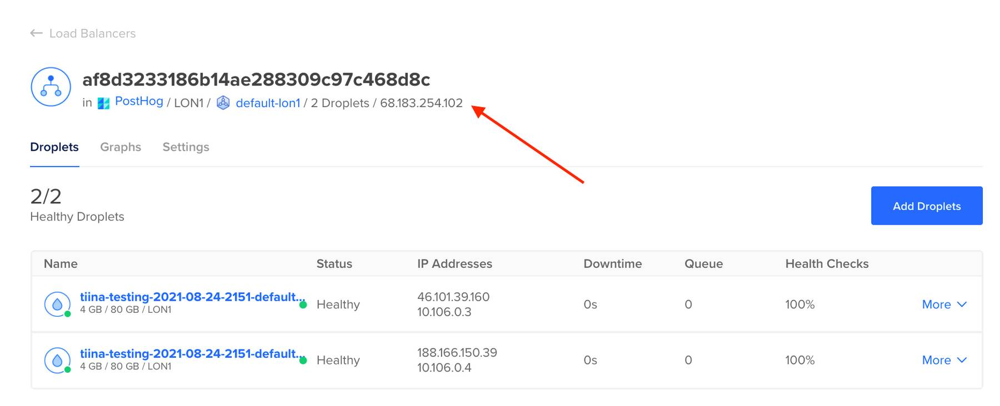

import GetURLSnippet from './get-url'

1. In the DigitalOcean web console ([networking tab](https://cloud.digitalocean.com/networking/load_balancers)), navigate to the IP address of the load balancer created by Kubernetes

    

2. If you have [configured `kubectl` access to your cluster](https://docs.digitalocean.com/products/kubernetes/how-to/connect-to-cluster/), run the following commands:

    <GetURLSnippet />
