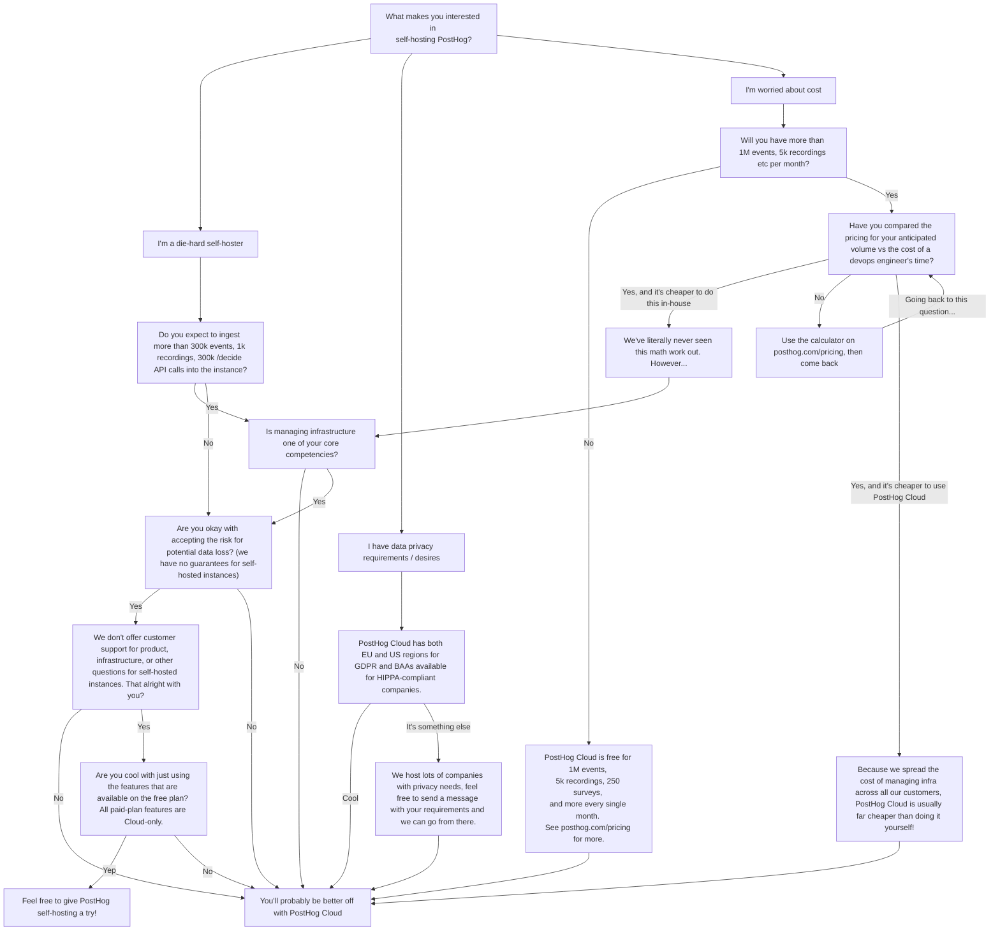

import Disclaimer from './\_snippets/disclaimer.mdx'
import Sunset from '../self-host/\_snippets/sunset-disclaimer.mdx'

PostHog is open-source and freely available for anyone to host themselves. We offer a free Docker Compose deployment under an MIT license. Essentially, self-hosting PostHog means you run or purchase your own infrastructure, manage deployments, choose your own URLs to expose it on, and deal with any scaling issues yourself.

The self-hosted version is the same exact product we run on PostHog Cloud, though our infrastructure is very, very different to support serious volume. We don't do tagged releases for self-hosted PostHog. All commits go through our standard CI/CD pipeline before they are merged into our cloud deployments and also become available for self-hosted instances.

Because we don't manage self-hosted instances or provide paid support plans for them, [we don't offer any sort of guarantees](/docs/self-host/open-source/disclaimer) around it working in certain ways on your infrastructure, and you assume all responsibility and risk for your use of the product and the stack.

## Should I use self-hosted PostHog or PostHog Cloud?

Good question! We've found that PostHog Cloud is far and away the best experience for the vast majority of our users. However, some people still want to self-host, and we're here for that! Here's a quick flow chart to help you understand if self-hosting PostHog is for you:



You can follow the rest of the guide for instructions on how to set up self-hosted PostHog. If you want to use Cloud instead, you can sign up for our
 [US](https://us.posthog.com/signup) or [EU](https://eu.posthog.com/signup) cloud instance.

## Requirements

-   You have deployed a Linux Ubuntu Virtual Machine.
    -   You will need something equivalent to a Hetzner VM with 4 vCPU, 16GB RAM, and more than 30GB storage.
-   You have set up an `A` record to connect a custom domain to your instance.
    -   PostHog will automatically create an SSL certificate for your domain using LetsEncrypt

New deployments of PostHog's paid open source product using Kubernetes are no longer supported.

## Configuration

There are various ways to configure and personalize your PostHog instance to better suit your needs. In this section you will find all the information you need about settings and options you can configure to get what you need out of PostHog.

-   [Environment variables](/docs/self-host/configure/environment-variables)
-   [Upgrading PostHog](/docs/runbook/upgrading-posthog)
-   [Securing PostHog](/docs/self-host/configure/securing-posthog)
-   [Running behind proxy](/docs/self-host/configure/running-behind-proxy)
-   [Email configuration](/docs/self-host/configure/email)

## Setting up the stack

To get started, all we need to do is run the following command, which will spin up a fresh PostHog deployment for us automatically!

```bash
/bin/bash -c "$(curl -fsSL https://raw.githubusercontent.com/posthog/posthog/HEAD/bin/deploy-hobby)"
```

You'll now be asked to provide the release tag you would like to use, as well as the domain you have connected to your instance.

> **This release tag is the [DockerHub tag](https://hub.docker.com/r/posthog/posthog/tags)** and doesn't refer to the [sunsetted Helm chart releases](https://posthog.com/blog/sunsetting-helm-support-posthog)

Once everything has been setup, you should see the following message:

```
We will need to wait ~5-10 minutes for things to settle down, migrations to finish, and TLS certs to be issued

⏳ Waiting for PostHog web to boot (this will take a few minutes)
```

PostHog will wait here on a couple of tasks that need to be completed, which should only take a couple minutes.

Once this is complete, you should be able to see your PostHog dashboard on the domain you provided!

> If you notice this step taking longer than 10 minutes, it's best to cancel it with `Ctrl+C` and take a look at the [troubleshooting](#troubleshooting) section.

### Customizing your deployment (optional)

By default, the `docker-compose.yml` file that gets run comes with a series of default config values that should work for most deployments.
If you need to customize anything, you can take a look at the [full list of environment variables](/docs/self-host/configure/environment-variables).
After making any changes, simply restart the stack with `docker-compose`.

Additionally, if you would like to run a different version of PostHog, you can change the tag for the web, worker, and plugins services.
Check out [here](https://hub.docker.com/r/posthog/posthog) for a list of all available tags.

## Troubleshooting

If you have already run the one-step deployment command above and something went wrong, this section covers a number of steps you can take to debug issues.

### Checking that all containers are running

We can use `docker ps` to check that all of our services are running.

```bash
$ docker ps

CONTAINER ID   IMAGE                               COMMAND     CREATED    STATUS    PORTS   NAMES
21a2f62d6e50   posthog/posthog:release-1.39.1      ...         1m ago     Up 1m     ...     ...
77face12d3e2   posthog/posthog:release-1.39.1      ...         1m ago     Up 1m     ...     ...
3b4bc7394049   posthog/posthog:release-1.39.1      ...         1m ago     Up 1m     ...     ...
03f393c7aa84   caddy:2.6.1                         ...         1m ago     Up 1m     ...     ...
f1060c3d8d73   clickhouse/clickhouse-server:22.3   ...         1m ago     Up 1m     ...     ...
7d2353a6bddf   bitnami/kafka:2.8.1-debian-10-r99   ...         1m ago     Up 1m     ...     ...
72051397040e   zookeeper:3.7.0                     ...         1m ago     Up 1m     ...     ...
ff42ccf14481   redis:6.2.7-alpine                  ...         1m ago     Up 1m     ...     ...
402a0eef69ae   postgres:12-alpine                  ...         1m ago     Up 1m     ...     ...
da0d115dd02e   minio/minio                         ...         1m ago     Up 1m     ...     ...
```

You should see all the same containers as above. If any containers aren't showing up or show that they've restarted recently, it's worth checking their logs to see what the issue is.

### Checking the logs of each container

We can use the following command to check the logs for each of our containers.

```bash
docker logs <container_name>
```

The best place to start looking is in the `web` container, which runs all the database migrations and will produce an error if any have failed.

> Running into issues with deployment? Ask a [question here](/questions) or check out [our community page](/posts) to get help.

## Upgrading

To upgrade, you can run the `upgrade-hobby` script from the PostHog repo.

```bash
/bin/bash -c "$(curl -fsSL https://raw.githubusercontent.com/posthog/posthog/HEAD/bin/upgrade-hobby)"
```

> **Warning:** Before upgrading, make sure you have created back-ups of all your data!

Our recommendation is to keep your PostHog deployment up-to-date. While we avoid breaking changes wherever possible we may sometimes deprecate or add features that require you to update to the latest version. You can track our latest updates in [the changelog](/changelog).

## Migrating

If your server is struggling, you can either increase your instance size or move to [PostHog Cloud](/docs/migrate/migrate-to-cloud#option-1-for-events-migration-self-hosted-migration-tool-alpha) for a hands-off experience
