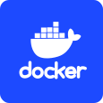

## Deploy

Getting a shiny, running production environment of PostHog is probably one the first things you want to do!

Lucky for you, our platform is incredibly easy to use and affordable to host with any provider. Below, we have several step-by-step guides outlining how to set up hosting on a variety of different services.

### **Deployment Options (ClickHouse):**

If (i) you're looking to track more than 1k users/month, or (ii) you're planning on doing lots of queries, or (iii) you may in future want to upgrade an existing instance to PostHog Scale (our paid product for growth stage or enterprise users), you're better off using PostHog backed by ClickHouse, see [Postgres vs ClickHouse](/docs/self-host/postgres-vs-clickhouse). If you are not comfortable with deploying Helm charts we recommend either using Postgres (see below) or [PostHog Cloud](/pricing)

- [1-click on DigitalOcean](https://marketplace.digitalocean.com/apps/posthog-1)
- [Using Helm chart](https://github.com/PostHog/charts-clickhouse)

### **Deployment Options (Postgres):**

All these options are backed by Postgres which is great up to about 1k tracked monthly users.

||||
| --- | --- | --- | --- |
|  |  |  |  |

We recommend:

- [Deploying to AWS](/docs/self-host/deploy/aws)
- [Deploying to GCS](/docs/self-host/deploy/gcs)
- [Deploying to Digital Ocean](/docs/self-host/deploy/digital-ocean)

Other options include: 

- [Deploying to Heroku](/docs/self-host/deploy/heroku)
- [Deploying to Microsoft Azure](/docs/self-host/deploy/azure)
- [Deploying to Qovery](/docs/self-host/deploy/qovery)
- [Deploying with Docker](/docs/self-host/deploy/docker)
- [Deploying with Kubernetes/Helm Chart](/docs/self-host/deploy/kubernetes)
- [Deploying from Source](/docs/self-host/deploy/source)

## Configure

There are various ways to configure and personalize your PostHog instance to better suit your needs. In this section you will find all the information you need about settings and options you can configure to get what you need out of PostHog.

- [Environment Variables](/docs/self-host/configure/environment-variables)
- [Upgrading PostHog](/docs/self-host/configure/upgrading-posthog)
- [Securing PostHog](/docs/self-host/configure/securing-posthog)
- [Running Behind Proxy](/docs/self-host/configure/running-behind-proxy)
- [Email Configuration](/docs/self-host/configure/email)
