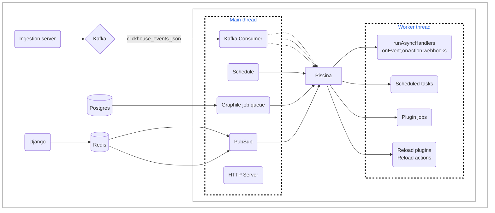

```mermaid
flowchart LR

    subgraph Wrapper [ ]
        direction LR
        Redis[(Redis)]
        Postgres[(Postgres)]
        Kafka{Kafka}
        Django(Django)
        IngestionServer(Ingestion server)


        subgraph PluginServerAsync [ ]
        
            KafkaConsumer(Kafka Consumer)

            Graphile(Graphile job queue)
            Piscina[Piscina]
            Schedule(Schedule)
            HttpServer(HTTP Server)
            PubSub(PubSub)


            subgraph MainThread [Main thread]
                KafkaConsumer
                PubSub
                Graphile
                HttpServer
                Schedule
            end

            subgraph WorkerThread [Worker thread]
                AsyncHandlers(runAsyncHandlers<BR>onEvent,onAction,webhooks)
                Scheduled(Scheduled tasks)
                Jobs(Plugin jobs)
                ReloadPlugins(Reload plugins<BR>Reload actions)
            end

        end


        Kafka --> |clickhouse_events_json| KafkaConsumer
        KafkaConsumer -.-> Piscina
        KafkaConsumer -.-> Piscina
        KafkaConsumer -.-> Piscina

        Piscina --> AsyncHandlers
        Schedule --> Piscina
        Piscina --> Scheduled

        Postgres --> Graphile

        Graphile --> Piscina
        Piscina --> Jobs
        IngestionServer --> Kafka
        Django --> Redis
        Redis --> PubSub
        Redis --> PubSub


        PubSub --> Piscina 
        Piscina --> ReloadPlugins

        %% Styles

        classDef sgraph fill:#fff,stroke-width:3px,stroke-dasharray:5,stroke:#000;

        class MainThread,WorkerThread sgraph;
        classDef plain fill:#ddd,stroke:#fff,stroke-width:4px,color:#000;
        classDef k8s fill:#326ce5,stroke:#fff,stroke-width:4px,color:#fff;
        classDef cluster fill:#fff,stroke:#bbb,stroke-width:2px,color:#326ce5;

   end
```