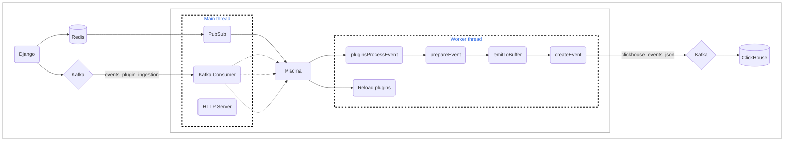

```mermaid
flowchart LR
    subgraph Wrapper [ ]
        direction LR
        Redis[(Redis)]
        ClickHouse[(ClickHouse)]

        Kafka{Kafka}
        Kafka2{Kafka}

        Django(Django)


        subgraph PluginServerIngestion [ ]
        
            KafkaConsumer(Kafka Consumer)
            HttpServer(HTTP Server)
            PubSub(PubSub)
            Piscina[Piscina]


            subgraph MainThread [Main thread]
                KafkaConsumer
                PubSub
                HttpServer
            end

            subgraph WorkerThread [Worker thread]
            
                ProcessEvent(pluginsProcessEvent)
                PrepareEvent(prepareEvent)
                EmitToBuffer(emitToBuffer)
                CreateEvent(createEvent)
                ReloadPlugins(Reload plugins)

            end

        end

        Django --> Kafka
        Django --> Redis
                
        Redis --> PubSub
        PubSub --> Piscina
        Piscina --> ReloadPlugins

        Kafka --> |events_plugin_ingestion| KafkaConsumer
        KafkaConsumer -.-> Piscina
        KafkaConsumer -.-> Piscina
        KafkaConsumer -.-> Piscina

        Piscina --> ProcessEvent
        ProcessEvent --> PrepareEvent
        PrepareEvent --> EmitToBuffer
        EmitToBuffer --> CreateEvent
        CreateEvent --> |clickhouse_events_json| Kafka2
        Kafka2 --> ClickHouse


        %% Styles

        classDef sgraph fill:#fff,stroke-width:3px,stroke-dasharray:5,stroke:#000;

        class MainThread,WorkerThread sgraph;
        classDef plain fill:#ddd,stroke:#fff,stroke-width:4px,color:#000;
        classDef k8s fill:#326ce5,stroke:#fff,stroke-width:4px,color:#fff;
        classDef cluster fill:#fff,stroke:#bbb,stroke-width:2px,color:#326ce5;
    end

```