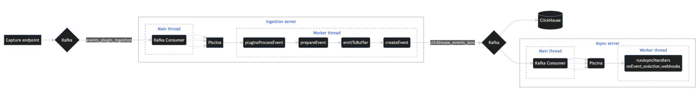
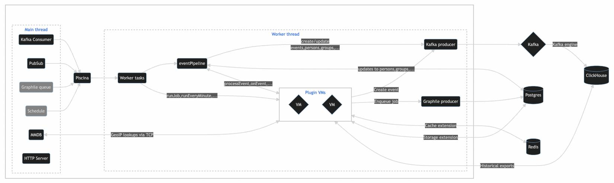
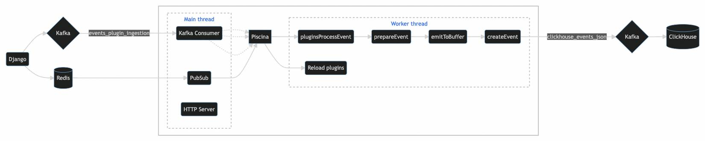
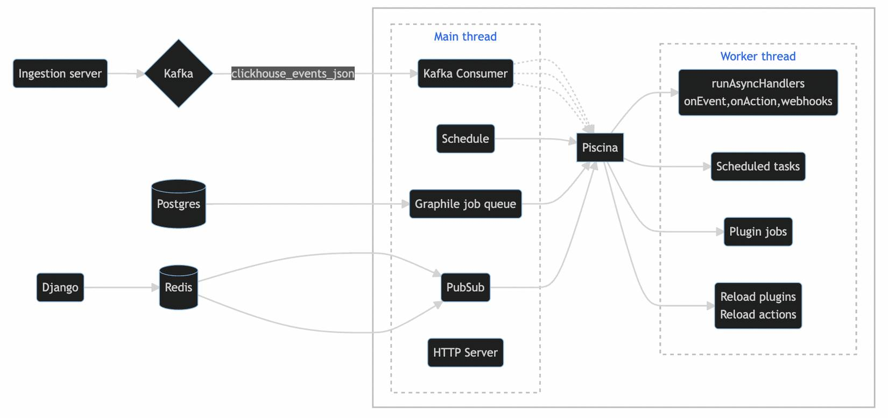

The plugin server is the core of event ingestion and the plugins platform at PostHog.

Despite being called the "plugin server", it is a **core service that PostHog cannot function without**.

This doc should give you a sense of what the plugin server is, how it operates, why it works this way, as well as a better sense of how to operate it in production. 

So buckle up, the journey is about to start.

## What does the plugin server do?

Before getting into the hows and the whys, it's important to understand what the plugin server is responsible for.

In short, its main responsibilities are:

- Validating, parsing, and ingesting events
- Handling all updates to the various models events can trigger changes to (e.g. persons, groups)
- Running all plugins 

Note that these are the responsibilities covered by the plugin server codebase, but **not necessarily by the same service**. More on this later.

## A brief history

The plugin server was born out of a hackathon in Italy during the first ever PostHog offsite.

Back then, the project had one goal: transforming events in flight. 

Much like CDPs offer "transformations", the goal was to be able to provide a way for PostHog users to enrich events with additional data from other sources.

From this hackathon, our most widely used plugin to date was born - GeoIP. 

An initial step towards the ultimate goal of displaying a "world map" in PostHog (solved 2 offsites later in Iceland) - the GeoIP plugin took the IP from an event and used that to enrich the event properties with location data (country, city, etc).

Now, while this may sound like irrelevant context - it set the stage for many architectural decisions to come. 

The first implementation of plugins was built directly into our core Django server, but we found the JavaScript ecosystem to be more mature when it came to running arbitrary code in a sandboxed environment.

As a result, a new service was born: the plugin server.

Fast forward a bit, and we decided that it seemed overly complex and inefficient to do a round trip while ingesting an event (Django -> Plugin Server -> Django -> Database), so we kept the endpoint for sending events in Django, and moved all the other logic pertaining to ingestion over to the plugin server.

Over a year passes, and now PostHog plugins are more powerful than ever. They can access storage, trigger jobs, run scheduled tasks, process events in flight, access events after ingestion, and a lot more. 

Yet, because of that first use case (processing events in flight), ingestion and all this extra processing are tightly coupled together. This is a poor design from an architectural perspective - plugins, meant to "extend" the platform, can cause problems for event ingestion, a core aspect of the PostHog product.

The plugin server has various mechanisms in place to prevent things like plugins running for too long, but ultimately the number of plugins that can run is unbounded, and they can trigger a great deal of tasks and jobs that can end up hogging resources meant for ingestion. 

We could keep on adding checks - but ultimately the best solution here was a fundamental refactor. It was time to split the service into two.

And that's where we are today. 

The plugin server can now be run in three modes - "default", "ingestion", and "async". 

The "default" mode follows the old architecture - one server doing everything. It might eventually disappear, but for now it greatly simplifies dev setups, as well as the setup for small/medium self-hosted instances.

The "ingestion" mode handles ingestion-related processing almost exclusively. The one bit of processing it does for plugins is handling the `processEvent` function - the function allowing events to be modified pre-ingestion. However, any additional processing triggered through running that function is **not** processed by the "ingestion" server.

Lastly, the "async" server handles everything the "ingestion" server doesn't. The three key areas it covers are plugin jobs, scheduled tasks (e.g. `runEveryMinute`), and "async handlers" (webhooks, `onEvent`, `onAction`).

## Plugins

Just before we dig into the architecture, it's important to get a briefing on key plugin concepts as well as plugin capabilities in PostHog.

### What can plugins do?

Plugins can:

1. Process events before they're ingested (via `processEvent`)
2. Access events and actions after the event has been ingested* (via `onEvent`, `onAction`, and `exportEvents`)
3. Schedule periodic tasks (via `runEveryMinute`, `runEveryHour`, and `runEveryDay`)
4. Trigger custom jobs to be run at any given point in the future (via the jobs API)
5. Access APIs for key-value storage (using Postgres) and cache (using Redis)
6. Create new events (via the `posthog` API inside plugin VMs)

Beyond this, they can also use some Node APIs and third-party libraries. 

To read about everything plugins can do, take a look at our [Developer Reference](https://posthog.com/docs/apps/build/reference).

## Plugins vs. plugin configs

There are two core models that plugins are built on top of - plugins (stored in the Postgres table `posthog_plugin` ) and plugin configs (stored in the Postgres table `posthog_pluginconfig`).

Plugins represent plugin "definitions" - most importantly they contain the plugin's config schema, and the plugin code, as well as metadata such as name, description, and logo.

From an installed plugin, teams in PostHog can set up their own instance of a plugin, called a "plugin config". 

For instance, a plugin may depend on a configuration option called `eventToExport`. Then, when a team decides to enable that plugin, they will set `eventToExport` to the desired event name that suits their purpose, like `my_special_event`. 

Plugin configs are what we use to setup plugin VMs. We load the plugin's code and inject the config's context.

For example, all storage and cache usage will be indexed by config ID, and a given VM will only receive events and actions for the team associated with the plugin config.

<HiddenSection headingType='h3' title='Advanced concepts' >

Initially, for every plugin config, we would setup a plugin VM on **every thread on every server**.

Since then, two things have changed:

- **Stateless plugins:** Plugins marked as "stateless" use the same VM for all plugin configs. In other words, the same VM is used for all teams that have the plugin enabled. This is because they don't rely on any team-specific context. The GeoIP plugin, for example, takes an IP and enriches the event with some location data, without depending on any additional configuration. The same operation is done for all events across all teams, so there's no need to run a VM per config. [*Read more here*](https://github.com/PostHog/posthog/pull/8112).
- **Capabilities:** A nice feature that came about as a result of plugin server "modes" is that we no longer need to run all plugins on all servers. For instance, if a plugin only has scheduled tasks, it will never be used on the ingestion server, so we don't need a VM for it on that server. [*Read more here*](https://github.com/PostHog/posthog/pull/9917).

</HiddenSection>

## Architecture

### Event flow

Here's a simplified high level overview of how an event flows through the PostHog ingestion pipeline:

**Diagram 1: Event flow**

The event is received over in Django, where some basic validation is done on the payload (does it have a distinct ID, does the project token exist, etc).

This event is then put in Kafka to be consumed by the ingestion server. The diagram is meant to only show the flow of events, but at this step we will also create and update any persons and groups based on the event, both on Postgres and ClickHouse.

The processed event is then put into another Kafka topic, which two consumer groups consume from. 

One consumer group is managed by ClickHouse, via its [Kafka table engine](https://clickhouse.com/docs/en/engines/table-engines/integrations/kafka/), which consumes messages from Kafka into rows in the database.

The other consumer group corresponds to the async server, which pass the event to plugins running functions like `onEvent` and `onAction`.

If your server is running in "default" mode, this step is skipped, and instead async handlers are processed after the "ingest event" step on the same server.

> Note that high load production deployments run many instances of the Django server, the ingestion server, and the async server. This is handled correctly by all services, and covered later.

### Plugin server

Now that we understand how events flow through the system, let's go even deeper into how the plugin server works.

**Diagram 2: Plugin server**

#### Main thread

Starting with the main thread, the first thing to note is that not all "services" run with every mode. 

Services in gray are "optional" from an individual server's perspective, but at least one server in the fleet should run them in order to cover all plugin capabilities.

All the services listed here run concurrently. 

##### Kafka Consumer

The Kafka consumer consumes from a specified Kafka topic and triggers a run of the event pipeline in the worker thread. The pipeline may be run partially or in full, and all that it does will depend on the mode the server is running in.

##### PubSub

The PubSub service connects to [Redis Pub/Sub channel](https://redis.io/docs/manual/pubsub/) and is used to trigger plugin reloads (e.g. if the code or config has changed) as well as action reloads (e.g. if an action definition has changed).

##### Graphile Queue

We use the [Graphile Worker](https://github.com/graphile/worker) for our plugin jobs implementation. This queue is a consumer that will periodically check the jobs listed in Postgres and trigger job runs when the jobs target time is reached.

##### Schedule

A [node-schedule](https://github.com/node-schedule/node-schedule) scheduler that will trigger scheduled plugin tasks (`runEveryMinute`, `runEveryDay`, etc). 

However, tasks are not necessarily triggered in a given server when the scheduled time hits. We use [Redlock](https://redis.com/redis-best-practices/communication-patterns/redlock/) to ensure that only one plugin server across the fleet processes scheduled tasks at a given point in time.

##### HTTP Server

A simple HTTP server that's currently only used for healthchecks.

#### Communication between the main thread and worker threads

We use the [Piscina thread pool](https://github.com/piscinajs/piscina) to communicate between the main thread and the worker threads in the plugin server.

By default, Piscina will spawn as many worker threads as the machine's CPU cores, and each worker can process 10 tasks concurrently by default. 

When a task is triggered, Piscina will select an available worker to process it. We've also forked Piscina and added a feature that allows us to run a task on **all** workers. We use this when we need to reload a plugin that has changed, for instance.

#### Worker thread

Most often, a task triggered from the main thread will either immediately trigger a plugin function, or run the event pipeline.

The former happens in the case of "standalone" functions, like scheduled tasks and jobs. The task payload contains everything the VM needs to execute the function, so we call it immediately.

On the other hand, the event pipeline handles the entire lifecycle of an event. The steps in the pipeline are the following:

1. `pluginsProcessEventStep`
2. `prepareEventStep`
3. `emitToBufferStep`
4. `createEventStep`
5. `runAsyncHandlersStep`

At certain steps, the pipeline may trigger plugin functions in the VMs, such as `processEvent` at step 1 and `onEvent` at step 5.

Most importantly, the pipeline need not be run in full each time. When both the "ingestion" and "async" servers are running, the ingestion server covers steps 1-4 and the async server covers step 5.

When running the event pipeline, we also update persons and groups in Postgres and ClickHouse (via Kafka).

Finally, the diagram also shows everything plugin VMs can connect to, directly or indirectly. For instance, they can create events that get put into Kafka, as well as trigger jobs that go to Postgres via the Graphile Producer.

### Ingestion server

**Diagram 3: Ingestion server**

### Async server

**Diagram 4: Async server**

## Plugin server management

From all this context and all these diagrams, we can derive useful lessons about managing this stack in production.

### Horizontal scaling

In order to cope with increased load, one can scale the plugin server horizontally. 

However, the marginal benefit of horizontal scaling will largely depend on the number of partitions for the `clickhouse_events_json` and `events_plugin_ingestion` topics.

Any additional ingestion server instance beyond the number of partitions for `clickhouse_events_json` will do absolutely nothing.

Additional async server instances beyond the number of partitions for `events_plugin_ingestion` will be useful, but their benefit will be limited. They will not process async handlers, but will still be able to process both jobs and scheduled tasks.

## Quirks

- In order to work correctly, you **must** either have a fleet composed of both async servers and ingestion servers, or all servers should be running in "default" mode. 
- We run a fork of [Piscina](https://github.com/PostHog/piscina) with two key changes: a feature called `broadcastTask`, and a [change to its internal use of the Atomics API](https://github.com/PostHog/piscina/pull/4)
- Both our Cloud environment and self-hosted installations need to [connect to a microservice](https://github.com/PostHog/http-mmdb) we manage if they wish to use the GeoIP plugin. GeoIP capabilities are built into the plugin server.
- Plugin VMs are not fully isolated from the environment they work on. Thus, one should always verify a plugin's source code carefully before installing it!

### Failure modes

> Note that we often mention how the plugin server can pick back up and ingest events that have been sitting in Kafka because some service is down. However, messages will be deleted from Kafka according to the topic's retention policy, so during long outages we should backup messages from the relevant Kafka topics. 

#### ______ is down

##### ClickHouse is down

This is fine. Historical exports will stop working but that's all. We will also not see any new events in the app, but these will be safe in Kafka waiting for ClickHouse to come back up.

##### Redis is down

Both plugins and the plugin server itself use Redis for caching. However, the plugin server *does not*, and plugins *should not* **need** Redis to operate.

Thus, Redis being down is also fine. Actions and plugins may get out of date, but these can also be updated by triggering a server restart.

##### Ingestion server is down

This is pretty self-explanatory. If the ingestion server goes down, PostHog event ingestion comes to a halt. 

However, if Django is working fine, events should be waiting in Kafka to be processed when the server comes back up.

From this, we can also derive that it is fine to restart the ingestion server if necessary. Consequences should be minimal.

##### Async server is down

If the async server is down, ingestion will continue to work, but scheduled tasks, plugin jobs, and async handlers will stop working. 

Jobs are kept in Postgres, so these are safe and will pick back up when the server starts.

Async handlers run on events from Kafka, so those will also "pick up from where they left off".

Scheduled tasks meant to trigger during the time the server is down will of course not run again, but they run on intervals, so the impact here is minimal as they will run on the next iteration if the server is back up.

##### Postgres is down

If Postgres is down, PostHog will have a difficult time doing *anything*, and the same applies to both the async and ingestion servers.

During this time, Django will send events to the dead letter queue, so the plugin server will not process events sent during this time, even when Postgres is back up.

##### Kafka is down

A key takeaway from all this is that Kafka is an essential piece of our infrastructure.

If Kafka is down, ingestion will be down and **events will be lost**.
