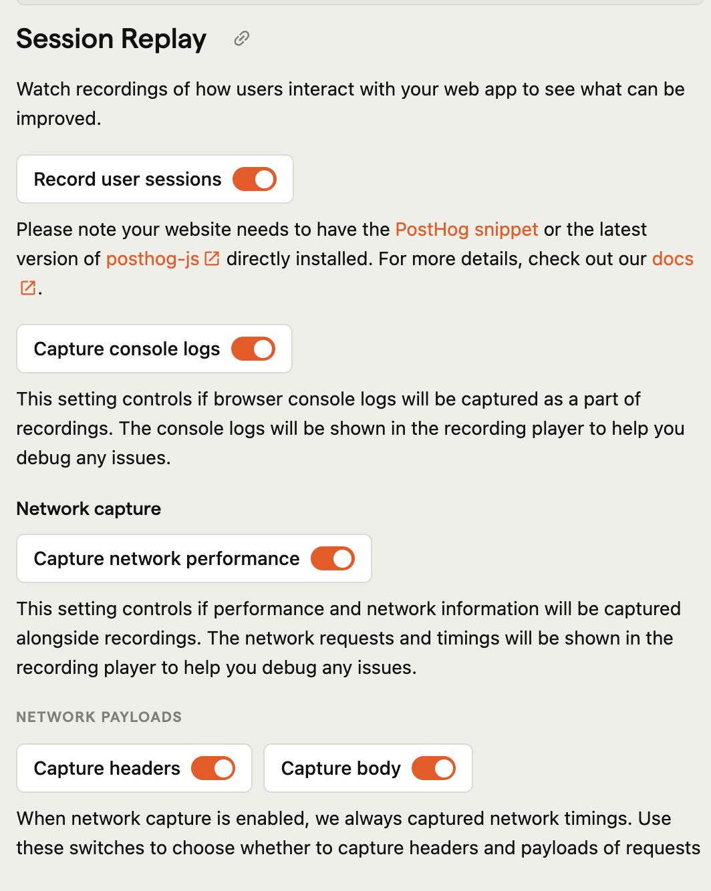

PostHog can capture network requests and their performance that occur during the browser session, so you can see the effect of slow network requests or errors on the user experience.

You can enable network recording from your [project settings](https://app.posthog.com/project/settings):



To remove sensitive information from the URL, these network requests can be modified before being captured like so:

```js-web
posthog.init('<ph_project_api_key>', {
    session_recording: {
        maskNetworkRequestFn: (request) => {
            // For example: ignoring a request entirely
            if (request.url.includes('example.com')) {
                return null
            }

            // ... or remove the query string from the URL
            request.url = request.url.split('?')[0]
            return request
        }
    }
})
```

# Troubleshooting

## Recording from localhost

Due the very high volume of network requests that some tools can make (for example when running hot-reload during development) PostHog does not capture network requests when running on localhost
