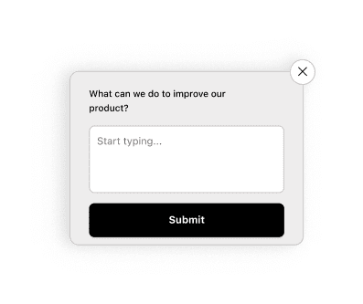
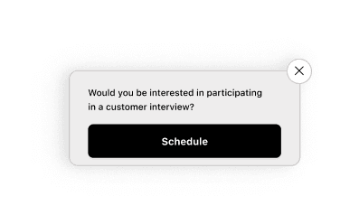
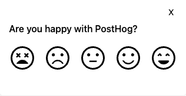
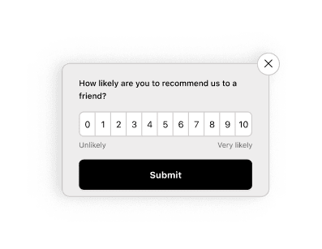
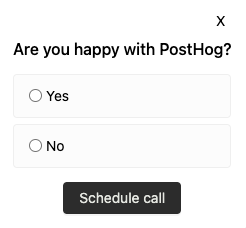
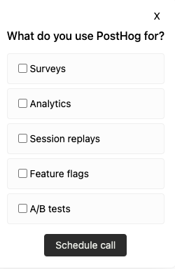
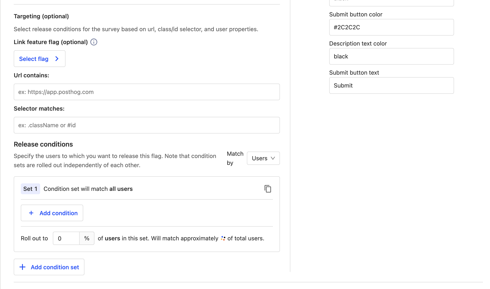

import {ProductScreenshot} from 'components/ProductScreenshot'
import newSurveyLight from '../../images/docs/surveys/new-survey-light-mode.png'
import newSurveyDark from '../../images/docs/surveys/new-survey-dark-mode.png'

To create a new survey, go to the [surveys tab](https://us.posthog.com/surveys) in the PostHog app, and click on the "New survey" button in the top right.

This presents you with a collection of survey templates or you can click "Create blank survey" to create your own. After choosing one, you are brought to a form where you can complete the details of your new survey:

<ProductScreenshot
    imageLight={newSurveyLight} 
    imageDark={newSurveyDark}
    alt="Create a survey" 
    classes="rounded"
/>

Here's a breakdown of each field in the form:

### Presentation

There are three options for displaying a survey:

1. **Popover:** Use PostHog's prebuilt user interfaces to show survey's as a popover in the bottom corner of the screen.

2. **API:** Implement your own survey UI and use PostHog to handle display logic, capturing results, and analytics.

3. **Feedback button (beta)**: Set up a survey to show a prebuilt feedback tab when a custom button is clicked.

### Steps

Steps is where you set up your questions as well as your confirmation message. You must subscribe to surveys to add multiple questions.

PostHog supports multiple questions types. All survey types are available for both popover and API display modes.

| Type                      | Preview                                                                                               |
|------------------------|-------------------------------------------------------------------------------------------------------|
| **Open text**              |                                      |
| **Link/Notification**                   |                                               |
| **Rating - emoji**         |                               |
| **Rating - number**        |                             |
| **Single choice select**   |                       |
| **Multiple choice select** |                          |

### Customization

Customization enables you to change the look of your popover survey: 

- The color of the background, border, buttons.
- The position of the popover.
- The visibility of the PostHog branding.
- The placeholder text.

### Targeting

This specifies the conditions a user must meet to be shown the survey. A user must meet **ALL** the conditions to be eligible.

You can target your survey to specific users based on:

- **Linked feature flag:** Whether a user has a specific [feature flag](/docs/feature-flags) enabled. For example, if you're rolling out a new landing page using a feature flag `new-landing-page`, you can gather feedback only from users who have that flag enabled.

- **Page URL contains:** Where the current URL contains a specific string.
  
- **Selector matches:** Whether a specific element appears on the page with the specified class name or ID. For example, you can target a survey with `#my-button` or `.my-button` selector.

- **User/group properties:** You can target a survey to users who have a specific [user](/docs/product-analytics/user-properties) or [group property](/docs/product-analytics/group-analytics#how-to-set-group-properties). For example, you can target a survey to users who have a property `is_paying=true`.

- **Wait period**: Hide surveys from users who have seen a survey in the last X days.

> **Want your survey to show up after a delay?** Use selector matching to match a class, then add logic to add that class to your page after a delay. See the full set up in our on [how to show a survey after a delay](/tutorials/delayed-survey)

## Launching your survey

Once you've set up your survey, click "Save as draft" to save your survey. This enables you to review any changes before launching. Then, when you're ready to launch, click the "Launch" button.

If you've created a [popover survey](#presentation), your survey will begin showing immediately.

If you've created an [API survey](#presentation), you'll need to add your [custom survey code](/docs/surveys/implementing-custom-surveys) before launching.

