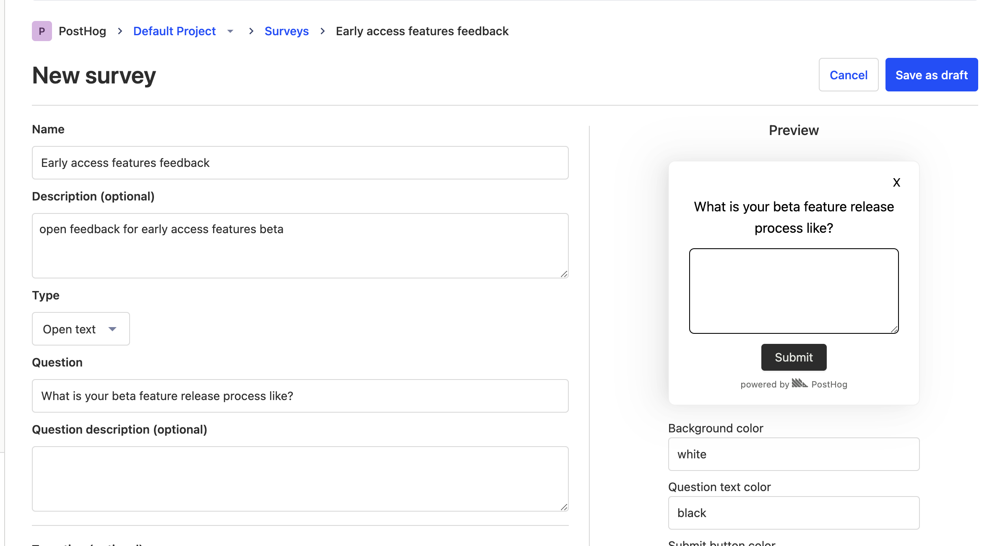

To create a new survey, go to the Surveys page in PostHog and click "New survey". You'll be prompted to enter a name for your survey, optional description, and what type of survey you'd like to create.

On the right side of the page, you'll see a preview of what your survey will look like, along with appearance customization options.

