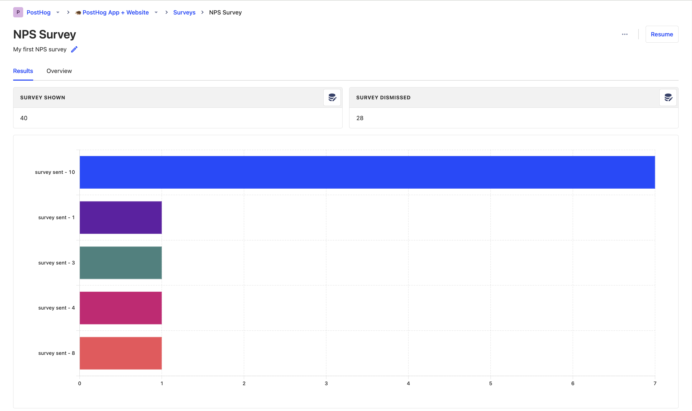

Survey results can be viewed in two places:

1. On the survey page in the "Results" tab.
2. By creating your own [insights](/docs/product-analytics/insights).

## 1. On the survey page

You can view the results of a survey by selecting your survey from the [surveys tab](https://app.posthog.com/surveys). You'll see data on:

- How many users have seen the survey.
- How many users have dismissed the survey.
- Survey responses.

Depending your survey [question type](/docs/surveys/creating-surveys#question-type), you may also see charts with your responses.

## 2. Creating your own insights

To create insights from survey results, navigate to the [insights tab](https://app.posthog.com/insights) and click on `New insights` button.

There are 3 survey events you create insights from:

1. `survey dismissed`
2. `survey shown`
3. `survey sent` (for survey responses)

When creating an insight, select either of these events. Then, to see data on the survey you want, create a filter using `Survey ID` or `Survey Name`.

Depending on your survey [question type](/docs/surveys/creating-surveys#question-type), you may also find it helpful to breakdown results by `Survey Response` (e.g., for number rating or single choice select surveys).

