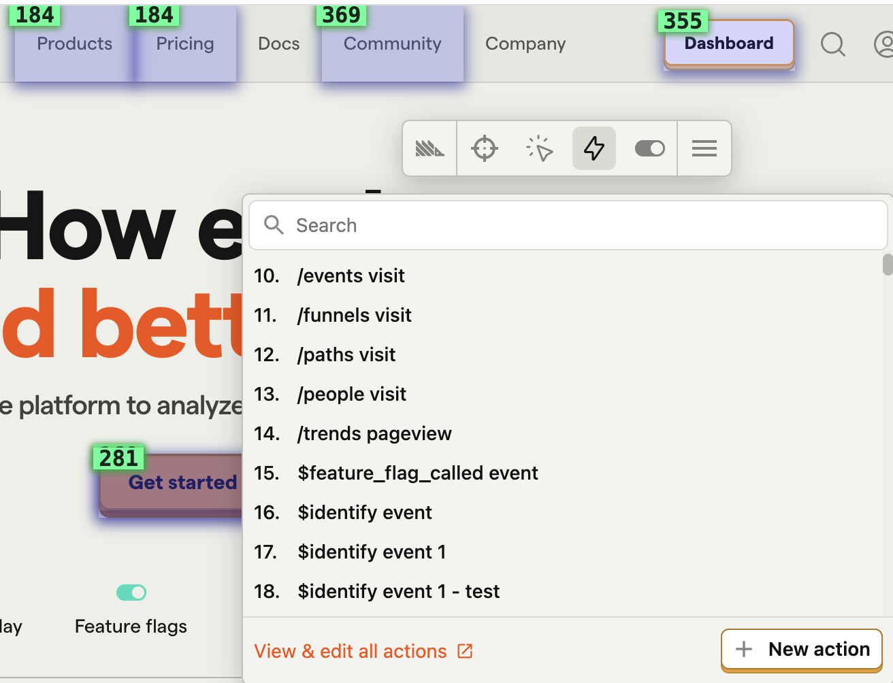

<iframe
    src="https://www.youtube-nocookie.com/embed/2jQco8hEvTI?start=250"
    className="rounded shadow-xl"
/>

The toolbar enables you to easily create [actions](/docs/data/actions) by clicking elements directly on your website. 

To do this, click on the 🔍 Inspect button on the toolbar. This will add a blue overlay to your website. Then, if you click on an element, you will be shown the option to create an action from it.

You can also create a more advanced action using the following additional options:

### 1. Add another element

If you want your action to cover more than one element, you can click 'Add another element' right above 'Create Action'. 

This is an `OR` operation, meaning that the action will be recorded if either Element A _or_ Element B are clicked. 

This is useful if you have various buttons that take you to the same page, for instance, and only care that the user clicks one of them. A common use case for this is leveraging the action as a [funnel step](/docs/user-guides/funnels). 

### 2. Element filters

These are used by PostHog to find the specific element you're creating the action for. 

- **Link target:** Where a click on the element leads to (if available).

- **Text:** Inner text of the element (if available).

- **Page URL:** If you have the same element at the same position in various pages (e.g. navbar elements), the default action will capture them all. To prevent this, you can set an exact URL or specify a pattern for pages where this exact action should be recorded.

- **Selector:** Path to the element on the page. If you're not happy with the selector PostHog is using automatically, you could, for example, select elements based on their `id` or `data-attr`. You can type a selector into the "Selector" field in the action creation modal to do this.

Or in the same modal, click "Edit the selector" to use our element picker to build the selector you want.

## Viewing your existing actions

You can view your existing actions on your page by clicking the "Actions" button on the Toolbar. This will highlight any elements that are associated with an action. This is a useful way to check that elements are associated with the correct actions.

By clicking on a specific element, you can update or delete the action.

The number in the green box on the top left of the element is the **action's index** in your list of actions (and **does not** represent how many times that action was triggered). The number in the yellow box next to the "Actions" button in the toolbar represents the total number of actions you have created.

