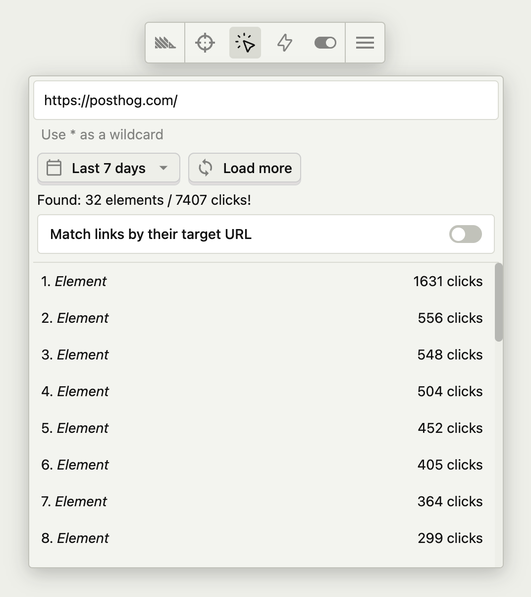
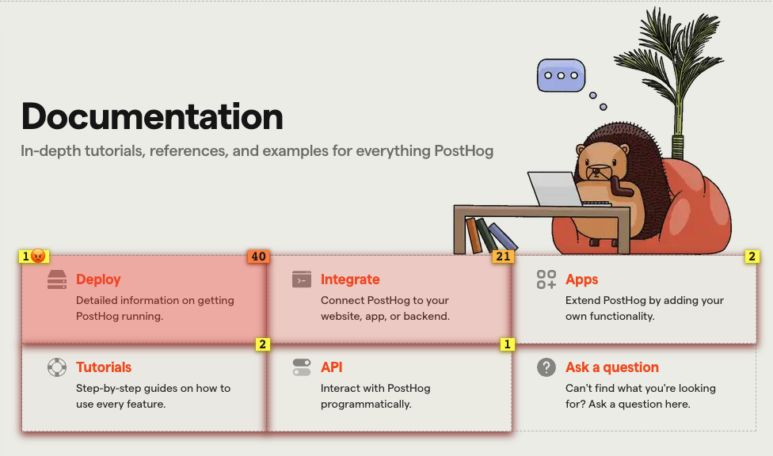
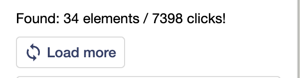
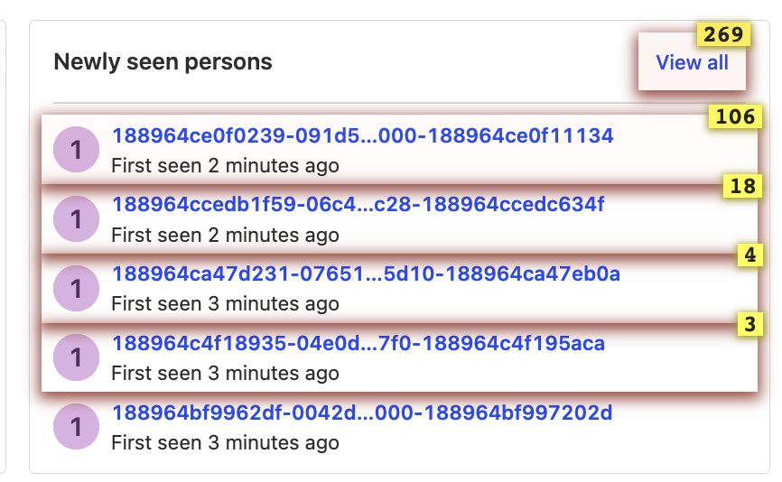
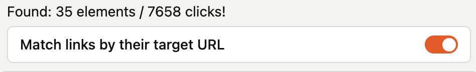
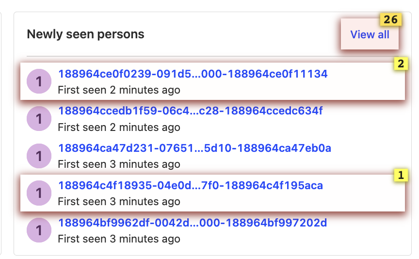
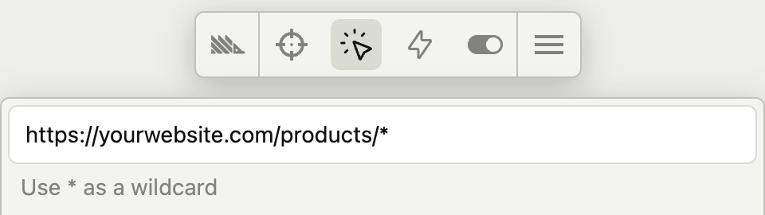

<iframe
    src="https://www.youtube-nocookie.com/embed/2jQco8hEvTI?start=250"
    className="rounded shadow-xl order-2 md:order-3"
/>
<Caption>Find out how we use heatmaps in our demo video</Caption>

> **Note:** To use heatmaps, [autocapture](/docs/data/autocapture) must be enabled.

Heatmaps is a feature in the toolbar that shows you how users are interacting with elements on your website or app. 

To view your heatmaps, click the heatmap icon on the toolbar.

With the heatmap on, clickable elements on your website will have a red overlay with numbers on them. Here's an example of our website with the heatmap enabled:

Each number in the top right box of each element represents the total number of clicks in the last 7 days. The number in the top left of the element is the number of rage-clicks.

Numbers at the bottom or top of the screen indicate that there are more elements that are not currently being displayed on the page.

## How to create an action from a heatmap

Once you have enabled the heatmap, click on any element. You will then be able to create an [action](/docs/data/actions) from it.

## Loading more data

If you have many events, you may need to load more data to see everything on the heatmap. To do this, click on the load more button in the heatmap menu.

## Matching links by their target URL

By default, the toolbar matches clicks using the elements on the page, and not by their target URLs (i.e., `href` attribute). This is fine for most scenarios where you have static elements with the same target URL. However, this may not be ideal for dynamic lists that have different target URLs depending on the underlying data.

For example, consider the following screenshot of a list of elements for "Newly seen persons" from the PostHog app:

The "Newly seen persons" shows the most recent list of persons using the app and is constantly being updated as new users use the app. In the heatmap, we see 106 clicks for the **first element**. This doesn't mean that the this specific person in the list received 106 clicks, but rather that the first element in the list received 106 elements, regardless of which person was shown.

If we were more interested in the number of clicks each specific person in the list received (regardless of which position they appeared in), then we can turn on "Match links by their target URL" in the heatmap menu. This matches clicks to elements based on their target URLs.

For example, if we enable this for our previous example, we see much fewer clicks. This is because we are now seeing clicks on each specific user:

## Combining heatmaps from similar pages using wildcards

If you have similar pages that are mostly the same but have dynamic content based on an identifier in the URL (e.g., product pages on an ecommerce site), you can search and display their combined heatmap using wildcards `*` in the heatmap menu.

For example, if the product pages on an ecommerce site use a URL format of `https://yourwebsite.com/products/product-id`, you can use the wildcard URL `https://yourwebsite.com/products/*` to display a combined heatmap from all the product pages.

