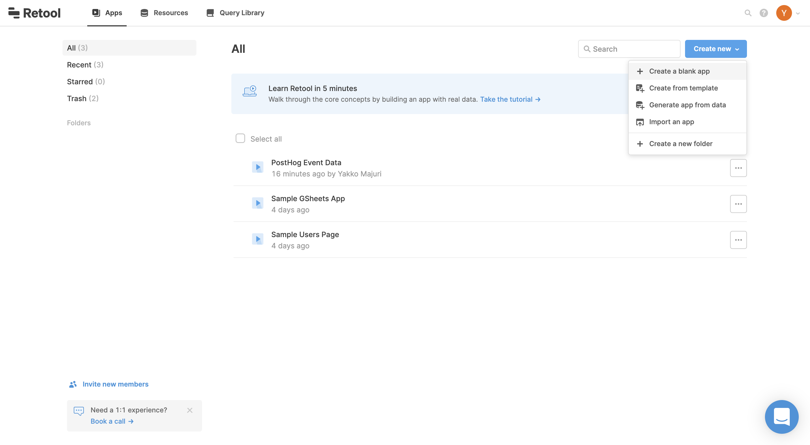
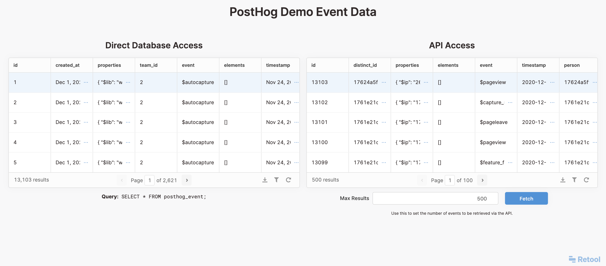
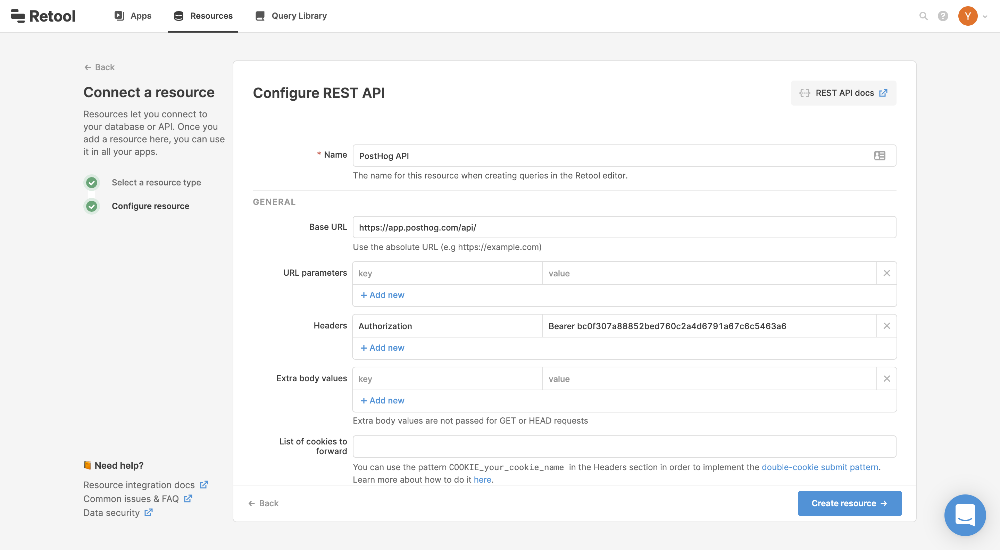
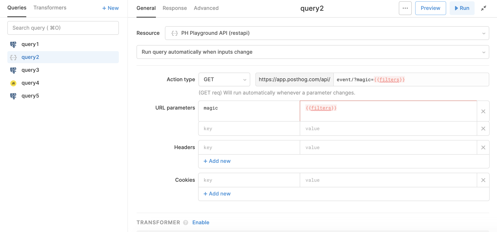

## Objective

Integrating PostHog with Retool.

## Why is this useful?

[Retool](retool.com/) is a platform you can use to quickly build internal tools that leverage your data from different sources with little to no-code.

## Pre-Requisites

To follow this tutorial along, you should:

1. Have [deployed PostHog](/docs/deployment). 
2. Have a [Retool account](login.retool.com/auth/signup)

## Step-By-Step Instructions

### Retool App Setup

First, create a new app from the Retool dashboard:



You will then need to create a new resource i.e. set up the configuration for where you'll pull the date from. If you have not created any resources before, Retool will prompt you to create one. 

Otherwise, you can add a new resource on the queries tab at the bottom of the page, by creating a new query and selecting '+ Add a new resource' on the query tab.

The resource you create will depend on how you use PostHog. If you're self-hosting our open-source version you can connect Retool directly to your PostgreSQL database. However, if you're using PostHog Cloud or our enterprise offering, you should use our API. Regarding the enterprise offering, this is the case because Retool does not yet integrate with ClickHouse.

> If you're on EE, we still use Postgres for certain types of data which you could use with Retool, but you'll have no access to event data, for example.

API access is significantly slower, especially since we need to setup a way for Retool to handle pagination on our endpoints.

To see the difference in speed, check out our [demo Retool app](https://phtesting.retool.com/embedded/public/6f20bb59-4199-4c75-ac7d-eee38a7b6b71):

<a href="https://phtesting.retool.com/embedded/public/6f20bb59-4199-4c75-ac7d-eee38a7b6b71" target="_blank">



</a>

### Integrating directly with PostgreSQL

Integrating Retool with PostgreSQL directly is rather simple. 

1. When creating a new resource, select the PostgreSQL integration. 
2. This will prompt you to enter your database details, which are the same authetication parameters you use to connect the database to PostHog. 
3. With the connection complete, you are now able to run SQL queries on your PostHog database and use the result on Retool tables, charts, and any other component available. Retool also makes the database tables and their respective schemas available to you, making the process of writing queries easier. 


### Integrating via API

1. When creating a new resource, select "REST API". 
2. This will open a configuration page for the API resource:

    <br /><br />

3. On the configuration page, use `https://app.posthog.com/api/` for the 'Base URL' if you're using PostHog Cloud. Otherwise use the address of your PostHog instance, followed by `/api/`. Then, on the 'Headers' section, configure a header called `Authorization` with value `Bearer <YOUR_PERSONAL_API_KEY>`. For more information on API authentication, see our [dedicated page for this](/docs/api/overview#authentication). 
4. Click 'Create Resource' and you should now be able to connect to PostHog endpoints through Retool queries. For information on our endpoints, see our [API Documentation](/docs/api/overview).
5. For some of our endpoints, this configuration is enough. However, endpoints like `/event` and `/person` have pagination, which Retool does not support out of the box. As such, follow the next steps for instructions on how to handle PostHog's pagination with Retool.

### Handling Pagination with Retool

To handle pagination in Retool and show results beyond the first "page", we need to do some Retool magic.

1. First, create a new query that uses the PostHog API resource and input the endpoint you want to use. 
1. Then, add a 'URL parameter' called anything that you like - I'll call it "magic", but the name is entirely irrelevant. Set its value to `{{filters}}` (this is important). Here's what the config will look like:

    <br /><br />

1. Retool will complain about `filters` not being defined, but that's OK. This is the [recommended way to handle paginated API endpoints](https://community.retool.com/t/returning-all-results-for-a-cursor-based-paginated-api/3387) while that isn't supported natively. "Save and run" your query. It will fail as expected.
1. Now, create a new query, using the 'Run JS Code (javascript)' resource. On the text editor, paste the following:

    ```js
    const fetchAll = (filters, results, n) => {

        // Check if enough events have been fetched
        if (n === Math.ceil(Number(textinput1.value)/100)) return results

        return new Promise(resolve => {
            // Trigger the API endpoint query
            return query1.trigger({
           	    additionalScope: {
             	    filters // Set `filters` to the params on the next URL
           	    },
           	    onSuccess: queryResult => {

                    // Join results of this query with the rest
                    const newResults = results.concat(queryResult.results)

                    // If this is the last page, return the results
                    if (!queryResult.next) return newResults

                    /* Call fetchAll until there are no pages left
                        or the specified limit is reached. 
                    */
                    return resolve(
                        fetchAll(
                            queryResult.next.split('?')[1],
                            newResults, 
                            n+1
                        )
                    )
           	    }
         	})
         })
    }

   return fetchAll("=1&", [], 0)
    ```


