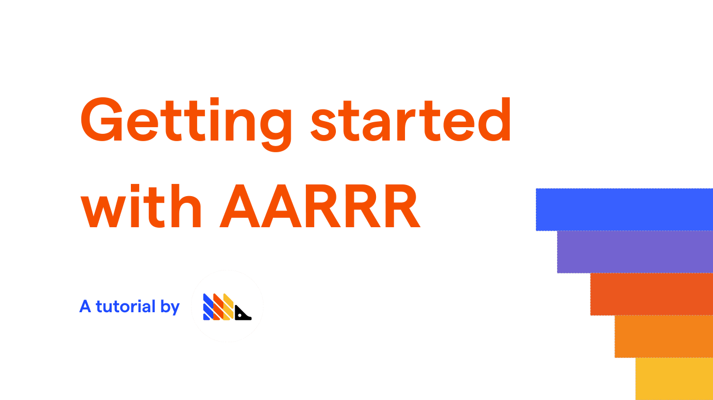

AARRR (Acquisition, Activation, Retention, Revenue, Referral) is a classic framework to establish end-to-end product tracking - this tutorial will help you figure out how to define each of these metrics for your product.

> For products focused on virality, it may be worth additionally tracking growth loops.

## General rules

Regardless if you're in B2B or B2C, we believe the best practice is to focus on end users, not organization adoption. Ultimately, a company is a collection of people. If you build for the end users within, a company's activation, retention and revenue will follow. It is still interesting for a B2B team to track the unique companies signing up, activating or being retained, but that shouldn't be the top level metric.

The way you optimize a metric may involve product, marketing or sales. Just because you now track retention, doesn't mean you only have a product lever to pull to improve it. Consider for each metric which approach is the most relevant for optimization.

For products with a variety of user personas, it may make sense to run several versions of this funnel for different personas. For example, a CEO may use Salesforce very differently to a salesperson - so it's rational to consider activation and retention behaviors quite differently. Likewise, for marketplace products - your  users will likely have different value propositions depending on if they are on the supply or demand side of your business.

These are also only top level metrics. You will want to track more than this. However, if you start by making sure you have one metric for each point of the AARRR framework, then you will have a valuable event taxonomy to get started with PostHog. We'd recommend after getting this in place, that you focus on 'deep dive' dashboards which cover metrics that can affect a top level metric. For example, a [deep dive acquisition dashboard](taxonomy-acquisition) will contain conversion rates, traffic volumes by source and so on.

Once you have defined each of the following metrics, save them to a [Dashboard](../user-guides/dashboards) in PostHog, so you can easily check their performance over time.

Starting with something is better than not starting at all. You can easily iterate metrics and what you pick here is a reversible decision.

## Acquisition

How many users signed up? This one is normally easy to start with.

Optionally, it may be rational to add a quality signal here. For example, at PostHog we track "high quality sign ups" as our acquisition metric. To do this, we consider users who signed up that look like they fit our [target audience](/handbook/strategy/strategy) - whilst we can't exactly measure if a user ticks all the boxes, we use whatever signals we can from our product as a signal that a user is in that audience. That means usage information, hosting setup, and company-level data enrichment (to get company size), and querying the lead score in our CRM via our [Plugins](../plugins),

## Activation

Some users don't stick around because they never used the product properly in the first place. For example, they created an account (adding to Acquisition), but they didn't do anything once they were in. Measuring Activation enables you to clarify whether you need to focus on this activation problem, or the separate retention problem of users coming back once they have experienced value for the first time.

To define Activation, don't be afraid to go deep. It must mean the first "aha" moment. For PostHog's own team, it means that users answer a product question (not just that they've got set up and integrated). For marketplaces, it might mean a user makes money. For social media websites, it might mean that a user builds an audience or receives a significant number of likes on a post.

We've found it's simplest to define this by starting from first principles - what problem does your product solve for users? Answering a question? Building influence? Something else? It might be many steps into your product when this occurs.

Once the Activation event is decided upon, double check it leads to increased retention. Create a cohort of activated users, and check you retain them significantly better than non-activated but signed-up users. If your retention doesn't change, then your activation metric isn't right (optimizing it would have zero positive effect).

## Retention

What event must critically occur for a user to get repeated value from your product?

Similar to Activation - you should consider this as a channel to invest in. Would you gain more ROI by spending $1M in engineering time to improve retention, which will forever influence your growth? Or would you rather spend $1M on performance marketing? (The answer? Likely the former if viral growth is your main growth engine, likely the latter if performance marketing is your main growth engine).

You must also define a usage interval - how often you expect the retention event to occur. This is relevant if you would expect a _minimum_ frequency of the retention event to occur. For Airbnb, this might mean two vacations a year. For payroll software, it might mean monthly. For a social network, it may mean daily or weekly usage.

Once you've created a cohort of activated users, Retention can be measured in two ways:

* n-day/n-week/n-month retention - how many of your users came back within a usage interval (use PostHog's [Retention feature](../user-guides/retention) to measure this)
* Unbounded retention - appropriate when there isn't a set usage interval, how many users came back at all (use Posthog's Stickiness feature to measure this)

## Revenue

What's your top revenue metric?

For Software-As-A-Service (SAAS), this often means Contracted Monthly Recurring Revenue (MRR). Others may focus on Average Revenue Per User. What you choose will depend on your business model.

You are able to send revenue as an event to PostHog, since you can define a property for it and you can set numerical values on properties. Using [Trends](../user-guides/trends) you can display relevant data as you need using event property averages, sums, percentiles and graph series formulae. You can even integrate with payment systems (such as Stripe) through PostHog's [Plugins](../plugins).

## Referral

How many users are created due to your existing user base?

This is relevant for products that have a growth loop (generally when the in-product experience is improved through multiple users, or when it's a product that encourages users to share fun content).

This means that sometimes referrals are internal - when you have more users who join within a single organization.

Other times, referrals are external - when a consumer invites their friends to a social network, or when a business user invites someone outside of their business to the product.

> Defined your metrics? Check out our tutorial on [how to create a AARRR funnel in PostHog](../tutorials/aarrr-how-to-build-pirate-funnel-posthog-with-posthog) for further information.